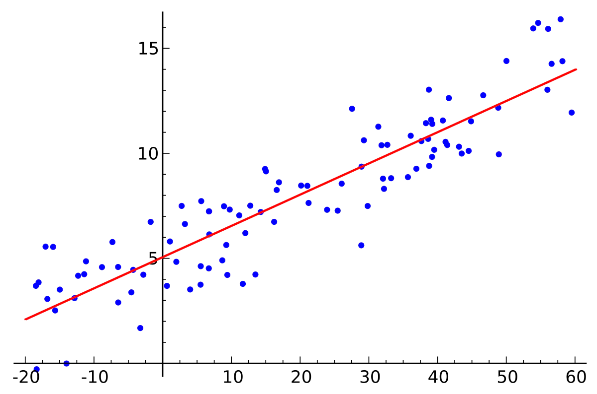

# 范数

>Wikipedia: In mathematics, a **norm** is a function from a real or complex vector space to the non-negative real numbers

一个向量/矩阵的范数（norm）是该向量/矩阵投影到非负范围内的值。

范数可以用于衡量两个向量/矩阵之间的距离。在机器学习中norm总被拿来衡量两个向量之间的距离。

# 1 范数

## 向量视角

Lp-norm：
$$
\|\mathrm{x}\|_{\mathrm{p}}:=\left(\sum_{\mathrm{i}=1}^{\mathrm{n}}\left|\mathrm{x}_{\mathrm{i}}\right|^{\mathrm{p}}\right)^{\frac{1}{\mathrm{p}}}
$$
p=1时就是L1范数，p=2时就是L2范数。

----

**L1-norm：**
$$
\|\mathrm{x}\|_{\mathrm{1}}:=\sum_{\mathrm{i}=1}^{\mathrm{n}}\left|\mathrm{x}_{\mathrm{i}}\right|
$$
**L2-norm：**
$$
\|\mathrm{x}\|_2:=\left(\sum_{\mathrm{i}=1}^{\mathrm{n}}\left|\mathrm{x}_{\mathrm{i}}\right|^2\right)^{\frac{1}{2}}
$$
L2-norm展开就是欧几里得范数：$\|\mathrm{x}\|_2:=\sqrt{\mathrm{x}_1^2+\cdots+\mathrm{x}_{\mathrm{n}}^2}$

**L$\infty$-norm：**
$$
\|\mathrm{x}\|_{\mathrm{\infty}}:=\left(\sum_{\mathrm{i}=1}^{\mathrm{n}}\left|\mathrm{x}_{\mathrm{i}}\right|^{\mathrm{\infty}}\right)^{\frac{1}{\mathrm{\infty}}} = \max \left(\left|\mathrm{x}_1\right|,\left|\mathrm{x}_2\right|, \ldots,\left|\mathrm{x}_{\mathrm{n}}\right|\right)
$$
无穷范数，得到向量中元素绝对值最大值。

## 矩阵视角

**Frobenius范数**：简称F-范数。
$$
\|\mathbf{A}\|_F \equiv \sqrt{\sum_{i=1}^m \sum_{j=1}^n\left|a_{i j}\right|^2}=\sqrt{\operatorname{trace}\left(A^* A\right)}=\sqrt{\sum_{i=1}^{\min \{m, n\}} \sigma_i^2}
$$
矩阵A各元素平方和。退化到向量中就是L2范数。其中，$A^*$表示$A$的共轭转置，$\sigma_i$是A的奇异值。

# 2 距离

## 向量视角

设$X, Y$都是一个n维的向量：$X=(x_1,x_2,x_3,...,x_n) , Y=(y_1,y_2,y_3,...,y_n)$。

**曼哈顿距离：**`对应L1范数`

来源于美国纽约市曼哈顿区，因为曼哈顿是方方正正的。
$$
D(X,Y)=\|X-Y\|_{\mathrm{1}}=\sum_{i=1}^{n}\left|x_{i}-y_{i}\right|
$$
**欧氏距离：**`对应L2范数`
$$
D(X, Y)=\|X-Y\|_{\mathrm{2}}=\sqrt{\sum_{i=1}^{n}\left(x_{i}-y_{i}\right)^2}
$$
**切比雪夫距离：**`对应L∞范数`
$$
D(X, Y)=\|X-Y\|_{\mathrm{\infty}}=\max \left(\left|x_1-y_1\right|,\left|x_2-y_2\right|, \ldots,\left|x_{n}-y_{n}\right|\right)
$$
**闵可夫斯基距离：**`对应Lp范数`
$$
D(X, Y)=\|X-Y\|_{\mathrm{p}}=\left(\sum_{i=1}^{n}\left|x_{i}-y_{i}\right|^{p}\right)^{\frac{1}{p}}
$$

## 矩阵视角

设$A \in \mathbb{R}^{m \times n},B \in \mathbb{R}^{m \times n}$为两个同型矩阵。

**Frobenius距离**：`对应F-范数`
$$
D(A, B)=\|A-B\|_{\mathrm{F}}
$$
F距离可用于为矩阵A找到一个近似的低秩矩阵B：
$$
B=\mathop{\arg\min}_{rank(B)=k}\|A-B\|_\mathrm{F}
$$

# 3 范数在机器学习上的应用

一般L1 L2范数在机器学习上的应用大概分为以下两类：

- 作为损失函数使用。
- 作为正则项使用。

## 3.1 作为损失函数使用

以回归问题为例，我们需要获得一条线，让数据点到直线的距离尽可能小。

范数既然可以表示距离，自然可以拿来用作损失函数了。

**L1-norm损失函数**，又被称作最小绝对偏差（least absolute deviation，LAD）：
$$
S=\sum_{i=1}^{n}\left|y_{i}-f\left(x_{i}\right)\right|
$$
如果我们最小化上面的损失函数，其实就是在最小化预测值和目标值之差的绝对值。

**L2-norm损失函数**，又称最小二乘误差（least squares error，LSE）：
$$
S=\sum_{i=1}^{n}\left(y_{i}-f\left(x_{i}\right)\right)^2
$$
之所以大家一般都用L2-norm损失函数，是因为绝对值求最小值有点麻烦，平方最最小值更方便（求导、置零、解方程）。

| L2损失函数               | L1损失函数 |
| ------------------------ | ---------- |
| 不是非常的鲁棒（robust） | 鲁棒       |
| 计算方便                 | 计算较复杂 |
| 稳定解                   | 不稳定解   |
| 总是一个解               | 可能多个解 |

## 3.2 作为正则项使用

正则化通过降低模型的复杂性，缓解过拟合，即在损失函数中加个正则项（regularization term）。

> 参考资料：
>
> 1. L1，L2，Lp，L∞范数，曼哈顿距离，欧式距离，切比雪夫距离，闵可夫斯基距离以及损失函数和正则项的应用 https://blog.csdn.net/qq_44766883/article/details/111416264