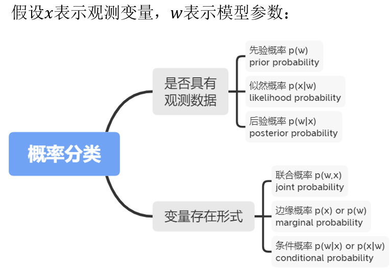
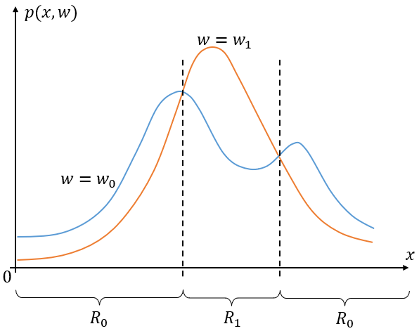

# 贝叶斯学习

# 1 贝叶斯公式

贝叶斯公式（Bayesian formula）也称为逆概率公式，是为了计算事件的“逆向概率”。

## 1.1 前置知识

**正向概率与逆向概率。**

假如某个动物园中熊猫雌性和雄性之间的比例是4:6，其中雌性熊猫中有90%是干净整洁的，雄性熊猫中有20%是干净整洁的。

那么在动物园看到一只干净整洁的雄性熊猫的概率是多少？这是正向概率问题。

在动物园看到一只干净整洁的熊猫的情况下，其是雄性的概率是多少？这是逆向概率问题。

**正向概率**：根据建模假设中隐含的因果关系评估观测数据的概率分布。

**逆向概率**：根据观测数据反推相关隐变量的概率分布。

**概率的分类。**

在模式识别中，$x$表示样本的特征向量（熊猫是否干净整洁），$w$表示分类标签（熊猫的性别）。

按是否具有观测数据分类：

- 先验概率：在没有观测数据$x$的情况下，$w$的概率。表示为$p(w)$。分类任务中又叫类先验概率。
- 似然概率：在给定$w$的情况下，$x$的概率。表示为$p(x|w)$。分类任务中又叫类条件概率。
- 后验概率：在给定$x$的情况下，$w$的概率。表示为$p(w|x)$。

按变量的存在形式分类：

- 联合概率：多个变量的联合概率。
- 边缘概率：单一变量的概率。
- 条件概率：给定某个变量的值的条件下其他变量的概率。

## 1.2 贝叶斯公式

**贝叶斯公式。**

贝叶斯公式刻画的是先验概率、似然概率与后验概率之间的关系：
$$
\begin{aligned}
p(w_i|x)&=\frac{p(w_i,x)}{p(x)} \\
&=\frac{p(x|w_i)p(w_i)}{\sum_{w}p(w_i,x)} \qquad \text{//分母:全概率公式} \\
\end{aligned}
$$
在模式识别中，$x=(x_1,x_2,...,x_d)^T$代表一个样本的特征向量，而这个向量可能属于的类别空间为$\Omega=\{w_1,w_2,...,w_m\}$。

分类问题中，由于$p(x)$在$p(w_1|x),p(w_2|x),...,p(w_i|x)$中都是一样的，可以看作归一化因子，起归一化作用，所以分类问题中可以忽略这个项：
$$
p(w_i|x) \propto p(w_i,x) \propto p(x|w_i)p(w_i)
$$

> $\propto$是成正比的意思。

# 2 贝叶斯决策

机器学习整个过程可以分为两个阶段：推理（inference）阶段、决策（decision）阶段。推理阶段主要是从训练集中估计出$p(x,w)$分布，决策阶段是根据该联合分布做出决策，对样本分类。

贝叶斯决策就是已知$p(x|w_i),p(w_i)$，在决策阶段利用贝叶斯理论进行决策。

## 2.1 最小错误率贝叶斯决策

最小错误率贝叶斯决策的主要目的就是让分布的平均分类错误率最小化，贝叶斯决策基于待预测的样本与训练集服从同一分布的假设。首先定义分类错误率，显然，考虑二分类情况，将类别1的物体分类到了2或者相反就是误分类了。

### 2.1.1 二分类问题

考虑二分类问题，已知似然概率分布$p(x|w_i)$和先验概率分布$p(w_i)$，根据样本特征向量$x$将样本分类为$w=w_0或w_1$。

单个样本分类错误率：
$$
\begin{aligned}
p(error)&=p(x预测为w_0,x真实为w_1)+p(x预测为w_1,x真实为w_0) \\
&=p(x\in R_0,w=w_1)+p(x\in R_1,w=w_0) \\
\end{aligned}
$$
整个训练集整体的分类错误率，在决策区域$R_k$上积分起来：
$$
\begin{aligned}
p(error)&=\int_{R_0} p(x,w=w_1)dx+\int_{R_1} p(x,w=w_0)dx \\
&=\int_{R_0} p(x|w=w_1)p(w=w_1)dx+\int_{R_1} p(x|w=w_0)p(w=w_0)dx \\
\end{aligned}
$$
其中，$p(x\in R_0,w=w_1)$表示将真实类别为$w_1$的样本分类为$w_0$的概率；$R_k$称之为决策区域（decision regions），如果输入向量被分类到决策区域$R_k$下，那么该样本被分类为$w_k$类。

例如，设各类别下从训练集观测到的联合概率$p(x,w_i)=p(x|w_i)p(w_i)$分布如下图所示：

要使整个分布的分类错误率$p(error)$最小，需要将被积函数$p(x,w=w_1) < p(x,w=w_0)$的样本区域分划为$R_0$，将$p(x,w=w_1) > p(x,w=w_0)$的样本区域分划为$R_1$，这样做出来的积分才能是最小的。由于训练集和待预测样本都属于该分布，所以对于一个待预测样本$x$，同样服从该规则，即

- 若$p(x,w=w_1) < p(x,w=w_0)$，则将样本划分为$R_0$；
- 若$p(x,w=w_1) > p(x,w=w_0)$，则将样本划分为$R_1$；

由贝叶斯公式得$p(w_i|x) \propto p(w_i,x)$，也即，对于待预测样本$x$，将其分类为后验概率大的类别。

### 2.1.2 多分类问题

考虑一般的多分类问题，假设存在$C$个类别，将样本空间分为区域$R_0,R_1,...,R_{C-1}$，每一类样本都可能被错分为其他类，决策的平均错误率可以表示为
$$
p(error)=[\int_{R_1}p(x,w=w_0)dx+\int_{R_2}p(x,w=w_0)dx+...+\int_{R_{C-1}}p(x,w=w_0)dx]+ \\
[\int_{R_0}p(x,w=w_1)dx+\int_{R_2}p(x,w=w_1)dx+...+\int_{R_{C-1}}p(x,w=w_1)dx]+...+ \\
[\int_{R_0}p(x,w=w_{C-1})dx+\int_{R_1}p(x,w=w_{C-1})dx+...+\int_{R_{C-2}}p(x,w=w_{C-1})dx] \\
= \sum_{i=0}^{C-1} \sum_{j=0,j\neq i}^{C-1} \int_{R_j}p(x,w=w_i)dx \\
$$
计算比较繁琐，所以通常可以采用计算平均正确率$p(correct)$来计算$p(error)$，即
$$
\begin{aligned}
p(error)&=1-p(correct) \\
&=1-[\int_{R_0}p(x,w=w_0)dx+\int_{R_1}p(x,w=w_1)dx+...+\int_{R_{C-1}}p(x,w=w_{C-1})dx] \\
&=1-\sum_{c=0}^{C-1}\int_{R_c} p(x,w=w_c)dx
\end{aligned}
$$
进一步，最小错误率决策即最大化平均正确率：
$$
p(correct)=\sum_{c=0}^{C-1}\int_{R_c} p(x,w=w_c)dx
$$
要想使平均正确率最大，某段决策区域需要被划分为最大的那个被积函数$p(x,w=w_c)$真实类别$w_c$，即该决策区域被划分为$R_c$。

则对于一个待分类样本，该样本被分类为在各类别中的联合概率$p(x,w=w_c)$最大的类别$w_c$。同时也等价于判别为后验概率$p(w_c|x)$最大的类别，即决策输出表示为：
$$
\begin{aligned}
h(x)&=\text{argmax}_c p(w=c|x) \\
&=\text{argmax}_c p(x|w=c)p(w=c) \\
\end{aligned}
$$

### 2.1.3 小结

最小错误率贝叶斯决策归根结底就是选择后验概率最大的类别作为最终分类结果：
$$
\text{argmax}_wp(w)p(x|w)
$$

## 2.2 最小风险贝叶斯决策

按道理来说，最小分类错误已经可以在绝大多数任务中使用了，但是有一些任务，比如医生根据CT影像对病人进行癌症的诊断，在这些任务中，错报和漏报可有着不同的后果。如果只是错报，将没有疾病的人诊断为病人，顶多再去进行一次体检排查，但是如果将有癌症的患者漏报成没有疾病的人，那么就可能错失了最佳的治疗时机，因此这种情况下，这两种错误方式可有着不同的损失代价。

样本真实类别为$w_j$但是被判为$w_i$类的损失为：
$$
\lambda_{ij}=\lambda(h(x)=w_i|w=w_j)
$$
对于$C$类分类问题，为了刻画不同错误方式所付出的代价，维护一个损失矩阵$(\lambda_{ij})_{C\times C}$，其中每个元素就是不同分类（误判）情况的损失。

### 2.2.1 二分类问题

损失矩阵：

| $\lambda(h(x)|w)$ | $w_0$ | $w_1$ |
| ----------------- | ----- | ----- |
| $h(x)=w_0$        | 0     | 1     |
| $h(x)=w_1$        | 2     | 0     |

从矩阵上可以看出，将$w_0$误分类为$w_1$比将$w_1$误分类为$w_0$要严重。损失矩阵对角线元素通常为0。

由损失函数乘以对应的后验概率$p(w|x)$并求和（分别计算每一行），得到风险函数（条件风险函数）$R(h(x)|x)$：
$$
R(h(x)=w_0|x)=\lambda_{11}p(w=w_0|x)+\lambda_{12}p(w=w_1|x) \\
R(h(x)=w_1|x)=\lambda_{21}p(w=w_0|x)+\lambda_{12}p(w=w_1|x)
$$
决策肯定要选取风险函数$R$最小的那一个分类作为样本的类别，即

- 若$R(h(x)=w_0|x)<R(h(x)=w_1|x)$，则将样本分类为$w_0$。
- 若$R(h(x)=w_0|x)>R(h(x)=w_1|x)$，则将样本分类为$w_1$。

进一步，将后验概率根据贝叶斯公式表示成似然概率和先验概率：

- 若$(\lambda_{21}-\lambda_{11})p(x|w=w_0)p(w=w_0)>(\lambda_{12}-\lambda_{22})p(x|w=w_1)p(w=w_1)$，样本将被判别为$w_0$类。
- 否则判别为$w_1$类。

还可以写成似然比的形式：

- 若$\frac{p(x|w=w_0)}{p(x|w=w_1)}>\frac{\lambda_{12}-\lambda_{22}}{\lambda_{21}-\lambda_{11}}\cdot \frac{p(w=w_1)}{p(w=w_0)}$，则分类为$w_0$类。
- 否则分类为$w_1$类。

这样写的好处是，不等式右边的损失函数和先验概率都是给定的，是一个常数，左边就是似然概率之比，所以只需要算出似然概率之比就可以进行分类预测。

> 为什么叫条件风险函数？
>
> 

### 2.2.2 多分类问题

在一般的多分类问题下，同理，每种分类的风险函数：
$$
R(h(x)|x)=\sum_i \lambda (h(x)|w=w_i)p(w=w_i|x)
$$
然后选出风险函数最小的那个分类：
$$
h(x)=\text{argmin}_j \sum_i \lambda (h(x)=w_j|w=w_i)p(w=w_i|x)
$$

### 2.2.3 最小错误率贝叶斯决策与最小风险贝叶斯决策之间的关系

当损失函数定义为0-1损失的时候，即
$$
\lambda(h(x)=w_i|w=w_j)=\begin{cases}
0, \qquad i=j  \\
1, \qquad i \neq j \\
\end{cases}
$$
也即（二分类情况）

| $\lambda(h(x)|w)$ | $w_0$ | $w_1$ |
| ----------------- | ----- | ----- |
| $h(x)=w_0$        | 0     | 1     |
| $h(x)=w_1$        | 1     | 0     |

此时
$$
\begin{aligned}
R(h(x)=w_i|x)
&=\sum_j \lambda (h(x)=w_i|w=w_j)p(w=w_j|x) \\
&=\sum_{i\neq j} p(w=w_j|x)  \\
&=1-p(w=w_i|x)
\end{aligned}
$$
最小风险决策退化成了最小错误率决策。

# 3 朴素贝叶斯分类器

不难发现，基于贝叶斯公式$p(w|x)=\frac{p(w)p(x|w)}{p(x)}$来估计后验概率的主要困难在于：类条件概率$p(x|w)$是所有属性上的联合概率，实际情况中，特征空间大且类条件概率分布稀疏，难以从有限的训练样本直接估计而得。为了避开这个障碍，朴素贝叶斯（naive Bayes）分类器提出了“属性条件独立”的假设：对已知类别，假设所有属性相互独立，换言之，假设每个属性独立地对分类结果发生影响。这也是它与一般贝叶斯分类器的核心不同。

即朴素贝叶斯假设向量的$D$个元素之间相互条件独立，其类条件联合分布可以写成$D$个独立的概率分布相乘。

基于此假设，类别$w$的后验概率可以写成：
$$
p(w|x)=\frac{p(w)p(x|w)}{p(x)} \propto p(w)\prod_{d=1}^D p(x_d|w)
$$
其中，$D$为特征个数，$x_d$为第$d$个特征的值。因此朴素贝叶斯分类器的分类结果为：
$$
\text{argmax}_wp(w)\prod_{d=1}^D p(x_d|w)
$$

# 4 参数估计

## 4.1 最大似然估计

## 4.2 最大后验估计

## 4.3 期望最大化算法

## 4.4 贝叶斯参数估计

> 参考资料：
>
> 1. 《模式识别与机器学习》孙仕亮
> 1. 《机器学习》周志华
> 1. 模式识别与机器学习专栏之贝叶斯分类决策（一） https://zhuanlan.zhihu.com/p/151410619
> 1. 贝叶斯之旅||第一讲，贝叶斯决策 https://zhuanlan.zhihu.com/p/158870943