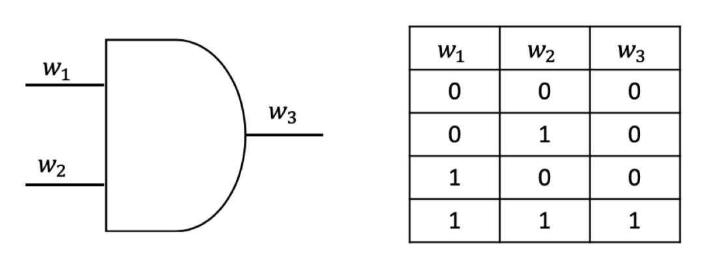
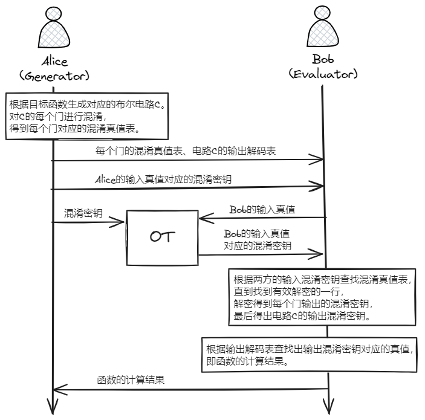
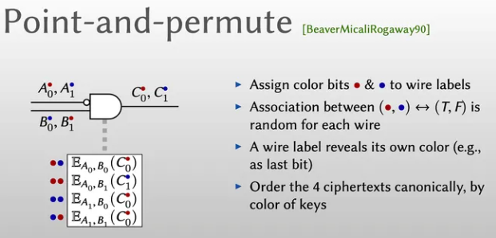

# 混淆电路

## GC

混淆电路（Garbled Circuit，GC）的思想起源于姚期智院士，之后Beaver等人提出了混淆电路的定义。混淆电路的构造从门开始，先加密一个门再延伸到加密整个电路。又叫姚氏混淆电路。

>- 支持的电路类型：支持布尔电路（布尔运算）。
>
>- 支持的参与方数量：两方。
>- 协议执行轮数：常数。

对于布尔电路来说，与或非门即可完备实现。即与或非三个门就能描述所有的布尔函数。

以与门为例，一个常见的与门及其真值表如下图所示，将该与门的输入导线记为$w_{1},w_{2}$，输出导线记为 $w_{3}$。

随机生成6个混淆密钥$\left\{ k_{1}^{0},k_{1}^{1},k_{2}^{0} ,k_{2}^{1},k_{3}^{0},k_{3}^{1}\right\}$，分别表示$w_{1},w_{2},w_{3}$这三条导线为0或1的两种情况。如$k_{1}^{0},k_{1}^{1}$分别表示$w_{1}$为0和$w_{1}$为1；$k_{3}^{0},k_{3}^{1}$分别表示$w_{3}$为0和$w_{3}$为1。

> $w_1,w_2,w_3$这些线叫做导线，混淆密钥又叫做导线标签，当计算电路时，真实输入值所对应的导线标签又可以叫做激活导线标签，该真实值可以称为激活值。

开始混淆：

1. 将真值表上的所有真值换成混淆密钥。
2. 将最后一列的混淆密钥用前两列的混淆密钥进行加密。
3. 打乱混淆真值表的行顺序。

输出线$w_3$上的混淆值$c$只有用前两列对应的混淆密钥一起才能解密出最后一列的混淆密钥，否则解密出的是无效值。

在电路中：

- 当一个输入线分成多条分别接入到多个门，其分出的每条线上的信号标记都相同。
- 对于一个门如有多个输出线，每条输出线的信号标记也都相同。

**具体协议**

上图中，“输出解码表”就是一个输出混淆密钥与输出真值对应的表，用于根据输出的混淆密钥来找到对应的真值。另外，Alice发送给Bob的混淆真值表实际上发送的是混淆真值表的最后一列（解密时一行行尝试解密）。

注意：上面是Bob来计算得到最终的计算结果，所以Alice还要发送输出解码表给Bob。

有的资料上给出的混淆电路没有发送”输出解码表“给Bob，而是在最后一步：Bob经过混淆真值表得到最终的输出的混淆密钥后，Bob将该混淆密钥发回给Alice进行解出该混淆密钥对应的真值。

## GC优化

### 标识置换

由于上述的GC协议Alice将混淆真表最后一列打乱发送给Bob，Bob在求值的时候需要拿着双方输入激活标签依次尝试解密所有的密文，时间复杂度为O(n)，浪费时间。因此，如果能给混淆真值表的每个条目一个索引，Bob求值的时候直接根据索引找到相应条目，就方便多了。

电路构造方给每个导线上的导线标签生成对应的标识比特（图上用红点蓝点表示）附加在导线标签后面，同一根导线上的导线标签所对应的标识比特是互斥的。假设输入导线标签$A_{v_A},B_{v_B}$所对应的标识比特分别为$p_A,p_B$，则将$E_{A_{v_A},B_{v_B}}(C_{v_C})$放在混淆真值表的$(p_A,p_B)$位置上。Bob在求值的时候，通过查看激活导线标签的标识比特来锁定对应条目的位置。

> 参考资料：
>
> - 【隐私计算笔谈】MPC系列专题（三）：不经意传输和混淆电路 https://zhuanlan.zhihu.com/p/376112588
> - 《实用安全多方计算导论》
> - Mike Rosulek系列课程笔记整理(四): 混淆电路及其优化(1) https://zhuanlan.zhihu.com/p/375296212
