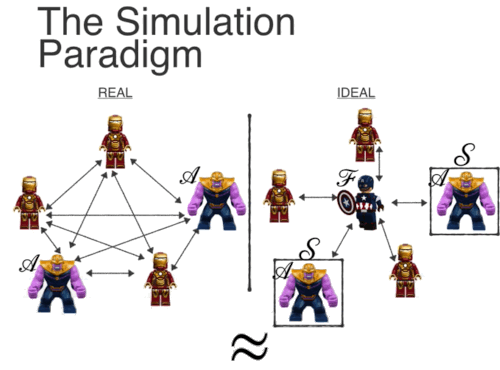

# 基于模拟的安全性证明

在零知识证明、多方安全计算等场景中，协议的参与方往往需要确保自己的秘密（输入）不能泄露给其他参与方。那么如何证明协议是安全的，参与方确实没有以某种形式泄露秘密呢？

> 什么是“模拟”?
>
> Simulation is a way of comparing what happens in the “real world” with what happens in an “ideal world” where the primitive in question is secure by definition.	-- How to Simulate It – A Tutorial on the Simulation Proof Technique

该安全性是基于“理想-现实模拟范式”进行证明的。在这个范式中，有一个模拟器试图模拟出一个理想世界，让敌手（被腐化的参与方）无法分辨出自己是在理想世界还是在现实世界。模拟器是不知道原始秘密的，因此理想世界是“零知识”的。又由于理想现实不可区分，因此在现实世界中敌手所获得的信息也是“零知识”的。因此如果存在这样一个模拟器可以模拟出这样的一个理想世界，那么该协议就满足基于模拟的安全性。

在上图中，在理想世界中，模拟器S接管了交互过程。模拟器必须做以下三件事：

1. 它必须为敌手生成一个视图，该视图与该敌手的现实视图不可区分；
2. 它必须提取敌手在协议执行过程中使用的有效输入；
3. 它必须使生成的视图与基于此输入的输出保持一致。（输出的正确性）

## 预备知识

对于一个有限集$S \subseteq\{0,1\}^*$，我们用$x \in_R S$表示$x$在集合$S$上是均匀分布的。我们用$U_n$表示集合$\{0,1\}^n$上的均匀分布。如果对于每一个正多项式$p(\cdot)$和所有的足够大的$n$，有$\mu(n)<1 / p(n)$，则函数$\mu(\cdot)$是可忽略的。最后，我们定义空串为$\lambda$。

### 计算不可区分

一个概率集合$X=\{X(a, n)\}_{a \in\{0,1\}^* ; n \in \mathbb{N}}$是多个随机变量所组成的无穷序列。在安全计算中，$a$代表参与方的输入，$n$代表安全参数。

如果对于每一个非一致多项式时间算法$D$，存在一个可忽略的函数$\mu(\cdot)$使得对于每一个$a \in\{0,1\}^*$和每一个$n \in \mathbb{N}$，
$$
|\operatorname{Pr}[D(X(a, n))=1]-\operatorname{Pr}[D(Y(a, n))=1]| \leq \mu(n)
$$
则两个概率集合$X=\{X(a, n)\}_{a \in\{0,1\}^* ; n \in \mathbb{N}}$和$Y=\{Y(a, n)\}_{a \in\{0,1\}^* ; n \in \mathbb{N}}$被称作计算性不可区分的，即$X \stackrel{\mathrm{c}}{\equiv} Y$。

所有参与方被假设是在安全参数下是多项式时间下运行的。（形式化地说，每个参与方都有一个安全参数纸带，上面写着$1^n$。那么该参与方在此纸带上的输入是多项式的。我们注意到，当一方的输入比它的整体运行时间更长时，则它甚至可能无法读取它的全部输入。）

### 非一致性

上述计算不可区分性的概念本质上是非一致的，这不仅仅是因为我们允许$D$是非一致的。

我们首先完整地写出计算不可区分的要求（不使用“不可忽略函数”的概念）：

如果对于每个非一致多项式时间算法$D$和每个多项式$p(\cdot)$，存在一个$N \in \mathbb{N}$使得对于每个$n>N$和每个$a\in \{0,1\}^*$，
$$
|\operatorname{Pr}[D(X(a, n))=1]-\operatorname{Pr}[D(Y(a, n))=1]|<\frac{1}{p(n)}
$$
现在，矛盾的点在于，存在一个$D$和一个多项式$p(\cdot)$，使得对于每个$N \in \mathbb{N}$，存在一个$n>N$和一个$a\in \{0,1\}^*$，
$$
|\operatorname{Pr}[D(X(a, n))=1]-\operatorname{Pr}[D(Y(a, n))=1]| \geq \frac{1}{p(n)}
$$
简言之，存在一个$D$和一个多项式$p(\cdot)$，使得对于无穷多个$n$，存在一个$a\in \{0,1\}^*$，
$$
|\operatorname{Pr}[D(X(a, n))=1]-\operatorname{Pr}[D(Y(a, n))=1]| \geq \frac{1}{p(n)}
$$
具体而言，这意味着对于每一个这样的$n$，都可以有一个不同的$a$。现在，如果两个概率集合在计算上是不可区分的，那么为了执行打破某些密码学原语或假设的归约，就必须知道与给定的$n$相关联的$a$的值。因此，与$n$相关的$a$值必须写在归约算法的建议纸带上，这使得它本质上是不一致的。

### 关于计算不可区分性的量词顺序

我们观察到，上述的计算不可区分的定义并不等同于说：对于每个$a \in\{0,1\}^*$有$\{X(a, n)\}_{n \in \mathbb{N}} \stackrel{\mathrm{c}}{\equiv}\{Y(a, n)\}_{n \in \mathbb{N}}$。因为上面的定义保证了对于每个$a$和每个非一致概率多项式时间算法$D$，存在一个可忽略函数$\mu$使得对于每个$n,D$以至多$\mu(n)$的概率将$X(a,n)$和$Y(a,n)$区分开来。这意味着对每一个$a$都可以有一个不同的可忽略函数，并且这个函数甚至可以依赖于$a$。特别地，考虑可忽略函数
$$
\mu_a=\begin{cases}
1, & \mbox{if   } n<2^{|a|} \\
2^{-n},  & \mbox{if   } n\ge 2^{|a|}
\end{cases}
$$
该函数满足定义要求。但是这个概念太弱，没有用。例如，对于$\mathcal{N P}$中的所有语言零知识证明将变得微不足道，因为当$n<2^{|x|}$时模拟器可以输出$\perp$（$x$是待证明的陈述），只能在$n \geq 2^{|x|}$时找到证人。这个问题在实际定义中并没有出现，因为它要求对$a \in\{0,1\}^*$的所有值都存在一个可忽略的函数。

## 语义安全

该定义允许明文的长度依赖于安全参数，并且允许明文是任意分布（只要采样的明文是多项式长度的）。该定义还考虑了可能通过其他方式泄露给敌手的明文的任意辅助信息函数$h$。敌手的目的是从密文和提供的辅助信息中学习明文的某个函数$f$（即学习明文的相关信息）。根据定义，不需要密文的情况下，仅从辅助信息（和明文长度）中学习相同的信息应该是可能的。

**定义**。A private-key encryption scheme $(G, E, D)$ is semantically secure (in the private-key model) if for every non-uniform probabilistic polynomial-time algorithm $\mathcal{A}$ there exists a non-uniform probabilistic polynomialtime algorithm $\mathcal{A}'$ such that for every probability ensemble $\{X_n\}_{n\in\mathbb{N}}$ with $\left|X_n\right| \leq \operatorname{poly}(n)$, every pair of polynomially-bounded functions $f, h:\{0,1\}^* \rightarrow\{0,1\}^*$, every positive polynomial $p(\cdot)$ and all suciently large $n$:
$$
\begin{aligned}
\operatorname{Pr}_{k \leftarrow G\left(1^n\right)} & {\left[\mathcal{A}\left(1^n, E_k\left(X_n\right), 1^{\left|X_n\right|}, h\left(1^n, X_n\right)\right)=f\left(1^n, X_n\right)\right] } \\
& <\operatorname{Pr}\left[\mathcal{A}^{\prime}\left(1^n, 1^{\left|X_n\right|}, h\left(1^n, X_n\right)\right)=f\left(1^n, X_n\right)\right]+\frac{1}{p(n)}
\end{aligned}
$$
(The probability in the above terms is taken over $X_n$ as well as over the internal coin tosses of the algorithms $G$, $E$, and $\mathcal{A}$ or $\mathcal{A}'$.)

对于任意的$f$，由于$\mathcal{A}$（给定密文）可以学习到的任何东西都可以被$\mathcal{A}'$（没有密文）学习到，说明密文$E_k\left(X_n\right)$并不能揭示任何关于$f\left(1^n, X_n\right)$的信息。

**作为模拟的语义安全。**虽然该定义没有明确提及“模拟”或理想世界，但该定义遵循了这种确切的范式。

在$\mathcal{A}'$所在的世界中，它只被给予了辅助信息、明文长度。因此，$\mathcal{A}'$存在于一个理想世界中，它学习的任何东西都只来自于辅助信息和明文长度。

将现实世界与理想世界作比较即是将$\mathcal{A}$与$\mathcal{A}'$所能学习到的东西相比较。现在可以解释为什么这种理想/现实世界的比较被称为模拟，原因在于，模拟是用来证明一个方案满足这种形式化定义的证明技术。

我们来看看如何证明一个加密方案满足上述语义安全定义。主要问题是，如何构造一个机器$\mathcal{A}'$，使其以几乎与$\mathcal{A}$相同的概率输出$f\left(1^n, X_n\right)$？$\mathcal{A}'$怎么知道$\mathcal{A}$做了什么？

答案是，$\mathcal{A}'$模拟$\mathcal{A}$的一个执行并输出$\mathcal{A}$做的事情。如果$\mathcal{A}'$能够通过给$\mathcal{A}$提供其期望的输入（$1^n, E_k\left(X_n\right), 1^{\left|X_n\right|}, h\left(1^n, X_n\right)$）来**完美地**模拟这样的执行，那么$\mathcal{A}'$将以与$\mathcal{A}$**完全相同的**概率输出$f\left(1^n, X_n\right)$。然而，显然$\mathcal{A}'$无法做到这一点，因为它没有接收$E_k\left(X_n\right)$作为输入。这可以通过让$\mathcal{A}'$给$\mathcal{A}$一个垃圾的密文（加密该垃圾）来解决：

**Simulator $\mathcal{A}^{\prime}$ :** Upon input $1^n, 1^{\left|X_n\right|}, h=h\left(1^n, X_n\right)$, algorithm $\mathcal{A}^{\prime}$ works as follows:

1. $\mathcal{A}^{\prime}$ runs the key generation algorithm $G\left(1^n\right)$ in order to receive $k$ (note that $\mathcal{A}^{\prime}$ indeed needs to be given $1^n$ in order to do this).
2. $\mathcal{A}^{\prime}$ computes $c=E_k\left(0^{\left|X_n\right|}\right)$ as an encryption of "garbage" (note that $\mathcal{A}^{\prime}$ indeed needs to be given $1^{\left|X_n\right|}$​ in order to do this).
3. $\mathcal{A}^{\prime}$ runs $\mathcal{A}\left(1^n, c, 1^{\left|X_n\right|}, h\right)$ and outputs whatever $\mathcal{A}$ outputs.

$\mathcal{A}^{\prime}$运行的模拟显然是有缺陷的：它不是给$\mathcal{A}$一个$X_n$的密文，而是给$\mathcal{A}$一个零串的密文。然而，如果密文是不可区分的，那么当给定$E_k\left(X_n\right)$时，$\mathcal{A}$应该以与给定$E_k\left(0^{\left|X_n\right|}\right)$时近似相同的概率输出$f\left(1^n, X_n\right)$。否则，可以通过观察$\mathcal{A}$是否成功输出$f\left(1^n, X_n\right)$来区分这些密文。因此，证明是通过证明$\mathcal{A}$确实不能区分两个这样的密文来进行的。即，规约工作是将**$\mathcal{A}$在两种情况下（被给予真实的密文和“垃圾”的密文）正确输出$f\left(1^n, X_n\right)$的概率是否是不可区分的**转换成**真实的密文和“垃圾”的密文是否是不可区分的**。例如，如果加密工作是通过将明文与伪随机发生器的输出进行异或操作，那么归约工作是说明：$\mathcal{A}$在两种情况下（被给予真实的密文和“垃圾”的密文）正确输出$f\left(1^n, X_n\right)$的概率之间任意不可忽略的差别可以转换为以不可忽略的概率将伪随机发生器的输出与随机串进行区分的区分器（distinguisher）：
$$
PRG \stackrel{\mathrm{c}}{\not\equiv} Random
$$

> 侧面印证了语义安全和密文不可区分性是等价的。

这种工作方式实际上是所有基于模拟的证明的典型。模拟器以某种方式模拟敌手的执行，同时将看起来难以区分的“垃圾”交给对手。然后，表明模拟是成立的，否则给定的假设可以被打破。

## 安全计算--半诚实敌手的模拟

### 背景

我们这里考虑的模型是在静态半诚实（static semi-honest）敌手存在的情况下的两方计算模型。这样的敌手控制其中一方（静态的，在计算开始时也是如此），并严格遵循协议规范。然而，它可能试图通过查看收到的消息的记录（transcript）及其内部状态来学习超过允许的信息。

### 定义半诚实敌手的安全性

**两方计算。**通过指定一个可能的随机过程，将输入对映射到输出对，从而产生一个两方协议问题。我们将这样一个过程称为functionality（函数），记为$f:\{0,1\}^* \times \{0,1\}^* \rightarrow\{0,1\}^* \times\{0,1\}^*$，其中$f=\left(f_1, f_2\right)$。也就是说，对于每一对输入$x,y\in \{0,1\}^n$，输出对为随机变量$(f_1(x, y), f_2(x, y))$。第一个参与方（输入为$x$）想要得到$f_1(x,y)$，第二个参与方（输入为$y$）想要得到$f_2(x,y)$。

**模拟下的隐私。**我们希望形式化的想法是，如果任何可以由参与协议的一方计算的东西都可以仅根据它的输入和输出来计算，则协议是安全的。换言之，参与方能学习到的所有东西都是从其输入和输出中所\begin学习得到的，说明参与方学习不到**超过允许的知识**。

> 在两方安全计算中（例如两方安全求和），一方得到其输入和输出（求和的结果），可以根据其输入输出反推出另一方的输入，虽然得到了另一方的输入，侵犯了输入隐私，但是由于是根据其输入输出计算而来的，所以在该定义下另一方的输入其实是允许的知识。

这是根据模拟范式进行形式化的：要求存在一个模拟器，该模拟器在执行中生成一方的视图。由于这里的参与方都有输入和输出，所以模拟器必须得到参与方的输入和输出才能生成视图。因此，这里安全性被形式化，通过说明：在协议执行中，一方的视图在给定该参与方的输入和输出的情况下是可模拟的。

> 这种表达意味着，参与方从协议的执行中除了从输入和规定的输出中可以得到的东西以外，什么也学不到。因为模拟器除了输入和输出以外什么也没有。

**安全定义。**定义以下符号：

- 令$f=(f_1,f_2)$为概率多项式时间函数（functionality），令$\pi$为计算$f$​的两方协议。（每当我们考虑一个函数时，我们总是假设它是多项式时间可计算的）
- 在$\pi$在$(x,y)$和安全参数$n$上执行的过程中，第$i$参与方（$i\in \{1,2\}$）的视图表示为$\textsf{view}_i^\pi(x, y, n)=\left(w, r^i ; m_1^i, \ldots, m_t^i\right)$，其中$w \in\{x, y\}$（该参与方的输入，$x$或$y$），$r^i$为第$i$参与方内部随机纸带的内容，$m_j^i$代表其收到的第$j$条消息。
- 在$\pi$在$(x,y)$和安全参数$n$上执行的过程中，第$i$参与方的输出表示为$\textsf{output}_i^\pi(x, y, n)$，可以从该参与方的视图中计算得到。我们将两个参与方的联合输出表示为$\textsf{output}^\pi(x, y, n)=(\textsf{output}_1^\pi(x, y, n),\textsf{output}_2^\pi(x, y, n) )$。

**定义1**：Let $f = ( f_1, f_2)$ be a functionality. We say that securely computes $f$ in the presence of static semi-honest adversaries if there exist probabilistic polynomial-time algorithms $\mathcal{S}_1$ and $\mathcal{S}_2$ such that
$$
\begin{aligned}
&\left\{\left(\mathcal{S}_1\left(1^n, x, f_1(x, y)\right), f(x, y)\right)\right\}_{x, y, n} \stackrel{\mathrm{c}}{\equiv}\left\{\left(\textsf{view}_1^\pi(x, y, n), \textsf{output}^\pi(x, y, n)\right)\right\}_{x, y, n},
\text{and}\\
&\left\{\left(\mathcal{S}_2\left(1^n, x, f_2(x, y)\right), f(x, y)\right)\right\}_{x, y, n} \stackrel{\mathrm{c}}{\equiv}\left\{\left(\textsf{view}_2^\pi(x, y, n), \textsf {output}^\pi(x, y, n)\right)\right\}_{x, y, n},
\end{aligned}
$$
where $x, y \in\{0,1\}^*$ such that $|x|=|y|$, and $n \in \mathbb{N}$.

从上述定义中可以看出，仅仅让模拟器$\mathcal{S}_i$生成一个与$\textsf{view}_i^\pi(x, y, n)$不可区分的串是不够的。模拟器的输出$\mathcal{S}_i\left(1^n, x, f_1(x, y)\right)$和函数输出$f(x,y)=(f_1(x, y), f_2(x, y))$的联合分布必须与$\left(\textsf{view}_i^\pi(x, y), \textsf{output}^\pi(x, y)\right)$不可区分。这对于概率函数是必要的。特别地，考虑参与方安全地计算一些随机函数$f(x,y)$的情况，其中参与方收到不同的输出。例如，令$x$和$y$是数据元素的列表，令$f$为一个函数，其输出$x\cup y$​的一个独立随机样本给每个参与方（每个参与方得到的输出是相互独立的）。

如果对于上面的案例，若安全定义不考虑带有输出的联合分布：
$$
\begin{aligned}
& \left\{\mathcal{S}_1\left(1^n, x, f_1(x, y)\right)\right\}_{x, y, n} \stackrel{\mathrm{c}}{\equiv}\left\{\textsf{view}_1^\pi(x, y, n)\right\}_{x, y, n}, \text { and } \\
& \left\{\mathcal{S}_2\left(1^n, y, f_2(x, y)\right)\right\}_{x, y, n} \stackrel{\mathrm{c}}{\equiv}\left\{\textsf{view}_2^\pi(x, y, n)\right\}_{x, y, n} .
\end{aligned}
$$
那么在该定义下，如果该协议安全地输出相同的随机样本给双方（每一方的视图都可以被模拟），那么该协议便符合上面更简单的定义。但是，按理说，其中一个参与方不应该有关于另一方所收到的输出的信息，所以，显然该协议是不安全的。所以，这种“阉割”的定义并不严谨，因为每个输出相互独立的要求不能通过单独看待每个输出（$f_i(x,y)$）来表达。

所以，我们应该将各方所收到的输出的联合分布考虑进来，即定义1。

**对于确定性函数的更简单形式。**在函数$f$是确定性函数的情况下，可以使用上述更简单的定义（伴随着额外的正确性要求），因为上面描述的问题不会出现。

该定义有两个要求：a）正确性（correctness），即参与方的输出是正确的；b）隐私性（privacy），即每个参与方的视图可以（单独）模拟。

a）正确性：There exists a negligible function such that for every $x, y \in\{0,1\}^*$ and every $n$,
$$
\textsf{Pr}\left[\textsf{output}^\pi(x, y, n) \neq f(x, y)\right] \leq \mu(n)
$$
b）隐私性：There exist probabilistic polynomial-time $\mathcal{S}_1$ and $\mathcal{S}_2$ such that
$$
\begin{aligned}
& \left\{\mathcal{S}_1\left(1^n, x, f_1(x, y)\right)\right\}_{x, y \in\{0,1\}^* ; n \in \mathbb{N}} \stackrel{\mathrm{c}}{\equiv}\left\{\textsf{view}_1^\pi(x, y, n)\right\}_{x, y \in\{0,1\}^* ; n \in \mathbb{N}}, \\
& \left\{\mathcal{S}_2\left(1^n, y, f_2(x, y)\right)\right\}_{x, y \in\{0,1\}^* ; n \in \mathbb{N}} \stackrel{\mathrm{c}}{\equiv}\left\{\textsf{view}_2^\pi(x, y, n)\right\}_{x, y \in\{0,1\}^* ; n \in \mathbb{N}} .
\end{aligned}
$$
对于确定性函数$f$，任何满足正确性和隐私性要求的协议都是安全的（满足上述安全定义1）。

我们可以观察到，区分器是被给予了$x,y$的，所以可以自己计算$f(x,y)$。因此
$$
\left\{\mathcal{S}_1\left(1^n, x, f_1(x, y)\right)\right\}_{x, y \in\{0,1\}^* ; n \in \mathbb{N}} \stackrel{\mathrm{c}}{\equiv}\left\{\textsf{view}_1^\pi(x, y, n)\right\}_{x, y \in\{0,1\}^* ; n \in \mathbb{N}} \tag{1}
$$
意味着
$$
\left\{\left(\mathcal{S}_1\left(1^n, x, f_1(x, y)\right), f(x, y)\right)\right\}_{x, y, n} \stackrel{\mathrm{c}}{\equiv}\left\{\left(\textsf{view}_1^\pi(x, y, n), f(x, y)\right)\right\}_{x, y, n} \tag{2}
$$
此外，正确性要求保证了输出$\textsf{output}^\pi(x, y, n)$与$f( x , y)$在计算上不可区分：
$$
\left\{\left(\textsf{view}_1^\pi(x, y, n), f(x, y)\right)\right\}_{x, y, n} \stackrel{\mathrm{c}}{\equiv}\left\{\left(\textsf{view}_1^\pi(x, y, n), \textsf{output}^\pi(x, y, n)\right)\right\}_{x, y, n}
$$
综上所述，我们有：
$$
\left\{\left(\mathcal{S}_1\left(1^n, x, f_1(x, y)\right), f(x, y)\right)\right\}_{x, y, n} \stackrel{\mathrm{c}}{\equiv}\left\{\left(\textsf{view}_1^\pi(x, y, n), \textsf{output}^\pi(x, y, n)\right)\right\}_{x, y, n}
$$
因此，该协议满足定义1。

上述更简单的定义放在概率函数上不成立，原因是公式（2）需要被理解为给等式两边一个$f ( x , y)$的相同样本。然而，当我们说区分器可以自行计算$f(x,y)$时，并不是说它可以对$f(x,y)$进行采样，从而使$f_1 ( x, y)$与给模拟器的输入相同。由于$f ( x , y)$是一个定义好了的单值，因此对于确定性函数不存在这个问题。因此，由式（1）推导到式（2）只对确定性函数成立。

**辅助信息。**在语义安全定义中，明确地向攻击者提供了辅助信息。相比之下，这里似乎没有任何辅助信息。然而，由于需要计算非一致敌手的不可区分性，辅助输入在定义中是隐式的。因此，区分器被赋予辅助输入。值得注意的是，没有必要向运行协议的敌手提供任何辅助信息，因为它是半诚实的，因此不管任何辅助输入，都遵循完全相同的指令。

> 参考资料：
>
> - Simulation-Based Security https://aandds.com/blog/zkp-simu.html
> - How to Simulate It – A Tutorial on the Simulation Proof Technique