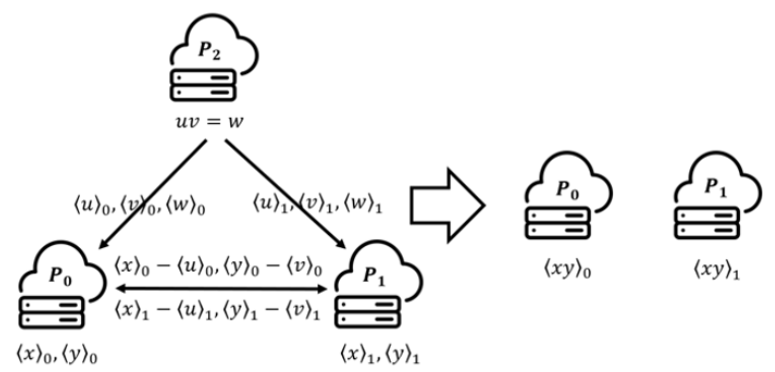

# 秘密分享

有$n$个参与方$P_1,...,P_n$，腐化门限为$t$（不诚实参与方的最大数量）。

在这里说明一下两个概念：

- 重构算法：指某个特定的参与方/秘密重构方恢复秘密。

- 打开算法：指大家公开自己的秘密份额，所有人都恢复秘密。相当于将重构算法运行$n$次。

下面都按重构算法来说明。

## 布尔秘密分享

Boolean Secret Sharing，基于异或门（XOR）。

**秘密：**$x\in \{0,1\}^l$，为一个比特串。

**分享：**$x = \langle x\rangle_1 \oplus \langle x\rangle_2\oplus ... \oplus \langle x\rangle_n ,\langle x\rangle_i\in \{0,1\}^l$

$\langle x\rangle_i$发送给参与方$P_i$。

两方场景下（$n=2$）：

- $P_i$随机选取一个$r\in_R \{0,1\}^l$。计算$\langle x\rangle_i=x\oplus r$，并将$r$发送给$P_{1-i}$。
- $P_{1-i}$直接令$\langle x\rangle_{1-r}=r$

同理，也可以拓展到多方的场景下。

**重构：**各方将各自的秘密份额发送给需要重构的一方，做计算：$x = \langle x\rangle_1 \oplus \langle x\rangle_2\oplus ... \oplus \langle x\rangle_n$

## 算术秘密分享

> 事实上关于算术秘密分享似乎并没有明确的定义。Arithmetic Secret Sharing最早在2011年"The Torsion-Limit for Algebraic Function Fields and Its Application to Arithmetic Secret Sharing"中提出。但是原文给出的定义也并不明确：
>
> An $(n,t,d,n−t)$-arithmetic secret sharing scheme (with uniformity) for $\mathbb{F}_q^k$ over $\mathbb{F}_q$ is an $\mathbb{F}_q$-linear secret sharing scheme where $k,n,t≥1, d≥2$, the secret is selected from $\mathbb{F}_q^k$ and each of the $n$ shares is an element of $\mathbb{F}_q$. Moreover, there is $t$-privacy (in addition, any $t$ shares are uniformly random in $\mathbb{F}_q^k$) and, if one considers the $d$-fold “component-wise” product of any $d$ sharings, then the $d$-fold component-wise product of the $d$ respective secrets is $(n−t)$-wise uniquely determined by it.
>
> - d-fold “component-wise” product：指将d个向量的各个分量进行逐元素相乘得到的结果向量。
>
> 所以算术秘密分享应当是一个广泛的概念，代指那些基于算术运算的线性秘密分享方案。

Arithmetic Secret Sharing，基于算术运算。

以下加法秘密分享、shamir秘密分享和复制秘密分享主要定义在一个域$\mathbb{F}$上, 也能扩展到一般环上（如整数环$\mathbb{Z}_{2^k}$，$k$一般为32或64）。

### 加法门

基于线性性质完成加法门，所以下面的秘密分享同样也是线性秘密分享（Linear Secret Sharing）。

【线性性质/加法同态性】所有参与方均可以本地计算以下秘密份额：

- 给定$\langle x\rangle ,\langle y\rangle$，可以本地计算$\langle x+y\rangle = \langle x\rangle + \langle y\rangle$。即份额的和等于和的份额。
- 给定$\langle x\rangle$和一个公开常数$c$，可以本地计算$\langle x+c\rangle = \langle x\rangle + c$。
- 给定$\langle x\rangle$和一个公开常数$c$，可以本地计算$\langle c\cdot x\rangle = c \cdot \langle x\rangle$。

即对于两个秘密$x,y$，$\langle x+y\rangle = \langle x\rangle + \langle y\rangle$。进一步也可得，$\langle c\cdot x\rangle = c\cdot \langle x\rangle $。

#### 加法秘密分享

Additive Secret Sharing，以加法形式拆分秘密。

**秘密：**$x\in \mathbb{F}$。

**分享：**$x = \langle x\rangle_1 + \langle x\rangle_2+ ... + \langle x\rangle_n ,\langle x\rangle_i\in \mathbb{F}$

$\langle x\rangle_i$发送给参与方$P_i$。

**重构：**各方将各自的秘密份额发送给需要重构的一方，做计算：$x = \langle x\rangle_1 + \langle x\rangle_2 + ... + \langle x\rangle_n$

**性质：**具备线性性质。

**威胁模型：**$t=n-1$。不能抵抗恶意参与方，这$t$个被腐化的参与方必须是半诚实的，不能是恶意的。

#### 复制秘密分享

Replicated Secret Sharing，以冗余备份的形式拆分秘密，在加法秘密分享的基础上允许每个参与方获得多份秘密份额。参与方数量需要较小，否则会组合爆炸。

**秘密：**$x\in \mathbb{F}$。

**分享：**以$n=3$为例，$x = \langle x\rangle_0 + \langle x\rangle_1 + \langle x\rangle_2 ,\langle x\rangle_i\in \mathbb{F}$

$(\langle x\rangle_{i-1}, \langle x\rangle_{i+1})$发送给参与方$P_i$，其中$i-1,i+1$的计算在$mod 3$下执行。

**重构：**各方将各自的秘密份额发送给需要重构的一方，做计算：$x = \langle x\rangle_0 + \langle x\rangle_1 + ... + \langle x\rangle_n$

**性质：**具备线性性质。

**威胁模型：**$t<n/2$。被腐化的参与方可以是恶意的，可以验证出发送来的秘密份额中是否有恶意的秘密份额，但是验证不出哪个参与方是恶意的。

假设3PC场景，$P_3$是恶意的，即$P_3$会发送错误的$(\langle x\rangle_{1}', \langle x\rangle_{2}')$给秘密重构方，秘密重构方收到$(\langle x\rangle_{0}, \langle x\rangle_{2}),(\langle x\rangle_{1}, \langle x\rangle_{0}),(\langle x\rangle_{1}', \langle x\rangle_{2}')$，这样，其比较$\langle x\rangle_0 + \langle x\rangle_1 + \langle x\rangle_2 = \langle x\rangle_0 + \langle x\rangle_1' + \langle x\rangle_2'$是否成立，如果不成立，说明有人发送了错误的秘密份额。

注意，上面哪怕再有一个非恶意参与方掉线，都无法完成恶意行为的识别。

==可见，掉线+恶意参与方的数量之和上限为$t<n/2$。==

#### Shamir秘密分享

Shamir Secret Sharing，基于拉格朗日插值进行秘密分享。

**秘密：**$s\in \mathbb{F}$。

**分享：**秘密分发方生成一个$t$次多项式$f(x)=a_{t}x^{t}+...+a_{1}x+s$（即随机生成这些系数$a_i\in \mathbb{F}$）。显然$f(0)=s$。

> 也等价于随机生成$t$个点，加上$(0,x)$这一点，一共$t+1$个点插值出$t$次多项式。这样，至少需要$t+1$个点才能重新插值出该曲线。

秘密分发方再随机生成$n$个整数$\alpha_1,...,\alpha_n \in \mathbb{F}$作为多项式曲线上$n$个点的横坐标。

$\langle s\rangle_i = f(\alpha_i)$作为$P_i$的份额，发送给$P_i$。

**重构：**各方将各自的秘密份额发送给需要重构的一方，收集至少$t+1$个秘密份额后，通过拉格朗日插值出$f(x)$，进而得到$s=f(0)$。

**性质：**具备线性性质。

**威胁模型：**$t< n/2$。被腐化的参与方可以是恶意的，可以验证出发送来的秘密份额中是否有恶意的秘密份额，但是验证不出哪个参与方是恶意的。

假设有$t=\lfloor (n-1)/2\rfloor$个参与方发送过来错误的秘密份额，秘密重构方一共收到$n$个秘密份额。不管收到秘密份额的顺序是什么，秘密重构方先将前$t+1$个秘密份额插值出一个$t$次多项式$f'$，然后用该多项式验证后$n-t-1$个秘密份额是否都在曲线$f'$上，若有秘密份额不在$f'$上，说明发来的$n$个秘密份额中有秘密份额出了错，使得这$n$个点不在同一个$t$次多项式上。

注意，假如只收到$t+1$个秘密份额，只能恰好插值出$t$次多项式，便无法验证。

==可见，若要能验证恶意行为，掉线上限为$n-t-2$，也就是起码得收到$t+2$个份额。==

> 拉格朗日插值法具体参见：https://changtiwu.github.io/myBase/#/scitech/math/%E6%8F%92%E5%80%BC%E6%B3%95

#### 打包秘密分享

Packed Secret Sharing，Shamir秘密分享的推广形式，可以一次性分享$k$个秘密。

**秘密：**$s_1,...,s_k \in \mathbb{F}$。

**分享：**令$f(\beta_i)=x_i$，再随机生成$t$个点，秘密分发方利用该$k+t$个点插值出一个$t+k-1$次多项式$f(x)$。

>这样，至少需要$t+k$个点才能重新插值出该曲线。

秘密分发方再随机生成$n$个整数$\alpha_1,...,\alpha_n \in \mathbb{F}$作为多项式曲线上$n$个点的横坐标。

$\langle s\rangle_i = f(\alpha_i)$作为$P_i$的份额，发送给$P_i$。

**重构：**各方将各自的秘密份额发送给需要重构的一方，收集至少$t$个秘密份额后，通过拉格朗日插值出$f(x)$。

**性质：**具备线性性质。

**威胁模型：**$t+k\leq n/2$

### 乘法门

乘法门的秘密分享相对加法就没有那么简单了，因为以两方场景为例，$xy = (\langle x\rangle_1+\langle x\rangle_2)(\langle y\rangle_1+\langle y\rangle_2) = \langle x\rangle_1 \langle y\rangle_1+ \langle x\rangle_1 \langle y\rangle_2+ \langle x\rangle_2 \langle y\rangle_1+\langle x\rangle_2 \langle y\rangle_2$，如果要秘密安全计算$xy$，需要交换$\langle x\rangle_1 , \langle x\rangle_2$，这样$x$的信息就会被泄露。

#### Beaver三元组

两方协作计算一个乘积：假设秘密$x$和$y$已经被分享，即$P_0$持有$\langle x\rangle_0,\langle y\rangle_0$，$P_1$持有$\langle x\rangle_1,\langle y\rangle_1$，两方想得到乘积$xy$的份额$\langle xy\rangle$，即$P_0$持有$\langle xy\rangle_0$，$P_1$持有$\langle xy\rangle_1$。

每个“乘法门“的计算都需要消耗一个Beaver三元组，在预处理阶段需要提前计算出大量的Beaver三元组以备用。

**威胁模型**

参与方全部半诚实。

**协议**

在协议开始之前预先生成一个beaver三元组$(u,v,w)$，随机选取$u,v\in \mathbb{Z}_{2^L}$使得$w=uv$，其中$u,v$对所有参与方保密（本例由第三方$P_2$生成）。

$P_2$生成三元组的份额$(\langle u\rangle_0,\langle v\rangle_0,\langle w\rangle_0)$和$(\langle u\rangle_1,\langle v\rangle_1,\langle w\rangle_1)$分发给$P_0,P_1$，其中$u=\langle u\rangle_0+\langle u\rangle_1, v=\langle v\rangle_0+\langle v\rangle_1, w=\langle w\rangle_0+\langle w\rangle_1$。

$P_0$计算$\langle x-u\rangle_0=\langle x\rangle_0-\langle u\rangle_0, \langle y-v\rangle_0=\langle y\rangle_0-\langle v\rangle_0$发送给$P_1$；$P_1$计算$\langle x-u\rangle_1=\langle x\rangle_1-\langle u\rangle_1, \langle y-v\rangle_1=\langle y\rangle_1-\langle v\rangle_1$发送给$P_0$。

> 这一步是为了所有参与方都能计算得到$(x-u),(y-v)$。

$P_0$计算
$$
\langle xy\rangle_0
=(x-u)(y-v)+\langle (x-u)v\rangle_0+\langle u(y-v)\rangle_0+\langle w\rangle_0 \\
=(\langle x-u\rangle_0+\langle x-u\rangle_1)(\langle y-v\rangle_0+\langle y-v\rangle_1)+(x-u)\langle v\rangle_0+(y-v)\langle u\rangle_0+\langle w\rangle_0
$$
$P_1$计算
$$
\langle xy\rangle_1
=\langle (x-u)v\rangle_1+\langle u(y-v)\rangle_1+\langle w\rangle_1 \\
=(x-u)\langle v\rangle_1+(y-v)\langle u\rangle_1+\langle w\rangle_1
$$

### 可认证秘密分享

加法秘密分享不能抗恶意敌手，即存在恶意实体发送错误的分享使得打开的秘密是错误的。为了达到恶意安全性，目前最有效的方法是嵌入信息论消息认证码（information-theoretic message authentication code，IT-MAC）到加法秘密分享中，从而实现对秘密值的认证。在诚实大多数情况下，没有必要嵌入IT-MACs到Shamir或复制秘密分享中，因为两类秘密分享已经在大部分实体诚实的情况下保证了打开秘密的正确性（即大部分诚实参与方的份额已经确定了秘密值）。

#### BDOZ

Bendlin-Damgard-Orlandi-Zakarias（BDOZ）在2011被提出。其在秘密分享中引入了信息论安全的消息认证码（IT-MAC）。

$MAC_{K,\Delta}(x)=K+\Delta \cdot x$是一个信息论安全的一次性MAC。$K,\Delta \in \mathbb{F}$是其密钥。

> 一次性MAC是指，持有MAC密钥的参与方只能使用此MAC密钥生成一个MAC。

在BDOZ中，$\Delta$被称为全局MAC密钥，$K$被称为本地MAC密钥。每个参与方所持有的$\Delta$在自己的所有MAC中保持不变，但是$K$在每个MAC中是不一样的。

BDOZ的核心思想是用这些信息论安全的MAC认证各个参与方的秘密份额。

【以2PC为例（$n=2$）】

**秘密：**$x\in \mathbb{F}$。

- 每个参与方$P_i$均生成自己的全局MAC密钥$\Delta_i$。
- 在每次分享中：
  - $P_i$生成本次MAC的本地密钥$K_i$。
  - $P_1$持有$(\langle x\rangle_1 , m_1)$。其中$m_1=MAC_{K_2,\Delta_2}(\langle x\rangle_1)$；
  - $P_2$持有$(\langle x\rangle_2 , m_2)$。其中$m_2=MAC_{K_1,\Delta_1}(\langle x\rangle_2)$；
- 打开：$P_i$公开自己的$(\langle x\rangle_i , m_i)$，各方均能基于加法同态性恢复出$x$。
- 认证：
  - $P_1$拿到$\langle x\rangle_2$后，用自己的MAC密钥验证$m_2=MAC_{K_1,\Delta_1}(\langle x\rangle_2)$是否成立。
  - $P_2$同理。

该IT-MAC同样具有加法同态性：

- $P_1$持有$(\langle x\rangle_1 , K_2 + \Delta_2 \cdot \langle x\rangle_1),(\langle y\rangle_1 , K_2' + \Delta_2 \cdot \langle y\rangle_1)$。那么
  - $\langle x+y\rangle_1 = \langle x\rangle_1 + \langle y\rangle_1$
  - $K_1 + K_1' + \Delta_2 \cdot \langle x+y\rangle_1 = K_2 + \Delta_2 \cdot \langle x\rangle_1 + K_2' + \Delta_2 \cdot \langle y\rangle_1$。即MAC的和仍然是和的MAC，对秘密的和仍然具有认证性。
- $P_2$同理。

#### SPDZ

在BDOZ中，每个参与方的每一个份额$\langle x\rangle$都必须保留其他$n-1$方对其认证的MAC，即$n-1$份MAC。换句话说，协议的存储复杂度随参与方数量的增加而线性增长。为解决此问题，Damgard、Pastro、Smart和Zakarias（SPDZ）提出了一个新的方案，将各个参与方可认证秘密份额的存储复杂度降低为常数。

SPDZ中的MAC为$MAC_\Delta = \Delta \cdot x$。SPDZ的核心思想是设置一个全局MAC密钥$\Delta$，但任何参与方都无法获得这个全局MAC密钥。相反，各参与方持有该全局MAC密钥的份额。

【以2PC为例（$n=2$）】

**秘密：**$x\in \mathbb{F}$。

- 随机生成全局MAC密钥$\Delta \in \mathbb{F}$。
- 在每次分享中：
  - $P_1$持有$(\langle x\rangle_1, \langle \Delta \rangle_1 , \langle MAC_\Delta (x)\rangle_1)$。
  - $P_2$持有$(\langle x\rangle_2, \langle \Delta \rangle_2 , \langle MAC_\Delta (x)\rangle_2)$。

- 打开：参与方不能直接公开其可认证秘密份额$(\langle x\rangle_i , \langle MAC_\Delta (x)\rangle_i)$，因为这样敌手就可以恢复出正确的$x$和$MAC_\Delta (x)=\Delta \cdot x$，从而获得全局MAC密钥$\Delta$。然后恶意敌手便可以根据$\Delta$伪造错误的秘密份额的MAC。为了不泄露$\Delta$，协议要分3个阶段打开秘密：

  - 参与方$P_i$只公开自己的秘密份额$\langle x\rangle_i$。此时可以恢复出原始秘密的候选值（此时$x$未被认证）。

  - 如果$x$的候选值是正确的，则
    $$
    \begin{aligned}
    &(\langle \Delta \rangle_1 \cdot x - \langle MAC_\Delta (x)\rangle_1)
    +(\langle \Delta \rangle_2 \cdot x - \langle MAC_\Delta (x)\rangle_2) \\
    &=(\langle \Delta \rangle_1 + \langle \Delta \rangle_2)\cdot x - (\langle MAC_\Delta (x)\rangle_1 + \langle MAC_\Delta (x)\rangle_2) \\
    &=\Delta \cdot x - MAC_\Delta (x) \\
    &=0
    \end{aligned}
    $$
    其中，$P_1$可以本地计算第一项；$P_2$可以本地计算第二项。随后$P_i$披露$\Delta \cdot x - MAC_\Delta (x)$的份额$\langle \Delta \rangle_i \cdot x - \langle MAC_\Delta (x)\rangle_i$给其他参与方，便可以验证上述等式了。

    但是如此一来会存在一个问题：比如$P_2$为恶意，其收到$P_1$发送过来的$\langle \Delta \rangle_1 \cdot x - \langle MAC_\Delta (x)\rangle_1$后，可以选择一个适当的$\langle \Delta \rangle_2 \cdot x - \langle MAC_\Delta (x)\rangle_2$再发送给$P_1$使其仍然通过验证。

    所以在发送$\langle \Delta \rangle_i \cdot x - \langle MAC_\Delta (x)\rangle_i$之前，$P_i$需要对$\langle \Delta \rangle_i \cdot x - \langle MAC_\Delta (x)\rangle_i$作出承诺。

  - 参与方打开承诺，若被承诺的值的和不等于0，则终止协议。

可以看出，SPDZ的核心思想是，各方通过$(\langle x\rangle_i, \langle \Delta \rangle_i , \langle MAC_\Delta (x)\rangle_i)$来计算生成验证等式的秘密份额$\langle \Delta \cdot x - MAC_\Delta (x) \rangle_i$，最后恢复出验证等式来进行认证。

显然，该IT-MAC同样具有加法同态性。

> 参考资料：
>
> 1. ABY – A Framework for Efficient Mixed-Protocol Secure Two-Party Computation
> 2. 隐私保护计算密码技术研究进展与应用, 中国科学 : 信息科学 2023 年 第 53 卷 第 9 期: 1688–1733
> 3. [What is the difference between any secret sharing scheme and arithmetic secret sharing scheme](https://crypto.stackexchange.com/questions/24381/what-is-the-difference-between-any-secret-sharing-scheme-and-arithmetic-secret-s)
> 4. Beaver, D., 1991. Efficient multiparty protocols using circuit randomization, in: Feigenbaum, J. (Ed.), Advances in Cryptology - CRYPTO ’91, 11th Annual International Cryptology Conference, Santa Barbara, California, USA, August 11-15, 1991, Proceedings, Springer. pp. 420–432. URL: https://doi.org/10.1007/3-540-46766-1_34, doi:10.1007/3- 540- 46766- 1\_34.
> 5. Towards Secure and Practical Machine Learning via Secret Sharing and Random Permutation