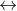
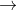
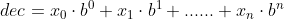
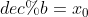
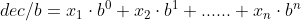
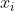
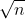

 持续更新中……

## 常用函数方法

### 1、接受空格输入

- cin.get()接受单个字符，接受空格输入，遇\n或EOF结束。

  [C++ cin.get用法（详解版）](http://c.biancheng.net/view/1346.html)

  ```cpp
  string s;
  cin.get();//把输入缓冲区中的\n剃掉
  cin.get(s);//为s读取单个字符，遇\n EOF结束
  ```

  

- getline()接受一行字符，接受空格输入，遇\n或EOF结束。

  [C++ getline函数用法详解](http://c.biancheng.net/view/1345.html)

  ```cpp
  string s;
  while(getline(cin, s)){//输入多个案例
      if(s == "")break;
      ......
  }
  ```

  

### 2、数学计算

**求最大值**

```cpp
#include<algorithm>
int max(int x, int y)

#include<math.h>
double fmax(double x, double y)
```


**求绝对值**

```cpp
#include<stdlib.h>
int abs(int x)

#include<math.h>
double fabs(double x)
```


**幂函数**

```cpp
#include<math.h>
double pow(double x, double y) //求x的y次幂
double exp(double x)           //求e的x次幂
```


 **开平方**

```cpp
#include<math.h>
double sqrt(double x)
```


**三角函数**

```cpp
#include<math.h>

double sin(double x) //sin x
double cos(double x) //cos x
double tan(double x) //tan x

double asin(double x) //arcsin x
double acos(double x) //arccos x，π值可以用arccos(-1)表示
double atan(double x) //arctan x
```


 **对数**

```cpp
#include<math.h>
double log(double x)    //以e为底x的对数
double log10(double x)  //以10为底x的对数
```


### 3、int  string

**int  string**

```cpp
#include <string>

int a=123;
string str=to_string(a);
```


或

```cpp
#include <sstream>

string str;
int a;
stringstream ss;
ss<<a;
ss>>str;
```


**string  int**

```cpp
#include <sstream>

string str;
int a;
stringstream ss;
ss<<str;
ss>>a;
```


多次使用stringstream时，用完一次要ss.clear()一次清空缓冲区。

### 4、char  string

```cpp
char ch='a';
string s(1,ch)  //string (size_t n, char c);
```


string是一个字符数组指针。包含单字符的string不能直接转成char，可以先转成char*，再取值。单字符string赋值给其他变量时同样需要下标[0]取值。

```cpp
string a = "5";
string b = "1234";

b[0] = a[0];//字符串b首字符替换成a
```


### 5、输出保留小数点后指定位数

```cpp
double res;

//C 保留小数点后2位
printf("%.2lf\n", res);

//C++ 保留小数点后2位
cout.setf(ios::fixed);
cout << setprecision(2) << res << endl;
```


### 排序

**头文件**

```cpp
#include<algorithm>
```


使用的是什么算法？

参考：[C++一道深坑面试题：STL里sort算法用的是什么排序算法？_std lg-CSDN博客](https://blog.csdn.net/qq_35440678/article/details/80147601)

用到的是快速排序，但不完全是快速排序，还结合了插入排序和堆排序。

- 快速排序时间复杂度并不是稳定的O(nlogn)，在排序表接近基本有序或逆序时，会退化成O(n^2)。
- 在数据量小的情况下，递归所造成的内存消耗不划算。
- 递归深度很大的情况下，空间消耗很大。

所以sort采取的排序方法如下：数据量大的情况下采取快速排序，当数据量小于某个阈值（16）的时候，采用插入排序，当递归深度过大的时候，采用堆排序。

编辑

**用法**

**1.默认对一维数组升序排列**

 sort(&begin,&end); //sort(起始地址，末地址);

```cpp
int a[n];
sort(a,a+n);//+n为元素个数，并非字节数
```


 **2.对一维数组降序排列**

增加一个参数排序规则cmp，并编写这个排序规则cmp()。

```cpp
bool cmp(int a,int b)  //自定义一个排序函数
{
    return a>b; //降序排列，如果改为return a<b，则为升序
}

int a[n];
sort(a,a+n,cmp);
```


**3.对结构体排序**

对cmp()函数稍加修改。

```cpp
struct node  //创建一个结构体代表每一个活动 
{
	int st,endd;//起止时间 
}data[100];
bool cmp(node a, node b)
{
	return a.endd < b.endd;//"<"就是升序排列；">"是降序排列
}
sort(data,data+n,cmp);//把所有活动按照结束时间进行升序排序
```


**4.对vector排序**

默认升序

```cpp
vector<int> v;
sort(v.begin(),v.end());
```


使用cmp

```cpp
bool cmp(int a,int b)
{
    return a>b;
}

vector<int> v;
sort(v.begin(),v.end(),cmp);
```


## 经典代码段

### 1、求反序数

求一个非负整数data的反序数。

```cpp
/*
    每一次循环：
    先将res整体左移空出个位，
    将data末尾位加到res个位，
    砍掉data末尾位。
*/
int reverse(int data){//计算反序数
    int res = 0;
    while(data){
        res *= 10;
        res += data % 10;
        data /= 10;
    }
    return res;
}
```


### 2、日期问题

有关日期处理的问题：

- 预处理，列出所有月份的天数并保存，更便捷；
- 闰年（两种情况）： 
  - 年数不能被100整除但能被4整除
  - 能被400整除

```cpp
int yeartype[2][12] = {
        {31, 28, 31, 30, 31, 30, 31, 31, 30, 31, 30, 31},//平年
        {31, 29, 31, 30, 31, 30, 31, 31, 30, 31, 30, 31}//闰年
    };

bool isleapyear(int year){//判断是否为闰年
    if(year % 100 != 0 && year % 4 == 0 || year % 400 ==0)return true;
    else return false;
}
```


### 3、二分查找

```cpp
bool binarySearch(vector<int> arr, int target){
    int left = 0, right = arr.size()-1;
    int middle = 0;
    while(left <= right){
        middle = (left + right) / 2;//更新middle
        if(arr[middle] > target)right = middle-1;
        else if(arr[middle] < target)left = middle+1;
        else return true;
    }
    return false;
}
```


上面更新middle时写

```cpp
middle = left + (right - left) / 2;
```


更好，不会出现溢出问题。

### 4、数制转换

**a进制（可能大于10）  十进制**

用string接收输入，由低位向高位依次计算，每一位所乘a的幂次依次增加。注意字母的处理。

```cpp
//转换成十进制
string n;//a进制的数
int dec = 0;//十进制
for(int i = 0; i < n.size(); i++){//从低位到高位依次计算
    if(n[n.size()-1-i] >= '0' && n[n.size()-1-i] <= '9')
        dec += (n[n.size()-1-i]-'0') * pow(a, i);
    else if(n[n.size()-1-i] >= 'a' && n[n.size()-1-i] <= 'z')
        dec += (n[n.size()-1-i]-'a'+10) * pow(a, i);
    else if(n[n.size()-1-i] >= 'A' && n[n.size()-1-i] <= 'Z')
        dec += (n[n.size()-1-i]-'A'+10) * pow(a, i);
}
```


**十进制  b进制（可能大于10)**

十进制数  ，，。

while每轮循环中，先对b取模得到低位数值，再整除b将从高位向低位移动。注意字母的处理。

```cpp
//十进制转换成b进制
int dec = 0;//十进制数
vector<string> res;//倒序保存b进制数

if(dec == 0){//dec为0特殊情况
    cout << 0 << endl;
    continue;
}

while(dec > 0){//先取模，再整除
    if(dec % b < 10)
        res.push_back(to_string(dec % b));
    else{
        string c(1, 'A' + dec % b - 10);//char转换成string
        res.push_back(c);
    }
    dec /= b;
}

for(int i = res.size()-1; i >= 0; i--)//倒着输出
    cout << res[i];
```


### 5、求最大公约数、最小公倍数

**最大公约数（GCD）**

不妨设a较大，a与b的最大公约数与a mod b与b的最大公约数相等。把求a，b的最大公约数转换成求a mod b，b的最大公约数，问题规模缩小，不断重复该过程直到把问题缩小成某个非零数与零的最大公约数，这样，该非零数即为所求。

```cpp
int GCD(int a, int b){//第一个参数a较大
    if(b == 0)return a;
    else return GCD(b, a%b);
}
```


**最小公倍数（LCM）**

a与b的最小公倍数为两数的乘积除以它们的最大公约数。

```cpp
int GCD(int a, int b){//第一个参数a较大
    if(b == 0)return a;
    else return GCD(b, a%b);
}

int LCM(int a, int b){//第一个参数a比较大
    return a*b / GCD(a, b);
}
```


### 6、素数

素数也称质数，是指只能被其自身和1整除的正整数（1不是素数）。判断一个数是否为素数？

**法一：暴力**

验证整数n是否为素数，只需从2验证到是否能整除，因为若不是素数，其两个因数其中一个必小于或等于。

**法二：素数筛法**

该方法基于这样一个结论：若一个数不是素数，则必存在一个小于它的素数为其因数。

找到一个素数，就将它的所有倍数均标记成非素数，这样，当遍历到一个数时，若它未被任何小于它的素数标记为非素数，则确定其为素数。

具体做法：设置一个标记数组isPrime[MAXN]，除了isPrime[0]，isPrime[1]赋为false，其余元素均设为true。从2开始遍历，若当前元素为true则该数为素数，并将其所有倍数赋为false，否则为非素数。

```cpp
int MAXN = 100001;

bool isPrime[MAXN];//标记数组
for(int i = 2; i < MAXN; i++)
    isPrime[i] = true;
isPrime[0] = false;
isPrime[1] = false;//1为非素数

for(int i = 2; i < MAXN; i++){
    if(isPrime[i]){//是素数
        ......
        for(int j = 2; j < MAXN; j++){//该素数的倍数都标记为非素数
            if(i*j < MAXN)isPrime[i*j] = false;
            else break;
        }
    }
}
```


### 7、宽度优先搜索（BFS）

```cpp
Struct Status{
    int x;
    int y;
};

Status s = {1, 2};

deque<Status> que;//辅助队列
que.push_back(s);//将初始状态入队

//BFS
while(!que.empty()){
    Status p = que.front();//获得队首元素的引用
    que.pop_front();//队首元素出队
    
    ......
    
    Status news = {3, 4}
    que.push_back(news);//压入新的状态
}
```


