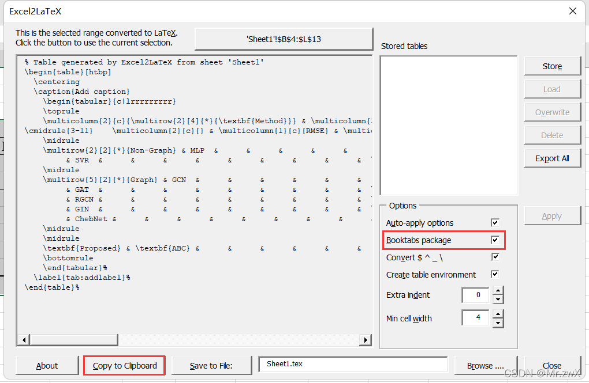
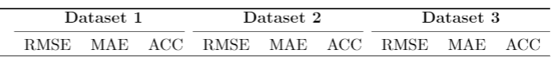

# Latex使用笔记

## 文字

使用字体颜色：

```
\usepackage{color}
\textcolor{color}{text}
```

使用删除线、波浪线等：

```
\usepackage{ulem}
\sout{}
```

```
\usepackage{booktabs}
\toprule
\midrule
\bottomrule
```

打勾叉：

```
\usepackage{bbding}
```

- 字体族
  - 罗马字体：笔画起始处有装饰`\textrm{}`
  - 无衬线字体：笔画起始处无装饰`\textsf{}`
  - 打字机字体：每个字符宽度相同，又称等宽字体`\texttt{}`

## 图片

### 并置多张图

使用latex的subfigure并排放置多张图。

```
\usepackage{graphicx}
\usepackage[caption=false,font=normalsize,labelfont=sf,textfont=sf]{subfig}
```

用`\\`换行，用`\hspace{1pt}`控制行内间距。

```latex
\begin{figure}[htbp]
	\centering
	\subfloat[The model size is 200,000.]{\includegraphics[width=0.49\columnwidth]{fig/comp_200000.pdf}}\hspace{1pt}
	\subfloat[The model size is 400,000.]{\includegraphics[width=0.49\columnwidth]{fig/comp_400000.pdf}}\\
	\subfloat[The model size is 600,000.]{\includegraphics[width=0.49\columnwidth]{fig/comp_600000.pdf}}\hspace{1pt}
	\subfloat[The model size is 800,000.]{\includegraphics[width=0.49\columnwidth]{fig/comp_800000.pdf}}\\
	\subfloat[The model size is 1,000,000.]{\includegraphics[width=0.49\columnwidth]{fig/comp_1000000.pdf}}\hspace{1pt}
	\subfloat[The model size is 1,200,000.]{\includegraphics[width=0.49\columnwidth]{fig/comp_1200000.pdf}}\\
	\caption{Average computational cost of each IoT device in each training round}
	\label{comp_cost}
\end{figure}
```

### 设置子图标题字体

修改开头的控制命令（原始）：
```latex
\usepackage[caption=false,font=normalsize,labelfont=sf,textfont=sf]{subfig}
```

为

```latex
\usepackage[caption=false,font=footnotesize,labelfont=rm,textfont=rm]{subfig}
```

其中font=footnotesize，表示修改大小为很小，可供选择的有：\tiny, \scriptsize, \footnotesize, \small, \normalsize, \large, \Large, \LARGE, \huge, \Huge，依次从小到大
labelfont=rm,textfont=rm，表示修改字体为罗马字体。原本的sf为无衬线字体。还有tt为打印机字体

### 横跨双栏显示

如果想让图表横跨双栏，在标签上加*：

```
\begin{table*}[htbp]
\end{table*}

\begin{figure*}[htbp]
\end{figure*}
```


## 算法流程图

### 添加伪代码向右指向小三角形注释

导入宏包：

```latex
\usepackage{algorithmic}
\usepackage{algorithm}
\renewcommand{\algorithmiccomment}[1]{\hfill $\triangleright$ #1}
```

然后在伪代码中，我们在需要注释的伪代码的下面一行或后面，使用以下的代码进行注释：

```latex
\COMMENT{your comment content}
\textcolor{blue}{\COMMENT{this is a comment}} #蓝色的注释
```


## 表格

### 复杂表格

绘制复杂表格，直接先在excel中绘制好表格，再用Excel2LaTex插件转换成latex表格代码。

Excel2LaTex下载地址：https://www.ctan.org/tex-archive/support/excel2latex/

下载后将`Excel2LaTeX.xla`文件导入到加载项中。

> 在Excel 2021中安装本地的XLA插件，请按照以下步骤操作：
>
> 1. 点击顶部菜单栏中的“文件”选项。
> 2. 选择“选项”。
> 3. 在弹出的选项窗口中，选择“加载项”。
> 4. 点击“转到”按钮，并浏览到您存储XLA插件文件的位置。
> 5. 选中要安装的XLA插件文件，并点击“确定”。
>
> 为防止本地导入xla插件被excel识别为风险而被阻止使用，应：
>
> - 将xla放入一个路径中导入，并将该路径设置为受信任的“加载项”路径：选项》信任中心》信任中心设置》受信任位置；
> - 启用宏设置：选项》信任中心》信任中心设置》宏设置》启用VBA宏；

在excel中绘制好表格后，**推荐将所有的灰色虚线去除**（将excel里面的灰色线条去掉：点击‘视图’，取消勾选‘网格线’）。用鼠标**选中需要生成LaTeX代码的表格区域**，点击左上角的`Convert Tabel to LaTeX`。通常勾选上`Booktabs package`这个选项，然后拷贝。

> 不勾选booktabs(三线表)，加包\usepackage{bigstrut,multirow,rotating} 
>
> 勾选booktabs(三线表)，加包\usepackage{booktabs}



将代码粘贴到LaTeX的文字中，**注意添加宏包：\usepackage{booktabs}**，否则会编译错误！同时，我用到了多行表格，所以需要添加 **\usepackage{multirow}**。

### 调整表格格式

#### 表上下边框加粗

上述方式生成的表格中\toprule在最上，\bottomrule在最下面，但是这样竖线的最上方和最下方仍然是没有和边框紧密相交，因此可以**把最上方代码的\toprule改为\bottomrule，把最下方代码的\bottomrule改为\toprule**。

#### 竖线连续

上述方式生成的表格中竖线是间断的，如果改为连续：**除了最上方和最下方的bottomrule和toprule**，将 \toprule 、\midrule 、\bottomrule修改为 \hline，将 \cmidrule修改为 \cline。

#### 横线间断

在生成的LaTeX代码中，Dataset下方的横线代码如下：

```latex
\cmidrule{3-11}
```

这显然是一根完整的横线，现在介绍如何分成三段。
将上述代码修改为：

```latex
\cmidrule(r){3-5} \cmidrule(r){6-8} \cmidrule{9-11} 
```


则可以将一根完整的横线分为三段，效果如下：




> 参考资料：
>
> 1. https://blog.csdn.net/qq_43153628/article/details/126050272
> 1. https://zhuanlan.zhihu.com/p/645999650
> 1. https://blog.csdn.net/qq_16763983/article/details/122912373
> 1. https://blog.csdn.net/weixin_43981621/article/details/124246342
