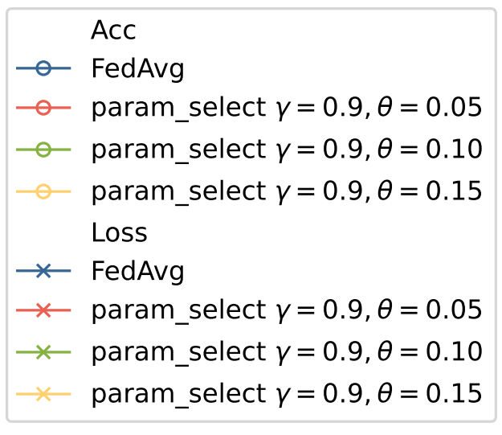
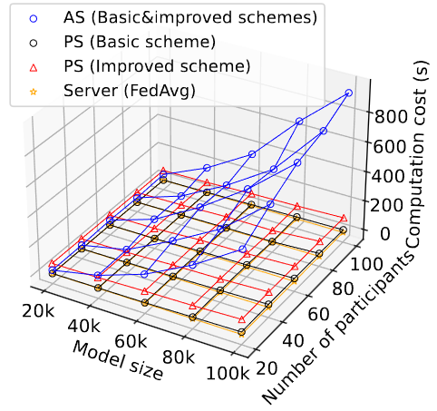

# 实验笔记-作图

## 准备

引入包：

```python
import matplotlib.pyplot as plt
```

matplotlib是基于子图概念进行绘制，因此即使只有一张图也应在图床上创建一个子图。

```python
fig = plt.figure(figsize=(10, 5)) # 创建一个10x5 inches的图床
ax1 = fig.add_subplot(121, projection='3d') # 绘制1x2的子图布局，该子图是其中的第1个，指明绘制3D图
ax2 = fig.add_subplot(122) # 绘制1x2的子图布局，该子图是其中的第2个，默认绘制2D图
```

调整子图之间的间距：

```python
plt.subplots_adjust(left=0, bottom=0.17, right=None, top=None, wspace=None, hspace=None)
```

有六个可选参数来控制子图布局。值均为0~1之间。其中left、bottom、right、top围成的区域就是子图的区域。wspace、hspace分别表示子图之间左右、上下的间距。

最后保存图片：

```python
plt.savefig("log/comp_cost.pdf")
```

## 2D图

### 折线图

数据准备：

```python
x = [20000, 40000, 60000, 80000, 100000]
y_fedavg = np.zeros(5, )
y_ours = np.zeros(5, )
```

绘制折线图，带有markers：

```python
ax.plot(x, y_ours, marker='o', color='blue', markerfacecolor='none', linewidth=1, label='Basic&improved schemes')
ax.plot(x, y_fedavg, marker='*', color='orange', markerfacecolor='none', linewidth=1, label='FedAvg')
```

添加坐标轴标签：

```python
ax.xlabel('Model size', fontsize=16)
ax.ylabel('Computation cost (ms)', fontsize=16)
```

### 条形图

```python
ax.bar(x, y, color="blue", edgecolor = "black")
# Adding text above each bar
for i in range(len(x)):
    plt.text(x[i], y[i] + 5, '{:.3f}'.format(y[i]), ha='center') #在bar上显示y值（保留小数点后3位），y[i] + 5控制高度。
```

### 热力图

折线图可以借助seaborn绘制。

```python
import seaborn as sns
fig_hp = sns.heatmap(data_sls[i], xticklabels=x_tick, yticklabels=y_tick, vmin=0, vmax=0.05, cmap='RdBu_r', linewidths=.5, ax=axes[i-1])
```

### 绘制双y轴图

借助关键函数twinx()绘制双y轴。

```python
'''创建图床'''
fig = plt.figure(figsize=(5, 4)) # 创建一个10x5 inches的图床
'''绘制第一个y轴的图'''
ax = fig.add_subplot(111)
ax.plot(x, y1, '-', label = 'class1')
ax.legend()
'''将第二个y轴的图绘制再第一张图的句柄上'''
ax2 = ax.twinx() #创建一个ax的孪生句柄ax2
ax2.plot(x, y2, '-r', label = 'class2')
ax.legend()
```

问题在于此时图例会有两个。

合并图例：

```python
lns1 = ax.plot(np.arange(0, 21), df_fedavg_acc['acc'], marker='o', markersize=5, color=color[0], markerfacecolor='none', linewidth=1, label='FedAvg')
lns2 = ax.plot(np.arange(0, 21), df_paramselect_9_05_acc['acc'], marker='o', markersize=5, color=color[1], markerfacecolor='none', linewidth=1, label=r'param_select $\gamma=0.9, \theta=0.05$')
lns3 = ax.plot(np.arange(0, 21), df_paramselect_9_10_acc['acc'], marker='o', markersize=5, color=color[2], markerfacecolor='none', linewidth=1, label=r'param_select $\gamma=0.9, \theta=0.10$')
lns4 = ax.plot(np.arange(0, 21), df_paramselect_9_15_acc['acc'], marker='o', markersize=5, color=color[3], markerfacecolor='none', linewidth=1, label=r'param_select $\gamma=0.9, \theta=0.15$')
ax2 = ax.twinx()
lns5 = ax2.plot(np.arange(0, 21), df_fedavg_loss['loss'], marker='x', markersize=5, color=color[0], markerfacecolor='none', linewidth=1, label='FedAvg')
lns6 = ax2.plot(np.arange(0, 21), df_paramselect_9_05_loss['loss'], marker='x', markersize=5, color=color[1], markerfacecolor='none', linewidth=1, label=r'param_select $\gamma=0.9, \theta=0.05$')
lns7 = ax2.plot(np.arange(0, 21), df_paramselect_9_10_loss['loss'], marker='x', markersize=5, color=color[2], markerfacecolor='none', linewidth=1, label=r'param_select $\gamma=0.9, \theta=0.10$')
lns8 = ax2.plot(np.arange(0, 21), df_paramselect_9_15_loss['loss'], marker='x', markersize=5, color=color[3], markerfacecolor='none', linewidth=1, label=r'param_select $\gamma=0.9, \theta=0.15$')
# 自定义图例
title1 = 'Acc'
title2 = 'Loss'
lns = [plt.Line2D([0], [0], color='none', marker='none')] + lns1 + lns2 + lns3 + lns4 + [plt.Line2D([0], [0], color='none', marker='none')] + lns5 + lns6 + lns7 + lns8
labs = [title1] + [l.get_label() for l in lns[1:5]] + [title2] + [l.get_label() for l in lns[6:]]
ax.legend(lns, labs, loc='center right', fontsize=10)
```

得到的图例如图：



## 3D图

### 3D wireframe plot



绘制上图所示的三维线框图（3D wireframe plot）。

引入需要的包：

```python
import numpy as np
import matplotlib.pyplot as plt
from mpl_toolkits.mplot3d import axes3d
```

首先定义数据点的xyz轴数据：

```python
x = [20000, 40000, 60000, 80000, 100000] # np array也可
y = [20, 40, 60, 80, 100]
X, Y = np.meshgrid(x, y) #根据x y轴数据生成一个坐标矩阵，作为3D线框图的底盘
z_as = np.zeros((5, 5))
z_ps = np.zeros((5, 5))
```


这里z轴的数据也应该是对应于x y轴划分的坐标矩阵的二维数组。

z轴数据与x y轴对应关系为：

```python
x = [1, 2]
y = [1, 2]
z = [
    [10, 20],
    [30, 40]
]
'''
In this case, we have four points with the following coordinates:
Point 1: (x=1, y=1, z=10)
Point 2: (x=2, y=1, z=20)
Point 3: (x=1, y=2, z=30)
Point 4: (x=2, y=2, z=40)
'''
```

数据准备好了，开始画图（以z_as z_ps为例）：

```python
fig = plt.figure()
ax = fig.add_subplot(111, projection='3d')
# draw wireframe plot
ax.plot_wireframe(X, Y, z_as, color='blue', linewidth=0.5)
ax.plot_wireframe(X, Y, z_ps, color='black', linewidth=0.5)
```

这仅仅是画了线条，如果要在数据点上加marker，需要另外单独绘制：

```python
# Add markers on each data point
ax.scatter(X.flatten(), Y.flatten(), z_as.flatten(), color='blue', marker='o', linewidth=0.5, facecolors='none', alpha=1, label='AS (Basic&improved schemes)')
ax.scatter(X.flatten(), Y.flatten(), z_ps.flatten(), color='black', marker='o', linewidth=0.5, facecolors='none', alpha=1, label='PS (Basic scheme)')
```

facecolor=‘none’控制marker是空心的。label如果放在marker这里，那么后面加图例的时候就是按照marker加的，label也标志着不同的分类。

调整坐标轴上的刻度值及刻度标签：

```python
ax.set_xticks(x) # 调整坐标轴上的刻度值，想调整set_xticklabels必须得有set_xticks
ax.set_xticklabels(['20k', '40k', '60k', '80k', '100k'], fontsize=12) # 自定义坐标轴上的刻度标签，也在这里自定义字体大小
ax.set_yticks(y)
ax.set_yticklabels(y, fontsize=12)
ax.set_zticks([0, 200, 400, 600, 800])
ax.set_zticklabels([0, 200, 400, 600, 800], fontsize=12) 
```

添加坐标轴标签：

```python
ax.set_xlabel('Model size', fontsize=12, labelpad=-2)
ax.set_ylabel('Number of participants', fontsize=12, labelpad=-2)
ax.set_zlabel('Computation cost (s)', fontsize=12, labelpad=0)
```

用labelpad调整坐标轴标签与坐标轴之间的距离。

调整刻度值与坐标轴之间的距离：

```python
ax.tick_params(axis='x', pad=-2)
ax.tick_params(axis='y', pad=-1.5)
ax.tick_params(axis='z', pad=1)
```

添加图例：

```python
ax.legend(fontsize=11)
```


> 参考资料：
>
> 1. https://www.cnblogs.com/Atanisi/p/8530693.html
