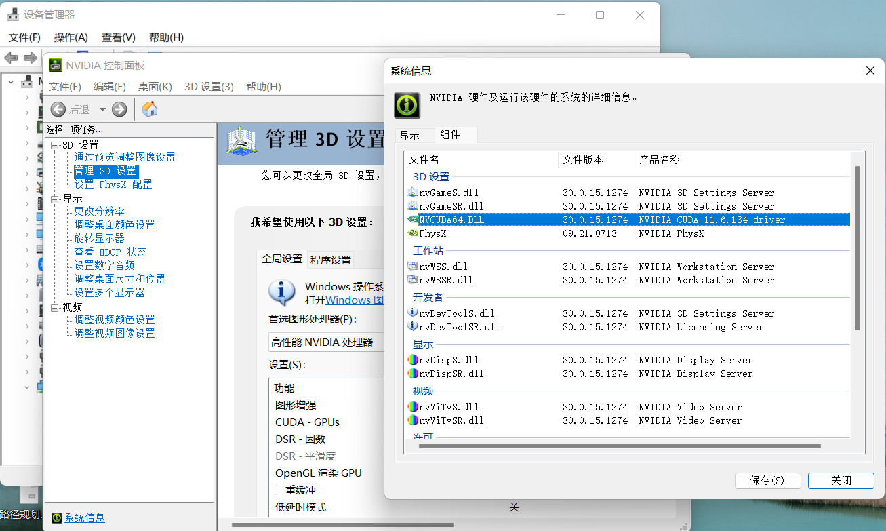
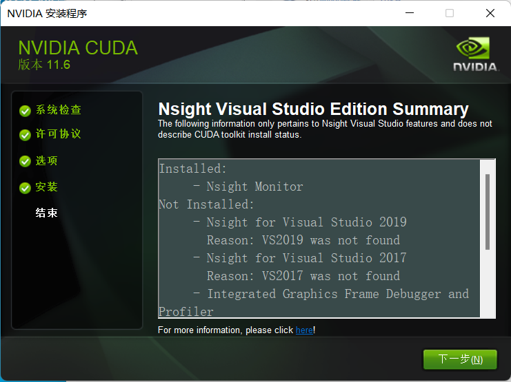
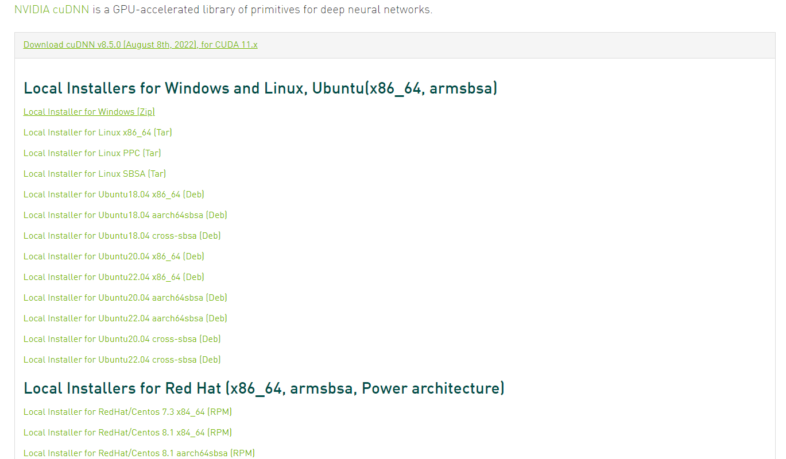
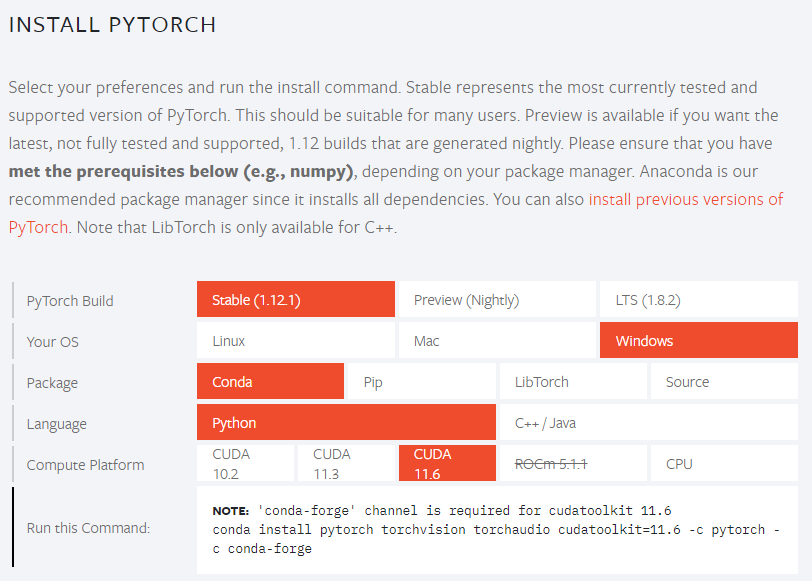

# 深度学习环境配置

## Windows

### 1 安装CUDA

需要安装两个：

- CUDA toolkit（就是我们所说的CUDA）
- cuDNN，其实就是 CUDA 的一个补丁而已，专为深度学习运算进行优化的。

#### 安装CUDA

1、查看本机的CUDA驱动适配版本

桌面右键打开英伟达控制面板，点击帮助->系统信息->组件。



看到本机支持CUDA 11.6.134及以下版本。

2、下载CUDA

下载CUDA https://developer.nvidia.com/cuda-toolkit-archive，选择对应版本。于是我选择了CUDA Toolkit 11.6.0。

- 第一次选择安装路径是临时解压目录，安装结束后会自动删除该文件夹。
- 第二次会让设置安装目录。走默认的话就直接装C盘了。

这两个安装目录名称千万不要一样！

一直往下走默认，系统变量会自动生成。因为我的电脑没有装VS，所以相关组件它也没装。看来应该是占了C盘7G左右的空间。



验证是否安装成功：

- 运行cmd，输入nvcc --version 即可查看版本号；

- set cuda，可以查看 CUDA 设置的环境变量。

#### 安装cuDNN

安装网址：https://developer.nvidia.com/rdp/cudnn-download

可以在此查看适配版本：https://developer.nvidia.com/rdp/cudnn-archive

选择cuDNN v8.5.0，适配CUDA 11.x。会下载一个压缩包。



将压缩包解压到自定义的一个文件夹，解压后，有三个文件夹，把三个文件夹中的所有文件拷贝到CUDA的安装目录下同名的文件夹中（C:\Program Files\NVIDIA GPU Computing Toolkit\CUDA\v11.6）。

验证是否安装成功：

- 首先win+R启动cmd，cd到安装目录下的 …\extras\demo_suite,然后分别执行bandwidthTest.exe和deviceQuery.exe（进到目录后需要直接输“bandwidthTest.exe”和“deviceQuery.exe”）

> 最后网络上有说出了自动生成的两个环境变量以外要进一步添加环境变量，但是我没有添加貌似也测试安装成功了。

### 2 安装PyTorch

Torch的Python版本叫PyTorch，安装的版本需要适配CUDA的版本，去官网选择合适版本：https://pytorch.org/，复制安装命令到miniconda bash粘贴运行。



## Linux

参考这篇的安装顺序：https://www.cnblogs.com/lycnight/p/17767720.html

安装cuda时，要看我们的驱动（driver）版本所支持的cuda最高版本。

在终端使用命令`nvidia-smi`查看`CUDA Version`所显示的就是driver所支持的cuda最高版本。

conda安装cudatoolkit：

```
conda install cudatoolkit=11.7.1
```

conda安装cudnn：

```
conda install cudnn=8.5.0
```

不写版本会自动选版本与cuda版本相匹配：

```
conda install cudnn
```


注意，pytorch安装一定要使用pytorch官网上，用pip进行安装，这里虽然没指定cudatoolkit，但也一起安装上了。

进入官网（https://pytorch.org/），选定自己适配的配置，复制命令到自己的conda env中执行安装torch和cuda，其中cuda不能超过自己driver所支持的cuda最高版本。

如果使用conda，一定会给你安成CPU版本的，让你GPU无法启动,即下面代码返回false。

```python
import torch
print（torch.cuda.is_available()）
```


> 参考资料：
>
> 1. CUDA安装教程（超详细） https://blog.csdn.net/m0_45447650/article/details/123704930
> 1. https://blog.csdn.net/weixin_43976737/article/details/129269838?csdn_share_tail=%7B%22type%22%3A%22blog%22%2C%22rType%22%3A%22article%22%2C%22rId%22%3A%22129269838%22%2C%22source%22%3A%22weixin_43976737%22%7D
> 1. https://blog.csdn.net/weixin_43976737/article/details/121440865?spm=1001.2014.3001.5501
> 1. https://www.cnblogs.com/lycnight/p/17767720.html