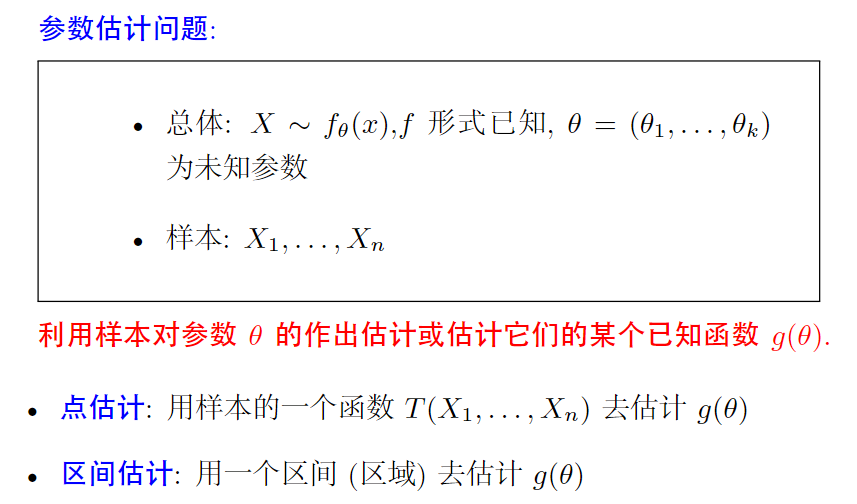
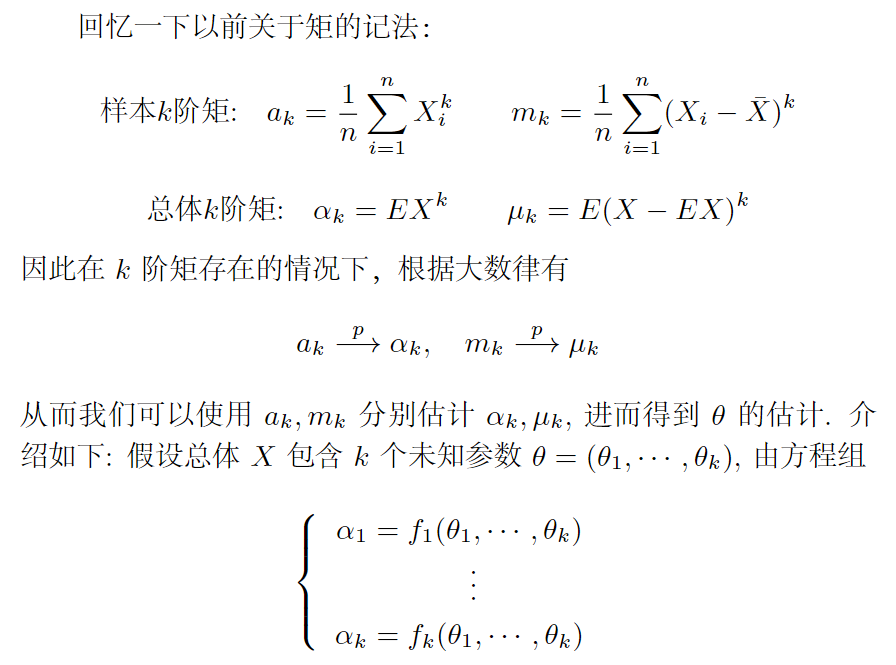
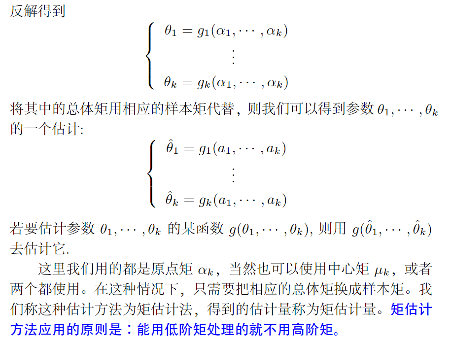
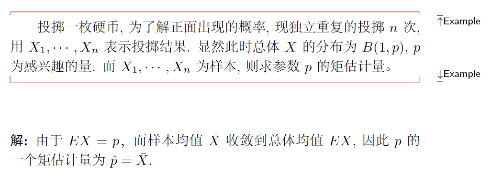
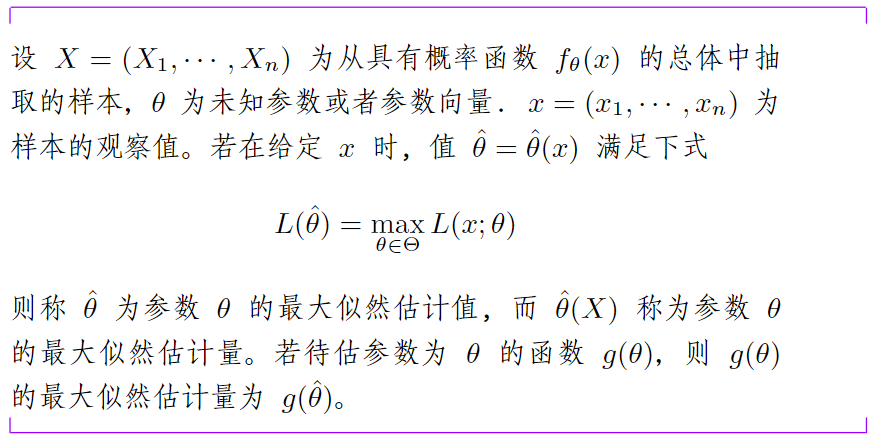
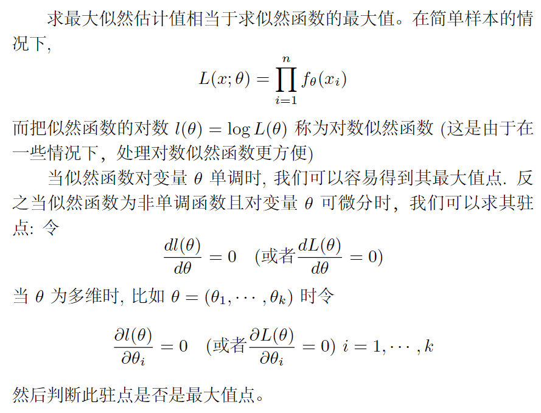

# 参数估计

在数理统计中，常常需要通过样本来估计总体的参数，估计可划分为两大类：点估计和区间估计。

> $T(X_1,...,X_n)$又叫做**统计量**。
>
> 样本是总体的反映，但样本所含信息不能直接用于解决我们所要研究的问题，而需要把样本所含的信息进行数学上的加工使其浓缩起来，从而解决我们的问题。为此，数理统计学往往构造一个合适的**依赖于样本的函数**，我们称之为**统计量**。
>
> 【定义】如果 $\left(X_1, \ldots, X_n\right)$ 为来自总体 $X$ 的样本，若样本函数
>
> $$
> T=T\left(X_1, \ldots, X_n\right): \mathbb{R}^n \rightarrow \mathbb{R}
> $$
>
> 是不含有任何**未知参数**的 (可测) 函数，则称 $T$ 为**统计量**。统计量的分布称为**抽样分布**。
>
> 常见的统计量：样本均值、样本方差、修正样本方差、...
>
> 这里的未知参数常指以下几种：
>
> - 分布中所含的未知参数
> - 分布的数字特征：期望、方差、标准差、分位数等
> - 某事件的概率

## 点估计

根据样本 $X_1, \cdots, X_n$ 来估计参数 $\theta$，就是要构造适当的统计量 $\hat{\theta}=\hat{\theta}\left(X_1, \cdots, X_n\right)$。当有了样本 $X_1, \cdots, X_n$ 的值后，就代入 $\hat{\theta}=\hat{\theta}\left(X_1, \cdots, X_n\right)$ 中算出一个值，用来作为 $\theta$ 的估计值。为这样特定目的而构造的统计量 $\hat{\theta}$ 叫做 $\theta$ 的**估计量**。由于参数 $\theta$ 是数轴上的一个点，用 $\hat{\theta}$ 估计 $\theta$，等于用一个点去估计另一个点，所以这样的估计叫做点估计。

> 考虑一个测量问题（如温度、血压、距离等），记测量对象真实值为$\theta$，$n$次测量数据为$x_1,x_2,…,x_n$。相信大部分人都会用样本均值来估计$\theta$，此时样本均值就是估计量。

### 矩估计

矩方法是基于一种简单的“替换”思想建立起来的一种估计方法。其基本思想是用样本矩估计总体矩。由大数定律，如果未知参数和总体的某个 (些) 矩有关系，我们很自然的来构造未知参数的估计。

矩估计法的优点是简单易行，有些情况下不需要事先知道总体是什么分布，缺点是，当总体类型已知时，没有充分利用分布提供的信息，一般场合下，矩估计量不具有唯一性。

### 最大似然估计

最大似然估计（Maximum Likelihood Estimation，MLE）是一种参数估计的方法。通俗理解来说，就是利用已知的样本结果，反推最可能导致这些样本结果出现的模型参数。最大似然估计中采样需满足一个重要的假设，就是所有的采样都是独立同分布的。

#### 2.1 似然函数

似然（likelihood）这个词其实和概率（probability）是差不多的意思，Colins字典：The **likelihood** of something happening is how likely it is to happen.

但在统计里面，似然与概率是一个事件的两面，有==一菜两吃==的意味。对于以下概率函数：
$$
f(x;\theta)
$$
其中，$x$表示样本结果，$\theta$表示模型的参数。

- 如果$\theta$已知，$x$是变量，这个函数叫做概率函数（probability function），它描述给定模型参数，不同样本点$x$发生的概率。

- 如果$x$已知，$\theta$是变量，这个函数叫做似然函数（likelihood function），它描述对于不同的模型参数，出现$x$这个样本点的概率是多少。似然函数通常记为$L(x;\theta),L(\theta)$。

当固定参数 $\theta$ 时, $f(x ; \theta)$ 可以看成是得到样本观察值 $x$ 的可能性，这样，当把参数 $\theta$ 看成变动时，也就得到 "在不同的 $\theta$ 值下能观察到 $x$ 的可能性大小, 即 $L(x ; \theta)$ "；**由于我们已经观察到了 $x$, 所以使得能观察到 $x$ 的可能性 $L(x ; \theta)$ 最大的 $\theta$ 值, 看起来应该最像未知的 $\theta$ 。这个 $\theta$ 的值即称为 $\theta$ 最大似然估计值 (看上去最有可能的)**。

#### 2.2 最大似然估计

【例】

假如有一个罐子，里面有黑白两种颜色的球，我们想知道罐中白球与黑球的比例。

我们可以每次从罐中拿出一个球并记录颜色再放回去（所以每次抽出来的球的颜色服从独立同分布），重复多次，以此来估计罐中黑白球的比例。

在一百次抽样中，“七十次是白球、三十次是黑球”事件发生的概率为$P(样本结果|model)$，如果历次抽样结果为$x_1,x_2,...,x_{100}$，可得下式：
$$
\begin{aligned}
P(样本结果|model) &=P(x_1,x_2,...,x_{100}|model) \\
&= P(x_1|model)P(x_2|model)...P(x_{100}|model) \\
&= p^{70}(1-p)^{30}
\end{aligned}
$$
现在根据上式求使得“七十次是白球、三十次是黑球”最有可能发生的模型参数$p$，即对其求导等于0时$p$的值，得$p=70\%$。

这也就是为什么我们只通过观察“七十次是白球、三十次是黑球”这个样本结果，能够推测出白球占$70\%$，背后蕴藏着最大似然估计的原理。

> $P(x|\theta)$、$P(x;\theta)$与$P(y|x;\theta)$：
>
> - $P(x|\theta)$有时表示条件概率，有时表示对$\theta$进行参数估计（此时与$P(x;\theta)$一样）。
>
> - $P(x;\theta)$表示已知样本$x$，对参数$\theta$进行估计。
> - $P(y|x;\theta)$表示已知样本$x$与真实标签$y$，对参数$\theta$进行估计。

> 参考资料：
>
> 1. 一文搞懂最大似然估计 https://zhuanlan.zhihu.com/p/26614750
> 2. 详解最大似然估计（MLE）、最大后验概率估计（MAP），以及贝叶斯公式的理解 https://blog.csdn.net/u011508640/article/details/72815981
> 3. 概率论：p(x|theta)和p(x;theta)的区别 https://blog.csdn.net/pipisorry/article/details/42715245

### 无偏估计

无偏估计是**用样本统计量来估计总体参数时的一种无偏推断**。 估计量的数学期望等于被估计参数的真实值，则称此估计量为被估计参数的无偏估计，即具有无偏性，是一种用于评价估计量优良性的准则。 无偏估计的意义是：在多次重复下，它们的平均数接近所估计的参数真值。

【通俗解释】样本均值的期望 = 总体均值

（每次抽样所计算的均值也是个随机变量，其有期望）

> 参考资料：
>
> - https://wulc.me/2017/02/18/%E6%A6%82%E7%8E%87%E8%AE%BA%E4%B8%8E%E6%95%B0%E7%90%86%E7%BB%9F%E8%AE%A1%E7%9F%A5%E8%AF%86%E6%95%B4%E7%90%86(6)-%E5%8F%82%E6%95%B0%E4%BC%B0%E8%AE%A1/
> - USTC讲义：http://staff.ustc.edu.cn/~zwp/teach/Prob-Stat/Lec14_slides.pdf