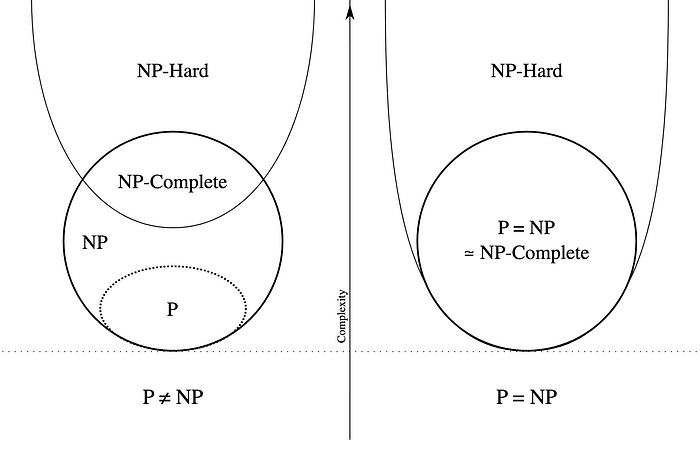

# P/NP问题

**时间复杂度**：随着问题规模的增大，算法执行时间增长的快慢。并不是表示一个程序解决问题需要花多少时间。

常见时间复杂度如下：
$$
O(1)<O\left(\log _2 n\right)<O(n)<O\left(n \log _2 n\right)<O\left(n^2\right)<O\left(n^a\right)<O\left(2^n\right)<O(n!)<O\left(n^n\right)
$$
其中$O\left(n^a\right)$及以前的时间复杂度为多项式时间复杂度，后面的是非多项式级的，其复杂度计算机往往不能承受。当我们在解决一个问题时，我们选择的算法通常都需要是多项式级的复杂度，非多项式级的复杂度需要的时间太多，往往会超时，除非是数据规模非常小。

## P问题

存在多项式时间算法的问题，即存在一个能在多项式的时间里解决它的算法。（P：polynominal，多项式）

## NP问题

可以在多项式的时间里验证一个解的问题。NP问题的另一个定义是，可以在多项式的时间里猜出一个解的问题。（NP：Nondeterministic polynominal，非确定性多项式）

显然，**P问题是NP问题的子集，因为存在多项式时间解法的问题，总能在多项式时间内验证他。**

我们可以在多项式时间内验证并得出这个问题的一个正确解，但是不确定这个问题存不存在一个多项式时间的算法，所以叫非确定性（non-deterministic）。因此，这就引出了这类讨论的一个千年问题：**是否NP类问题=P类问题？**

目前为止这个问题还“啃不动”。但是，人们普遍认为，P=NP不成立，也就是说，多数人相信，存在至少一个不可能有多项式级时间复杂度的算法的NP问题。人们如此坚信P≠NP是有原因的，就是在研究NP问题的过程中找出了一类非常特殊的NP问题叫做NP-完全问题，也即所谓的 NPC问题。正是NPC问题的存在，使人们相信P≠NP。

## NPC问题

为了证明“是否NP类问题=P类问题？”这个千古难题，科学家想出了很多办法。其中之一就是问题的约化/归约（reduction）。可以用问题B的算法来解决A，我们就说问题A可以归约成问题B。归约是具有传递性的，如A归约到B，B归约到C，A就可以归约到C，同时不断归约下去。

归约的标准概念：如果能找到这样一个变化法则，对程序A的任意一个输入，都能按这个法则变换成程序B的输入，使两程序的输出相同，那么我们说，问题A可归约为问题B。

> - 当然，我们所说的“可归约”是指的可“多项式地”归约（Polynomial-time Reducible），即变换输入的方法是能在多项式的时间里完成的。归约的过程只有用多项式的时间完成才有意义。
> - 若问题A可归约为问题B，显然B的时间复杂度高于或者等于A的时间复杂度。

NPC问题（NP-complete）：存在这样一个NP问题，所有的NP问题都可以归约成它。换句话说，只要解决了这个问题，那么所有的NP问题都解决了。

NPC问题确实是存在的。比如逻辑电路问题就是一个NPC问题：给定一个逻辑电路，问是否存在一种输入使输出为True。

## NP难问题（NP-hard问题）

所有的NP问题都可以归约成它的问题，即它满足NPC问题定义的第二条但不一定要满足第一条。

NP-hard问题同样难以找到多项式的算法，但它不列入我们的研究范围，因为它不一定是NP问题。即使NPC问题发现了多项式级的算法，NP-hard问题有可能仍然无法得到多项式级的算法。

> 参考资料：
>
> - http://www.matrix67.com/blog/archives/105
> - http://www.matrix67.com/blog/archives/7084
> - https://zh.wikipedia.org/zh-cn/P/NP%E9%97%AE%E9%A2%98
> - https://zhuanlan.zhihu.com/p/73953567