Udacity：Applied Cryptography https://www.udacity.com/course/applied-cryptography--cs387

# 1 对称加密（Symmetric Cryptography）

## 1.1 对称加密系统（Symmetric Cryptosystems）

"对称"意味着加密和解密都采用相同的密钥。

**一些术语介绍：**

我们可以把加密想象成一个函数，其输入是明文（plaintext），输出是密文（ciphertext），我们的目标是能够发送密文在一个不安全的信道（可以是无线网络/互联网/...）上，我们希望对方收到的密文和我们发出的密文是一样的，然后通过解密函数得到明文信息。

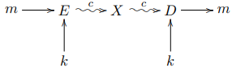

可能会有一个窃听者（eavesdropper）$X$在不安全信道上窃听密文；开头的明文$m$是一些信息，它是所有可能信息$\mathcal{M}$（可能是有限的）的一个子集（$m \in \mathcal{M}$）；密文$c$是所有可能密文$\mathcal{C}$的一个子集（$c \in \mathcal{C}$）；密钥$k$是所有可能密钥$\mathcal{K}$的一个子集（$k \in \mathcal{K}$）；加密函数为$E:\mathcal{M} \rightarrow \mathcal{C}$，解密函数为$D:\mathcal{C} \rightarrow \mathcal{M}$。

解密和加密的顺序相同，我们需要该性质：解密函数是加密函数的反函数。

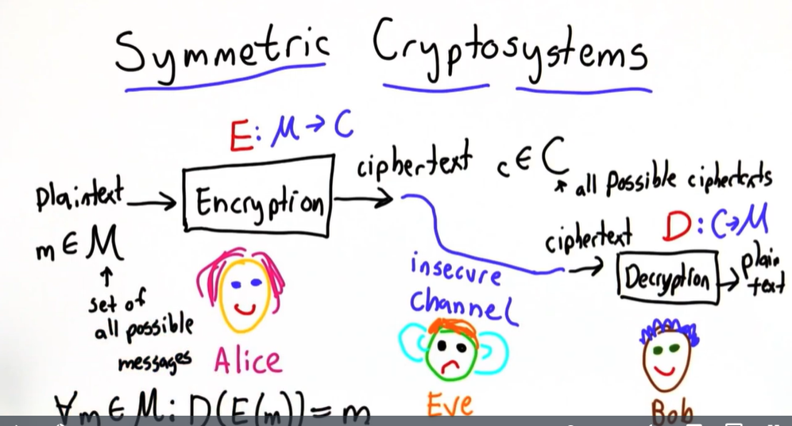

## 1.2 密钥及Kerchoffs原则（Keys and Kerchoffs Principle）&正确性与安全性（Correctness and Security）

**Kerchoffs原则：** 即使加密和解密函数被知道了，你的加密仍然是安全的。

想要实现此原则，要引入一个密钥。如果安全性仅依靠密钥的秘密性，我们就可以将加密函数和解密函数公开，分析研究它们，以发展更好的加密解密函数。如果密钥暴露，换一个新密钥即可，而不用换一个新的加密解密函数。

对于$m \in \mathcal{M} , c \in \mathcal{C} , k \in \mathcal{K} , E:\mathcal{M} \times \mathcal{K} \rightarrow \mathcal{C} , D:\mathcal{C}  \times \mathcal{K} \rightarrow \mathcal{M}$，

**正确性性质（Correctness Property）：** 为了使接收方解密后得到与发送方发送的明文相同的信息，我们需要满足$\forall m \in \mathcal{M}, \forall k \in \mathcal{K}$，
$$
D_{k}\left(E_{k}(m)\right)=m
$$
**安全性性质（Security Property）：** 密文不能揭露任何关于密钥和明文的信息。

## 1.3 异或函数（Xor Function）

**异或函数（xor function）：** 用$\oplus$表示，真值表如下：

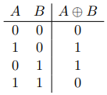

异或函数有许多有用的性质，使得其成为密码学最青睐的函数：

- 可分配性（Disributivity）：$x \oplus(y \oplus z)=(x \oplus y) \oplus z$
- 可交换性（Commutativity）：$x \oplus y=y \oplus x$
- 否定（Negation）：$x \oplus 1=\bar{x}$
- 同一性（Identity）：$x \oplus x=0$

便有$x \oplus y \oplus x=x \oplus x \oplus y=y \Leftrightarrow m \oplus k=c \text { and } c \oplus k=m$。

## 1.4 一次性密码本（One-Time Pad）

设$\mathcal{M}=\{0,1\}^n$，即每条信息$m \in \mathcal{M}$由一串0，1组成，长度固定为$n$。$\mathcal{K}=\{0,1\}^n$。同时$m=m_0m_1...m_{n-1},k=k_0k_1...k_{n-1}$，则加密函数如下：
$$
E_k(m)=c_0c_1...c_{n-1}
$$
例如，对“CS”加密，$m='CS'=10100111000011$，$n=14$。采用One-Time Pad，密钥长度同样为14bits，我们将创造一个随机密钥（在密码学中找随机数很重要），设$k=11001000100110$，那么密文就是明文和密钥异或的结果$c=01101111100101$。根据异或的性质，接收方将密文和密钥异或便可得明文$m \oplus k \oplus k=m$。

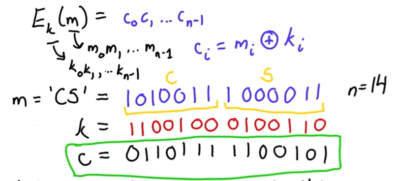

## 1.5 概率知识回顾（Probability）

**概率空间$\Omega$（Probability Space）：**所有可能输出的集合。

> 例如，掷硬币，$\Omega=\{正面,反面,立起来\}$。

如果概率空间有一个均匀分布（uniform distribution），意味着所有输出有着相同概率。

**事件（Event）：**“硬币掷为正面”是一个事件，我们可以将事件定义得更广一些，事件是服从某一分布的输出的一个子集。这样一来，一个事件的概率就是其所有输出的概率总和。

> $正面 = \{正面\}$可以是一个事件，$可用=\{正面,反面\}$也可以是一个事件。

**条件概率（Conditional Probability）：**给定两个事件$A,B$，在相同的概率空间中，在$A$的条件下$B$的概率为
$$
P(B \mid A)=\frac{P(A \cap B)}{P(A)}
$$

## 1.6 [[秘密共享]]（Secret Sharing）

XOR可以被用于在多人之间共享一个秘密。设Alice想在Bob、Colleen之间共享一个秘密：

1. 长度为$n$的秘密为$x=x_{0} x_{1} x_{2} \ldots x_{n-1}$。
2. 生成一个随机密钥$k \in\{0,1\}^{n}$：$k=k_{0} k_{1} k_{2} \ldots k_{n-1}$。
3. 计算$c=x\oplus k$，用$\forall i \in\{0,1,2, \ldots, n-1\}: c_{i}=k_{i} \oplus x_{i}$的方式。
4. 将$c$和$k$分别给到Bob和Colleen，$x$Alice自己保存。

然后不能让Bob和Colleen见面，一见面就会复现出秘密。但是如果Alice担心Bob和Colleen会串通，她想共享秘密给4个人，推广一下：

1. 长度为$n$的秘密为$x=x_{0} x_{1} x_{2} \ldots x_{n-1}$。
2. 生成3个随机密钥$k_1,k_2,k_3 \in\{0,1\}^{n}$。
3. 计算$c=x\oplus k_1 \oplus k_2 \oplus k_3$。
4. $c$给B，$k_1$给C，$k_2$给D，$k_3$给E，$x$Alice自己保存。

所以，为了在$m$个人中共享一个长度为$n$bits的秘密$x$，需要生成$(m-1)\cdot n$bits的密钥（即生成$m-1$个$n$bits长度的密钥）。

## 1.7 完美加密（Perfect Cipher）

**完美加密：**如果一个攻击者截获了一个密文，将不会揭露任何关于明文的信息。

在此给出完美加密的定义，对于$m,某一具体值m^* \in \mathcal{M}$，攻击者的目标是判断出截获的密文$c$的明文$m$是否与$m*$相同，需满足：
$$
P\left[m=m^{*} \mid E_{k}(m)=c\right]=P\left[m=m^{*}\right]
$$
这意味着，对于一个攻击者/窃听者，不知道$m$密文的条件下$m=m^*$的概率等于知道$m$密文的条件下$m=m^*$的概率，==也即$m$等于某一具体值$m^*$的概率不取决于是否知道密文==。如果先验地认为攻击者对信息一无所知，因此所有的信息都有同样的可能性，满足以下条件也是正确的：
$$
P\left[m=m^{*} \mid E_{k}(m)=c\right]=\frac{1}{|\mathcal{M}|}
$$
其中，$|\mathcal{M}|$是$\mathcal{M}$的基数（cardinality），即可能消息的数量。但这显然是不成立的，因为攻击者可能知道一些更多的信息，其知道哪些句子可能是有效的，可能攻击者知道一些关于消息$m$的分布的先验知识，其不一定服从均匀分布。

## 1.8 One-Time Pad是完美加密

> 对于明文$m$和密文$c$，采用Otp加密，只有唯一一个密钥$k$可以使$E_k(m)=c$。

$P\left(m=m^{*} \cap E_{k}(m)=c\right)$的值是多少呢？如下图所示，将所有可能的明文排列在左侧$\{m_0,m_1,...,m_{|\mathcal{M}|-1} \}$，顶部按照加密成$c$的一一对应关系排列相应的密钥$\{k_0,k_1,...,k_{|\mathcal{K}|-1} \}$，使$E_{k_i}(m_i)=c$，如此一来，$E_{k}(m)=c$便可用下图的斜对角线表示，$m=m^*$可用红色的横线表示，两线交点的概率即为所求概率。

交点对应顶部的密钥$k^*$，满足$E_{k^*}(m^*)=c$，明文与密钥的选取是相互独立的，所以
$$
P\left(m=m^{*} \cap E_{k}(m)=c\right)=P\left(m=m^{*} \cap k=k^*\right)=P\left(m=m^{*}\right)\cdot P\left(k=k^*\right)
$$
设密钥是完全随机的，服从均匀分布，而明文的分布不可知（不一定服从均匀分布），则$P\left(k=k^*\right)=\frac{1}{|\mathcal{K}|}$，所以：
$$
P\left(m=m^{*} \cap E_{k}(m)=c\right)=P\left(m=m^{*}\right)\cdot \frac{1}{|\mathcal{K}|}
$$
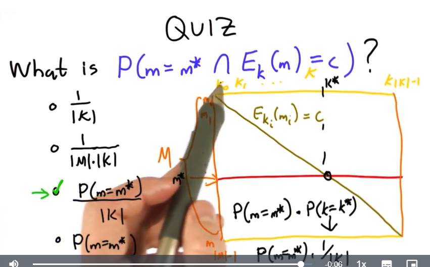

由上图已可知$P[E_{k}(m)=c]=\frac{1}{|\mathcal{K}|}$，则
$$
P\left[m=m^{*} \mid E_{k}(m)=c\right]=\frac{P\left(m=m^{*} \cap E_{k}(m)=c\right)}{P\left(E_{k}(m)=c\right)}=\frac{\frac{P\left(m=m^{*}\right)}{|\mathcal{K}|}}{\frac{1}{|\mathcal{K}|}}=P\left(m=m^{*}\right)
$$
符合完美加密的定义，所以Otp是完美加密。

> 虽然Opt是完美加密，但是它有两个缺陷：
>
> - 可被改变（malleable）：不安全信道上的攻击者虽然无法根据截获的密文获取关于明文的任何信息，但是如果其是一个积极的攻击者，其篡改了密文信息，然后接收方就会接收到错误的密文进而解密出错误的明文。
>   - 比如'Y'的二进制明文是1011001，'N'的明文是1001110。Alice发送'N'（1001110）给Bob，但是被Mallory截获了。Mallory只需对截获的密文$c$做$m_Y \oplus m_N \oplus c$，然后发送给Bob，就可以将Y变成N，N变成Y。
> - 不现实（impractical）：密钥的长度必须和明文一样长，并且密钥是一次性的。

## 1.9 完美加密是不现实的（impractical）`?`

**Shannon的密钥空间理论（Shannon's Keyspace Theorem）：**每一个完美加密都是不现实的。因为完美加密需要所有可能的密钥数量不小于所有可能的明文数量，这也是加密想要完美的唯一途径，即
$$
|\mathcal{K}| \geqslant |\mathcal{M}|
$$
**反证法证明（proof by contradiction）：**

假设我们有一个完美加密$E$，但是不满足$|\mathcal{K}| \geqslant |\mathcal{M}|$，即$|\mathcal{K}| < |\mathcal{M}|$。有$c_0 \in \mathcal{C} \ \text{with} \ P[E_{k}(m)=c_0]>0$，意味着有密钥可以加密明文$m$成$c$。

现在用所有$k$对$c_0$进行解密，由于加密是正确的（为了实现完美，其必须满足正确性和安全性），这意味着解密函数必须满足以下性质：
$$
D_{k}\left(E_{k}(m)\right)=m
$$
强力攻击者（brute-force attacker）会用每一个密钥$k$解密$c_0$得到明文的集合$\mathcal{M_0}$：
$$
\mathcal{M}_{0}=\bigcup_{k \in \mathcal{K}} D_{k}\left(c_{0}\right)
$$
它满足

- $\left|\mathcal{M}_{0}\right| \leqslant|\mathcal{K}|$，因为不同密钥可能会解密出同样的明文。
- $\left|\mathcal{M}_{0}\right| <|\mathcal{M}|$，因为所有可能的密钥数量少于所有可能的明文数量。
- $\exists m^{*} \in \mathcal{M} \ \text{where} \ m^{*} \notin \mathcal{M}_{0}$，由上一条可得。

由于完美加密的定义是$P\left[m=m^{*} \mid E_{k}(m)=c\right]=P\left[m=m^{*}\right]$，若$m^{*} \notin \mathcal{M}_{0}$，则$P\left[m=m^{*}\right]=0$，因为$m^*$不在$c_0$可能解密出的集合中。但是$P\left[m=m^{*}\right]=0$，二者相悖，故所有完美加密都是不切实际的。

## 1.10 Lorenz密码机（Lorenz Cipher Mechine）`?`

**在此引入一个故事：**二战时期，布莱切利园（Bletchley Park）是英国政府进行密码解密的主要地方，盟军在此破解Lorenz密码，Lorenz加密被纳粹用于欧洲城市之间的通信。由于Lorenz密码机在城市中使用，不像Enigma密码机在乡间使用容易被盟军缴获，所以从始至终盟军都没能接触到该机器以尝试获知其是如何工作的。Lorenz密码机就是用于生成密钥（一串bit序列），当然，对于机器来说生成一个完美的随机数是不可能的。机器的结构决定了其生成序列的性质。

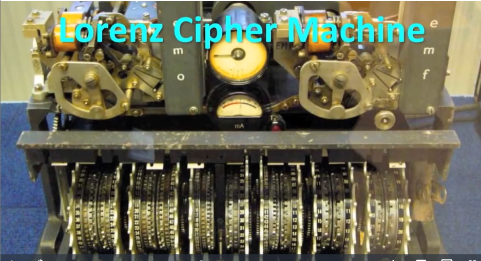

基于机器配置，机器将生成一个密钥序列。如果发送和接收方的生成密钥的机器都采用相同配置，接收方便可根据密文和生成的密钥做异或解密出明文。

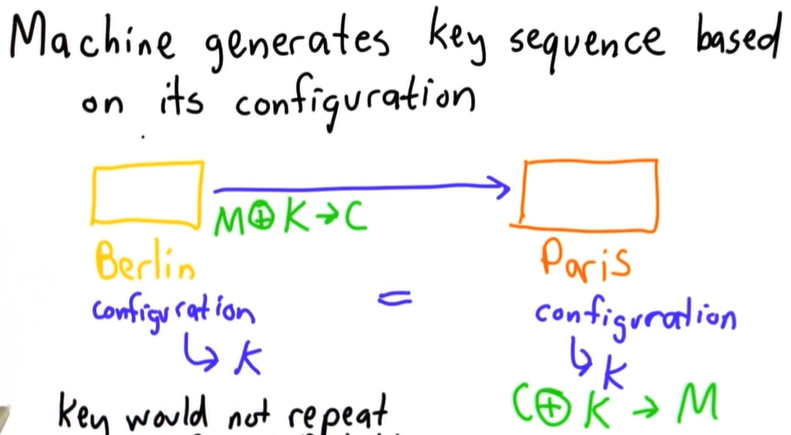

但是1941年，盟军取得大突破。发送接收方两边的Lorenz机当天都采用相同的配置$c_0$，$c_0$是从代码本中选取的。第一次发送$m$的时候接收方没有收到，便让发送方再次发送，第二次发送方修改了一点明文内容$m'$再次发送，两次密文都被窃听者截获了，盟军将截获的两次密文做异或得：
$$
c \oplus c'=m \oplus k \oplus m' \oplus k=m \oplus m'
$$
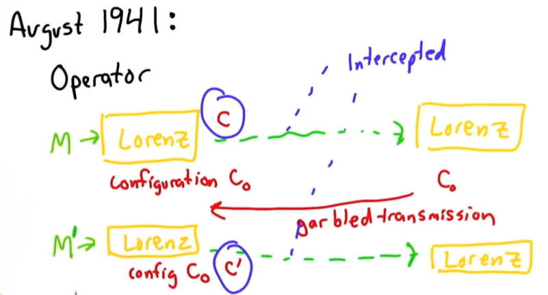

## 1.11 Colossus密码机

## 1.12 现代对称加密（Modern Symmetric Ciphers）

现代对称加密有两种主要类型：

- 流密码（stream cipher）：由一个数据流组成，并且一次可以加密一些小块（chunks）（通常是一次1byte）。
- 块密码（block cipher）：数据被分割成更大一些的块（chunks），并一次加密一个块（通常一个块的大小至少为64bits，可以达到128或256bits）。

二者唯一的不同就是块的大小，设计意图也不一样。

## 1.13 高级加密标准（Advanced Encryption Standard）

高级加密标准（AES）是现今最重要的块加密，块大小为128bits，代替了数据加密标准（Data Encryption Standard，DES），已经成为了过去数十年来的一个标准。是美国从1997年开始举办的一个比赛选出来的用于替代DES的标准。

AES甚至几乎所有现代块加密都采用XOR并且包含两种操作：

- shifts，置换位，移动位。其比单纯的异或操作要好，因为我们移动数据而非改变数据。
- s-boxes，非线性：以非线性的方式混合数据。其通过查找表（lookup-tables）完成：
  - 一个s-box需要8bits，并有一个查找表（有256个条目）将每组8bits映射到另一组8bits。设计查找表是一个挑战。查找表必须是尽可能的非线性，并确保该表中的数据没有任何模式。

AES的工作方式是将移位（shifts）和s-boxes与xor相结合来扰乱数据，并进行多轮（rounds）操作，然后通过一系列的移位和s-boxes与xor将其放回。轮数取决于密钥大小：对于AES最小的密钥大小（128bits），我们将进行10轮循环，得到该块的输出密文。（实际细节其实很复杂）

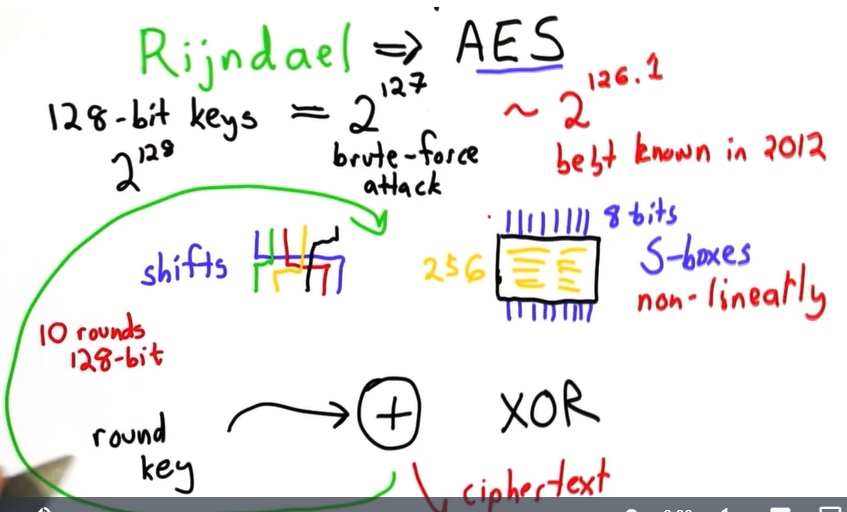

# 2 对称加密的应用（Application of Symmetric Ciphers）

我们所有关于安全性的假设都依靠密钥$k$，我们两个密钥假设：

1. 密钥是随机选取的，均匀分布的。这意味着密钥不可预测。
2. 密钥是秘密保存的（但是可以共享）。这意味着敌手无法学习到密钥。

## 2.1 生成随机密钥

衡量一个序列$s$的复杂度（Kolomogorov Complexity）：
$$
K(s) = s可能的最短描述的长度
$$
其中，描述可以是一个图灵机、一个python程序或任何一种描述语言，只要该语言有足够能力描述$s$。

**随机性（randomness）：**一个bit串当且仅当它短于任何计算机程序可以提供的串，它就是随机的。换言之，随机串是那些不能被压缩的串。

**随机序列（random sequence）：**一个序列是随机的，当且仅当
$$
K(s)=|s|+C
$$
这意味着，随着序列变长，描述长度也是同步率变长。

Kolomogorov复杂度无法计算，如果尝试用统计学测试判断随机性，只能证明序列是非随机的，并不能证明随机性。但是可以从序列生成的方式入手，如果我们知道序列是怎么生成的，就知道其是否满足随机的要求——不可预测性（unpredictability）：

如果即使一个攻击者已经知道序列中前一个数字了，但还是只能用同样的概率去猜下一个数字，那么就说该序列对攻击者是不可预测的，是一个随机序列。

**物理随机事件（Physically Random Events）：**

- 量子力学（例如：宇宙中的事件，辐射衰减，以及其他）。
- 热噪声。
- 鼠标点击和用户动作。
- ……

有某种网站，通过用户鼠标在屏幕上胡乱滑来滑去的动作生成随机密钥。

## 2.2 伪随机数生成器（Pseudo Random Number Generator）

**伪随机数生成器（PRNG），种子（seed），状态（state）：**伪随机数生成器将少量的物理随机性（种子）作为输入，并产生一长串的 "随机 "比特。PRNG是一种生成近似于随机数属性的数字序列的算法。该序列不是真正的随机，因为它完全由一组相对较小的初始值决定，称为PRNG的状态，其中包括一个真正随机的种子。

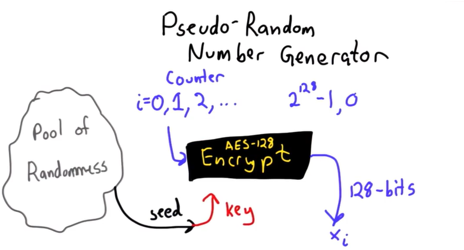

从随机池（有限的许多真正的随机数）中选择一个种子$s$作为密钥，PRNG看起来就是如下这个样子。上图采用的是AES-128加密，密钥是128bits，生成的$x_i$也是128bits。

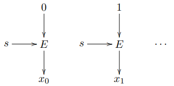

如果不使用好的随机性的话，也即如果选取不好的密钥，加密不会工作地很好，所以需要注意不要使用程序语言中的内置随机生成器，它在密码学意义上可能不安全，有很好的随机数生成库。

## 2.3 操作模式（Modes of Operation）

**操作模式：**是指在一个单一的密钥下实现重复和安全使用一个块密码（AES）的程序。这意味着操作模式是对一个文件进行加密的方法，从密文$c$中并没有给出关于信息$m$的那么多信息。

### 2.3.1 电子密码本模式（Electronic Codebook Mode，ECB）

设想一个加密文件的场景，一个文件拥有者可以读该文件，现有一个密钥$k$可以解密文件，一种直接的方式：将文件$m$分成多块，块大小取决于加密方式，在此假设块大小128bits（AES），将要存储的是密文，每个密文块是采用密钥$k$加密明文块后的结果。

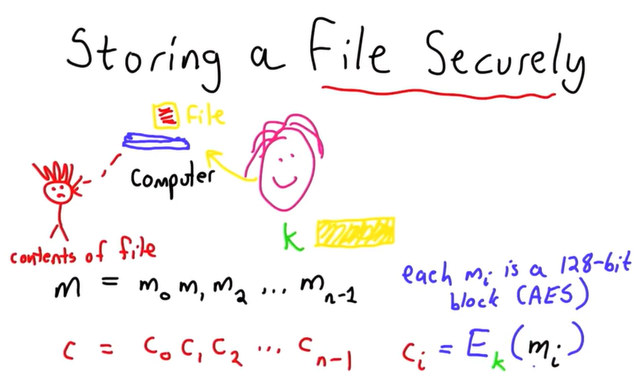

由于每次加密都采用同一个密钥$k$，明文块$m_i$和密文块$c_i$是一一对应的（就像密码本一样），所以攻击者可以从密文$c$中学习到：

- $m$的长度。
- 哪些块是相等的。

因此该模式有两个主要问题：

- 不隐藏重复。
- 攻击者可以移动或替代块，将会解密出可用但顺序错误的明文。

### 2.3.2 密码块链接模式（Cipher Block Chaining Mode，CBC）

为了避免上述模式的问题，密码链接模式是一个解决办法。我们采用前一个块的密文来影响下一个块，我们仍然将明文分块$m=m_{0} m_{1} m_{2} \ldots m_{n-1}$，每块大小为$b$，每次加密仍使用同一个密钥$k$。

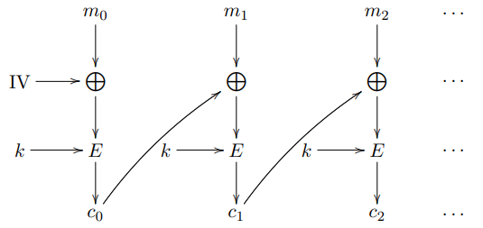

这意味着每个明文块不是独立进行的，而是与前一个密码块进行异或，然后再进行加密：

1. 第一个信息块$m_0$将与一个初始化向量（IV）配对，IV是一个大小为$b$的随机块，然后用$k$进行加密，得到$c_0$。IV不需要保密，但不要重复使用一个IV。（如果不用IV，还是掩盖不了重复的性质，不同的$m$之间的首块可能重复）
2. $m_1$与$c_0$做异或，再用$k$加密得$c_1$。
3. 以此类推直到$c_{n-1}$生成。

CBC的结果为$\forall i \in\{1,2,3, \ldots, n-1\}:$
$$
\begin{aligned}
c_{0} &=E_{k}\left(m_{0} \oplus \mathrm{IV}\right) \\
c_{i} &=E_{k}\left(m_{i} \oplus c_{i-1}\right)
\end{aligned}
$$
如果Alice用CBC模式加密后，忘了IV，除了$m_0$那还是可以复现出剩下的明文$m_{1} m_{2} \ldots m_{n-1}$。因为IV仅仅是为了隐藏首块之间的重复性。具体方式是从密文的尾块倒着向前解密就是了。

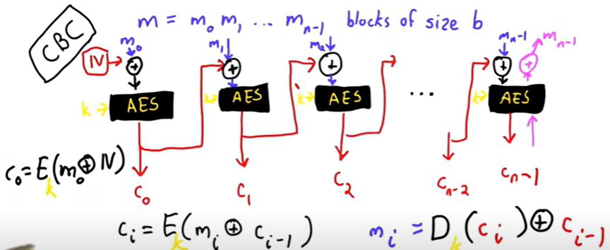

### 2.3.3 计数器模式（Counter Mode，CTR）

一个明文$m$被分为$m=m_0m_1 ... m_{n-1}$块。在CTR中，不是只有一个明文块进入加密函数，而是有一个计数器（一些在自然数中循环的值），它是加密函数的输入，所以结果是一些加密的块。这些块与相应的消息块相异或，就是最终的密文块。为了避免每次都使用相同的计数器序列的问题，我们添加一个nonce（事实上：将nonce与计数器的值相连接）。nonce只是一个一次性的、不可预测的值（类似于钥匙），它不需要保密（例如，在AES中：一个块的大小总是128位，因此nonce和计数器都是64位长）。

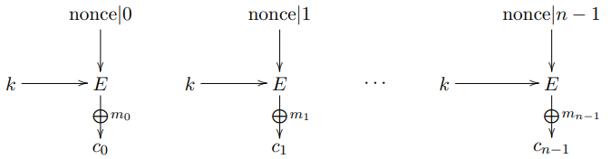

加密：$c_{i}=E_{k}(\text { nonce } \mid i) \oplus m_{i}$

解密：$m_{i}=c_{i} \oplus E_{k}(\text { nonce } \mid i)$

> CBC vs CTR
>
> 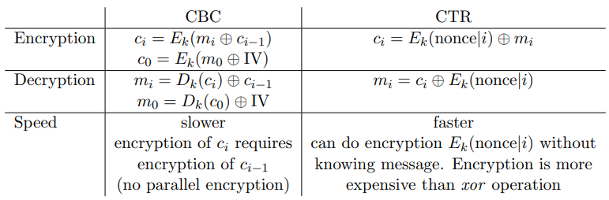

### 2.3.4 密码反馈模式（Cipher Feedback Mode，CFB）

CFB模式将一些$n$位长的$x$值$x_0, x_1, x_2, ...$作为输入，其特性是第一个值是初始化向量$x_0 = IV$。每个$x$值被分成2个块：第一个块$\widetilde{x}_{i}$的大小为$s$（s块），第二个块的大小为$n-s$（n-s块）。加密函数将一个长度为$n$的$x$和一个长度为$n$的密钥$k$作为输入，并给出一个$n$位长的结果。该结果被分成两个块：第一个块$c_i'$的长度为$s$（s块），因此第二个块$c_i''$的长度为$n-s$（n-s块）。明文$m$被分为长度为$s$的块：$m = m_0m_1m_2 . . .$， 每个明文块与相应的s块（$c_i'$ ）进行异或，得到长度为s的密文块。下一个$x$值被合成：第一部分是前一个$x$值的n-s块，第二部分是前一个加密函数的密文（与相应的$m$块异或后）。

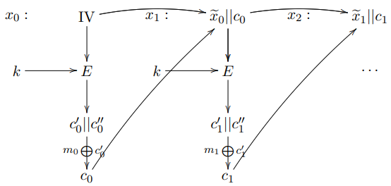

解密：
$$
\begin{aligned}
m_{i} &=c_{i} \oplus \underbrace{E_{k}\left(x_{i}\right)}_{=c_{i}^{\prime}} \\
x_{i} &=\widetilde{x}_{i-1} \| c_{i-1} \\
x_{0} &=\mathrm{IV}
\end{aligned}
$$

> ||是连接的意思。
>
> CBC vs CFB
>
> 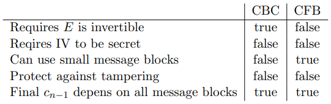

## 2.4 协议（Protocols）

**协议（Protocol）：**协议涉及2个或更多方，是对一系列步骤的精确定义。每个步骤都可能涉及一些计算和通信（在各方之间发送数据）。加密协议还涉及一个秘密。

**安全协议（Security Protocol）：**安全协议是一种协议，即使一些参与者作弊（不按照协议规定的步骤行事），也能提供一些保障。

**padding：**如果使用一个需要输入n比特长的块状密码（最小n=128，用于信息、密钥和AES的输出），信息有时必须被填充以达到所需长度。最简单的形式是零填充（用零填充，直到达到要求的长度）。

## 2.5 加密哈希函数（Cryptographic Hash Function）

**加密哈希函数（Cryptographic Hash Function）：**加密哈希函数$H$是将一些大数作为输入，输出一个小数的函数：
$$
h=H(x)
$$
常规哈希函数有这些性质：

- 压缩：输入大数输出一个固定的小数。
- 分布：$H$分布得很好：$P(H(x)=i) \sim \frac{1}{N}$，服从均匀分布，$N$是输出的大小（输出范围：$[0,N)$）。

一个加密哈希函数有额外的一些性质：

- 抗厡像性（"单向性"）（Pre-image resistance (”one-way-ness”)）：给定$h$难以反解出$x$。
- 弱抗冲突性（Weak collision resistance）：给定$h=H(x)$，难以找出任何$x'$使得$H(x')=h$。
- 强抗冲突性（Strong collision resistance）：难以找出任何一对$(x,y)$使得$H(x)=H(y)$。

一个几乎好的加密哈希函数是使用CBC来加密$x$，并将最后的输出块作为散列函数的值，因为这提供了压缩特性以及抗碰撞特性。这种结构与Merkle-Dangard结构类似。对于哈希函数来说，使用相同的密钥就可以了（选择密钥为0)

**随机预言假设（Random Oracle Assumption）：**是一个理想的（有所有所需的性质）加密哈希函数。其以均匀分布将任何输入映射到$h$。一个试图找到冲突的攻击者并不能比一个暴力搜索做得更好：
$$
H(x) \mapsto h
$$
构建一个随机预言是不可能的。

## 2.6 存储密码（Storing Passwords）

## 2.7 字典攻击（Dictionary Attacks） 

## 2.8 加盐的密码方案（Salted Password Scheme）

## 2.9 哈希链（Hash Chain）

# 3 密钥分发（Key Distribution）

在对称密码中，所有参与方都有相同的密钥来进行加密和解密。密钥可能是相同的，也可能在两个密钥之间有一个简单的转换。使得密码学对称的重要属性是使用相同的密钥来加密和解密。如果2个或更多的当事方想要相互交谈，他们首先必须就秘密密钥达成一致。这意味着必须有一种方法让双方在不暴露密钥的情况下交流这个密钥。早期，这是用密码本来完成的（密码本被物理地分发到各端点），这并不实用。如今，有不同的方法来建立一个安全的密钥。

## 3.1 成对共享密钥（Pairwise Shared Keys）

两两共用一个密钥。这种方法只能在人数少的时候使用。

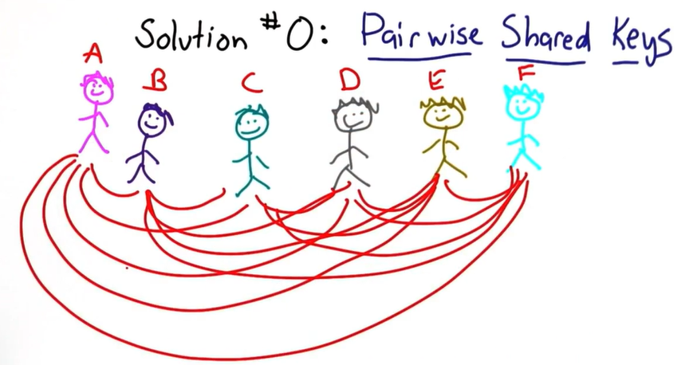

## 3.2 可信第三方（Trusted Third Party）

假设网络中有两方$A,B$，一个可信第三方$TP$对$A,B$分别有一个密钥$k_A,k_B$。当$A,B$想要通信的时候：

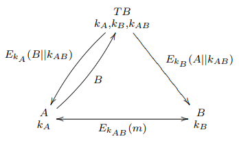

> 图中有误，TB应为TP。

1. $A$发送请求给$TP$告诉想要跟$B$通信。
2. $TP$生成一个随机密钥$k_{A B} \in\{0,1\}^{n}$。
3. $TP$发送$E_{k_{A}}\left(B \| k_{A B}\right)$给$A$，发送$E_{k_{B}}\left(A \| k_{A B}\right)$给$B$，告诉两方对方的userID和用于通信的密钥$E_{k_{AB}}$。
4. $A,B$可以用$E_{k_{AB}}$通信了。

该方法有一些问题：

- 可信第三方可以获知两方之间通信的所有消息，因为密钥都是它生成的。
- 可信第三方可以冒充每一个客户，其可以生成一个伪造的消息，伪装成$A$发给$B$的。
- 一个攻击者可以篡改$E_{k_{A}}\left(B \| k_{A B}\right)$以盗取$k_{AB}$（取决于加密和操作模式）。

所以可信第三方的方法也是阳春白雪。

## 3.3 Merkle's Puzzles

首先两方协商一些参数：

- 加密函数$E$。
- 安全参数$s,n,N(s \leqslant n)$。

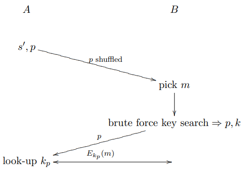

协议流程：

1. $A$生成$N$个秘密：$s^{\prime}=\left[\{0,1\}^{s},\{0,1\}^{s}, \ldots,\{0,1\}^{s}\right]$，每个秘密长度为$s$bits。
2. $A$生成$N$个puzzles：$p=\left[E_{s_{1}^{\prime} \| 0^{n-s}} \text { ('Puzzle': 1), } E_{s_{2}^{\prime} \mid 0^{n-s}}(\text { 'Puzzle': } 2), \ldots, E_{s_{N}^{\prime} \| 0^{n-s}} \text { ('Puzzle': } N)\right]$，第i个puzzle采用第i个秘密（加以填充0）作为密钥加密。被加密的信息包括字符串'Puzzle'和相应的秘密的序号i。
3. $A$打乱puzzles并发送给$B$。
4. $B$随机选取其中一个puzzle$m$并用暴力密钥搜索的方式试图解密：$D_{g|| 0^{n-s}}(m)$，其中$g$是猜测的密钥$g \in\{0,1\}^{s}$和一个已知的解密函数（加密函数$E$的反函数）。最终$B$将会找到一个可以解密出$'Puzzle':i$的密钥$g$和puzzle number $i$。
5. $B$将puzzle number $i$发回$A$。
6. $A$根据收到的puzzle number确定相应的秘密$s'_i$作为双方沟通的密钥。

> 对于更长的密钥可以，将密钥与puzzle number放在一起，放在puzzle里，$B$解密出puzzle number发回$A$就能知道puzzle number对应的密钥。

该方法也是不实用的，因为$A$需要生成大量秘密和puzzles，并且需要大带宽来发送信息，以至于攻击者不能轻易获取密钥。

**定理：**假设有完美的加密和随机密钥，得到所有发送的信息的攻击者预计需要N/2倍于B的工作量来找到密钥。

**证明：**由于B从洗牌后的集合p中随机挑选了一个谜题，并用暴力密钥搜索的方式解决了它，并将谜题的编号发回给A，攻击者并不知道哪些加密谜题与这个编号对应。攻击者必须尝试破解所有的加密谜题，并且在尝试了大约N/2个谜题后，有望找到与B挑选的谜题相匹配的谜题。

## 3.4 Diffie-Hellman密钥交换（Diffie-Hellman Key Exchange）

在进入数学描述之前，先假设这样一个场景：有一个公共颜色黄色，Alice和Bob都各有一个秘密颜色绿色和粉色。现在双方各自将公共颜色与自己的秘密颜色混合成怪绿和怪粉，然后发送给对方，Alice拿到怪粉后，将其和自己的秘密颜色混合得灰色；同理，Bob将收到的怪绿和自己的秘密颜色混合也得灰色。

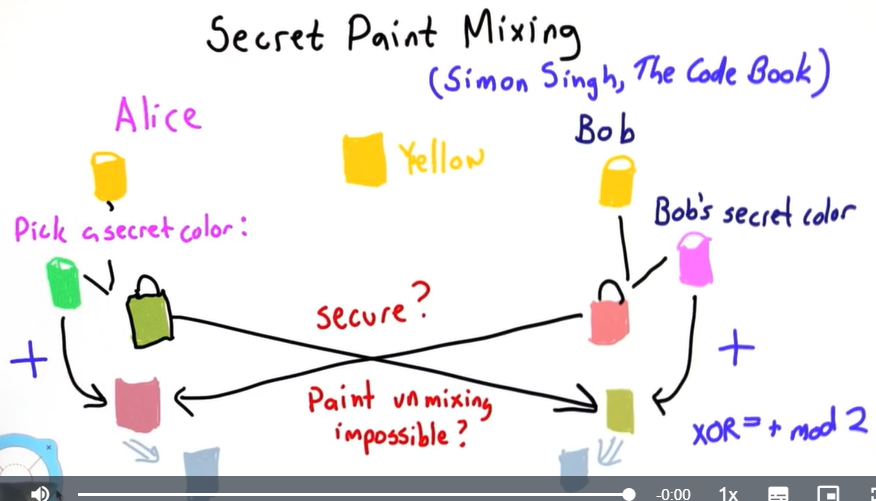

**乘法运算（Multiplication）**的性质（DHKE中使用）：

- 交换性：$\forall a, b \in \mathbb{Z}, \forall n \in \mathbb{N}:  a \cdot b(\bmod n)=b \cdot a(\bmod n)$
  
- 幂交换性：$\forall a \in \mathbb{Z}, \forall c, b \in \mathbb{N}, \forall c, b \in \mathbb{Z} \Leftrightarrow a+\mathbb{Z} n \in(\mathbb{Z} / \mathbb{Z} n)^{\times}, \forall n \in \mathbb{N}:$
  $$
  \left(a^{b}\right)^{c}(\bmod n)=a^{b c}(\bmod n)=a^{c b}(\bmod n)=\left(a^{c}\right)^{b}(\bmod n)
  $$

即使取模，上述性质依然有效。

**原始根（primitive root）：**$p$是一个素数，如果每一个模$p$整数$\mathbb{Z}_p$中的非零元素都是$r$的幂，非零整数$r\in \mathbb{Z}_p$是$p$的一个原始根。

例如，$p=7$，则$r=3$是$p$的一个原始根：
$$
\begin{array}{rlrl}
r^{1}=3 & 3  \equiv 3 \bmod 7 \\
r^{2}=9 & 9  \equiv 2 \bmod 7 \\
r^{3}=27 & 27  \equiv 6 \bmod 7 \\
r^{4}=81 & 81  \equiv 4 \bmod 7 \\
r^{5}=243 & 243  \equiv 5 \bmod 7 \\
r^{6}=729 & 729  \equiv 1 \bmod 7
\end{array}
$$
$\mathbb{Z}_p=\{1,2,3,4,5,6\}$中的每一个元素都是$r=3$在模$p=7$空间下的幂。

**定理：**如果$p>2$且为素数，其至少有2个原始根。

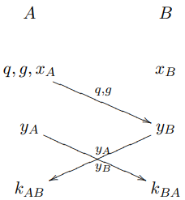

**协议：**DHKE允许两方不需要提前协商而建立一个共享密钥：

1. $A$选取一些值$q$（大素数）和$g$（$q$的原始根），将它们发给$B$。
1. $A$选取一个随机值$x_{A} \in\{0,1\}^{n}$，$B$选取一个随机值$x_{B} \in\{0,1\}^{n}$。
1. $A$计算$y_{A}=g^{x_{A}} \bmod q$，$B$计算$y_{B}=g^{x_{B}} \bmod q$。
1. $A,B$交换$y_A,y_B$。
1. $A$计算密钥$k_{A B}=y_{B}^{x_{A}} \bmod q$，$B$计算密钥$k_{B A}=y_{A}^{x_{B}} \bmod q$。

==$k_{AB}=k_{BA}$==，证明：
$$
\begin{aligned}
A: & \\
k_{A B} &=y_{B}^{x_{A}} \bmod q \\
&=\left(g^{x_{B}}\right)^{x_{A}} \bmod q \\
&=g^{x_{B} x_{A}} \bmod q \\
B: & \\
k_{B A} &=y_{A}^{x_{B}} \bmod q \\
&=\left(g^{x_{A}}\right)^{x_{B}} \bmod q \\
&=g^{x_{A} x_{B}} \bmod q
\end{aligned}
$$
由于幂交换性，所以$g^{x_{B} x_{A}}=g^{x_{A} x_{B}}$。

**DHKE安全性（对抗消极攻击者）：**消极攻击者（只监听）获取到公共值$q,g,y_A,y_B$。方案的安全性依靠于很难解
$$
a^{x}=b \bmod n
$$
对于$x$给定$a,b,n$（离散对数问题）。

如果模数$n$不是素数，Diffie-Hellman方案仍然是正确的（两方产生相同的密钥）但也不一定，因为一些非素数计算离散对数不难。

**DHKE安全性（对抗积极攻击者）：**DHKE在对抗积极（改变、重写被发送的消息）攻击者时是不安全的。如果一个攻击者可以改变$y_A,x_B$（例如，如果攻击者将$y_A,y_B$变成1，然后秘密密钥将变成1，而个人密钥仍是1）。或者攻击者可以获得所有值$g,p,y_A$并用密钥$k_{AM}$与$A$建立一个安全的假连接，用密钥$k_{BM}$与$B$建立一个安全的假连接。于是攻击者在中间：
$$
\underbrace{c=E_{k_{A M}}(m)}_{A} \stackrel{c}{\rightarrow} \underbrace{m=D_{k_{A M}}(c), m \rightarrow m^{\prime}, c^{\prime}=E_{k_{B M}}\left(m^{\prime}\right)}_{M} \stackrel{c}{\rightarrow} \underbrace{m^{\prime}=D_{k_{B M}}\left(c^{\prime}\right)}_{B}
$$
这意味着：$A$发送一个加密的消息给$M$认为它是$B$。$M$可以解密消息并改变它然后将其发送给$B$，$B$认为该消息是$A$发送过来的。

**离散对数问题（Discrete Logarithm Problem）：**

- **连续对数（Continous Logarithm）：**已知$a,b \in \mathbb{R}$，$a^x=b$解得$x=\log _{a} b$，可以高效地解出。

- **离散对数（Discrete Logarithm）：**已知$a,b,n \in \mathbb{R}$，$a^x=b \bmod n$解得$x=\text{dlog} _{a} b$。其中$\text{dlog}$是离散对数。事实证明，这是一个非常困难的问题，而且$n$是一个大质数。尚不清楚$\text{dlog}$是否总是存在（对于确切的$a,b,n$它将不存在）。

这里$a$是一个生成器，意思是：$a^{1}, a^{2}, \ldots, a^{n-1}$是$\begin{equation}
1,2,3, \ldots, n-1 \in \mathbb{Z}_{n}
\end{equation}$的一个排列（通常每个数字只出现一次）。

给定一个幂，很难在原始根例子的列表中找到相应的数字（对于大于7的数值）。最快的已知解决方案需要指数时间（而不是多项式）。这意味着解决这个问题的唯一方法是尝试所有可能的幂，直到你找到一个可行的幂。你可以通过巧妙的方式尝试幂数（并排除一些幂数）来做得更好一些，但没有比做指数搜索更好的方法了，因为指数搜索是以n的大小为指数的（n的值为线性）。

如果能够有效地计算$\text{dlog}$，那么攻击者（知道$q,g,y_A,y_B$）就能够计算
$$
k=y_B^{\operatorname{dlog}_g y_A \bmod q} \bmod q
$$
其中$\text{dlog} _g y_A \bmod q=x_A$，并且$k$是密钥。

**决定性Diffie-Hellman假设（Decisional Diffie-Hellman Assumption）**：假设离散对数很难解，然后破解Diffie-Hellman意味着高效解决离散对数问题（不可证明）。Diffie-Hellman的安全性依靠一个强有力的假设：Decisional Diffie-Hellman Assumption：
$$
k=g^{x y} \bmod q
$$
与随机给定$q,g,g^x,g^y$（拦截的消息）没有区别。该假设对于确切的值是不真实的。

# 4 非对称加密系统（Asymmetric Cryptosystems）

# 5 加密协议（Cryptographic Protocols）

# 6 使用密码学解决问题

# 7 安全计算（Secure Computation）

