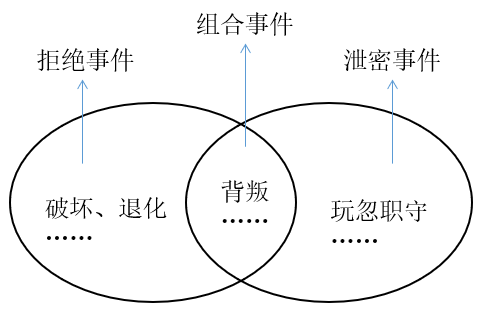
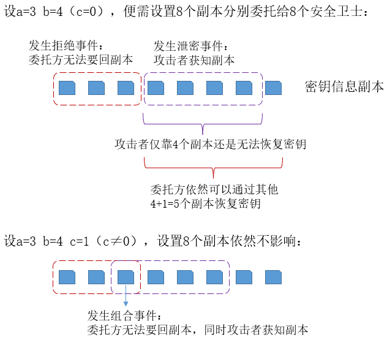

# 秘密共享（Secret Sharing）

# 1 Introduction

## 1.1 秘密共享的发展与现状

秘密共享本身是一个古老的技术。例如在古代，一个藏宝地图经常和被人为地分割为多个部分，由不同的人分别进行保管，只有合并地图的各个部分后，才能根据地图的指示获取宝藏；又如工业化社会中的某个产品的配方，为了防止配方泄露，经常都是根据材料的不同产生一系列小配方以便工人可以生产产品而无法获取配方信和息；还有近代革命时期，未曾谋面的志同道合之士有时也通过拼接一张纸币的方法进行接头等。尽管没有上升到秘密共享理论高度，但这些应用都能够通过秘密共享思想解释得通。

尽管如此，直到20世纪70年代，秘密共享概念才被明确提出。秘密共享（SS，Secret Sharing）的概念最早由Shamir[^1]和Blakley[^2]于1979年独立提出的。一般来说，一个秘密共享方案由一个秘密分发算法和一个秘密重构算法构成。在执行秘密分发算法时，秘密分发者（Dealer）将秘密分割成若干份额（Share/Piece/Shadow）或子秘密，并在一组参与者（Share Holder/Participant）中进行分配，使每一个参与者都得到关于该秘密的一个秘密份额；秘密的重构算法保证只有参与者的一些特定的子集，即合格子集（Qualified Set）中的参与者联合可以正确恢复秘密，而其他任何子集，即非合格子集（Unqualified Set）中的参与者联合不能恢复秘密，甚至得不到关于该秘密的任何有用信息。由所有合格子集构成的集合通第称为访问结构（Access Structure），常用$\mathcal{\Gamma}$表示。

Shamir和Blakey分别给出了第一个$(t,n)$门限秘密共享算法。在$(t,n)$门限秘密共享方案中，任何包含至少$t$个参与者的集合都是合格子集，而包含$t-1$或更少参与者的集合都是非合格子集。实现$(t,n)$门限秘密共享的方法处理Shamir和Blakley的方案外，还有基于中国剩余定理的秘密共享以及使用矩阵乘法的秘密共享等。最常用的是Shamir的$(t,n)$门限方案，它应用Lagrange插值法，实现简单，并且是一个完备的理想方案。使用$(t,n)$门限方案报关秘密具有如下优点：

1. 攻击者即使可以得到多达$t-1$个秘密份额，也不能会付出秘密$s$。
2. 即使多达$n-t$个份额因某些原因遭到破坏，秘密$s$也可以被恢复出来。
3. 将秘密$s$分散保管，有利于避免权力过分集中而导致的权力滥用问题。

然而，门限秘密共享只是秘密共享技术的特殊情况，只有在所有共享者具有完全平等的地位、可靠性和安全性的情况下才是有意义的，因此一般访问结构上的秘密共享研究具有更广泛的现实意义。

秘密共享一般都可以归结到门限秘密共享或访问结构上的秘密共享之一，在此基础上，根据不同的应用环境，近些年，学者提出了一些新型的秘密共享概念：

- 多阶段秘密共享。
- 多重秘密共享。
- 多秘密共享。
- 可验证秘密共享。
- 无秘密分发者的秘密共享。
- 可阻止恢复秘密的秘密共享。
- 可视秘密共享方案。
- 基于多分辨滤波的秘密共享。
- 量子秘密共享。
- 基于广义自缩序列的秘密共享。

## 1.2 秘密共享的应用

### 1.2.1 门限数字签名

门限数字签名（Threshold Digital Signature）是建立在秘密共享方案基础之上的数字签名体制。在$(t,n)$门限群签名方案中，利用门限技术将签名密钥分散给多人管理，使只有$t$个或更多的参与者（或签名者）联合才能生成有效的群签名。

### 1.2.2 多方安全计算

安全多方计算（Secure Multiparty Computation，SMC）是密码理论以及许多应用的基础，因为几乎所有密码学问题（如加密、认证、签名、承诺和门限密码等）都可以看作是安全多方计算的特例。安全多方计算协议解决的问题是：一组相互不信任的参与者希望通过网络来计算某个约定的函数，每个参与者提供该函数的一个输入值，并要求参与者提供的输入值对其他人保密。秘密共享协议是实现安全多方计算的基本工具之一。

### 1.2.3 密钥协商

分布式的密钥生成（Distributed Key Generation，DKG）是门限密码系统及分布式密码计算的重要组成部分。它允许多个参与者合作生成一个密码系统的公钥和私钥，使公钥以公开形式输出，而私钥被参与者按照某一秘密共享方案所共享，并可用于面向群体的密码系统（如群体签字或群体解密）。

### 1.2.4 其他

在电子商务、密钥托管、可验证签名共享、电子选举、安全组播、生物特征识别和加密等方面有着重要应用。

# 2 经典的秘密共享算法

## 2.1 Blakley密钥管理方案

### 2.1.1 密钥管理面临的窘境

在现代密码学中，密钥是整个安全系统的核心和根本。密码算法要求是公开的，其安全性完全依赖于密钥的机密性。密钥管理简单地说必须要包含两个要求：

1. 机密性要求，确保非授权用户无法获取密钥信息。
2. 可用性要求，确保授权的合法用户总是可以正确地获取密钥信息。

确保机密性已有非常成熟的软硬件技术可以实现，但是实现可用性要求很难，因为攻击者通常会在对获取的密文或密码设备进行分析失败后不会将其物归原主，甚至会销毁，使合法用户也不能正常使用，这也算是一种拒绝服务攻击（Denial of Service，DoS）形式。

由于以上原因，密钥信息通常需要在不同安全存储设备上存储多个副本进行备份。但是，副本越多，只要一个副本泄密，整个安全系统就崩溃了，机密性越低；副本越少，副本可能会被全部摧毁，可用性越低。

### 2.1.2 密钥管理中的安全事件

==委托方将密钥信息副本委托（entrust）给一个安全卫士（guard）。==

> 委托方是指委托他人代为办理事务的人；被托方是接受他人委托代为办理事务的人。

存储的密钥信息副本至少需要满足以下安全要求（它们必须能防止什么攻击事件呢？）：

1. 拒绝事件（Abnegation Incident）。==指委托方无法再要回完整的重要信息（密钥信息副本）。==有三种主要的拒绝事件：
   1. 破坏（Destruction），例如一个保存副本的人可能遇到无法预料的突发事故从而导致副本被损坏。
   2. 退化（Degradation），例如一个人可能丢失他的副本，然后再被问及的时候处于尴尬和混乱中产生其他内容来冒充。
   3. 背叛（Defection），例如拥有副本的人可能会将它暴露给委托方的对手，并且拒绝将副本还给委托方。
2. 泄密事件（Betrayal Incident）。==指将委托人的重要信息（密钥信息副本）完全提供给委托人的对手。==上面提到的背叛行为就是泄密事件的一种。另一种主要的泄密事件称为玩忽职守（Dereliction），是指将所委托的信息在被要求归还之前或之后暴露给委托人的对手, 并且还做一些掩盖行为以便不让委托人发现其背叛行为。例如，拥有副本的人可以将它暴露给对手，但同时，他还仍然扮演着忠实守卫的角色，甚至还会在被要求时正确地提供所掌握的副本内容。从安全事件的危害程度来说，玩忽职守行为危害更大。
3. 组合事件（Combination Incident）。既属于拒绝事件，又属于泄密事件的事件。==一种主要的组合事件就是前面所讨论的背叛==。

### 2.1.3 解决问题的思路和方法

Blakley的门限方案[^2]是基于对安全事件计数的。对安全事件计数，有两大法则：

1. Boole的包含排斥原理。假定一个委托方（组织）将信息副本委托给一些安全卫士，令$a$代表拒绝事件的数量，$b$代表泄密事件的数量，$c$代表组合事件的数量。那么事件的总数量$d=a+b-c$，因为组合事件被计算了两次。
2. 非常不常见的事件（使同一信息副本上发生两个独立的事件），其可能性从概率意义上看可以忽略不计而不考虑。（背叛既是拒绝事件又是泄密事件，是可能发生的，故考虑在内）这意味着$a,b,c,d=a+b-c$都无法超过将信息副本块委托给$g$个安全卫士的数目$g$，即安全事件总数不会大于安全卫士的数量。

由于$c \leqslant \min\{a,b\}$，由以上两大法则可以得到
$$
a+b-\min\{a,b\} \leqslant d \leqslant a+b \ , \ d \leqslant g
$$
为了使设计的密钥管理系统能够预料事件的最大数，必须假定组合事件的个数$c=0$，这样安全事件总数$d=a+b$。这样一个密钥管理系统必须至少能够产生$a+b+1$个不同的信息副本，并将它们交付给不同的安全卫士进行保管。密钥必须可以由任意$b+1$个副本进行恢复（因为至多发生$a$个拒绝事件，委托方至多要不回$a$个密钥信息副本，但剩余$b+1$个副本依然可以恢复密钥），从$b$个副本中无法得到有关密钥的任何信息（这是对$b$个泄密事件的防护，因为至多发生$b$个泄密事件，攻击者至多获得$b$个密钥信息副本，还是无法获取密钥的任何信息）。

> 拒绝事件：委托方无法要回副本（除组合事件外，攻击者无法获知副本）。
>
> 泄密事件：攻击者获知副本（除组合事件外，委托方也可要回副本）。
>
> 组合事件（背叛）：委托方无法要回副本，同时攻击者可以获知副本。

### 2.1.4 数学基础

**引理 1：**令$a$和$b$均为正整数，$R$是包含至少$a+b+2$个元素的集合。那么，$R$有超过$a+b+2$个包含$b+1$个元素的子集，有超过$a+b+1$个包含$b$个元素的子集。如果$f,g$是$R$中的两个元素，那么$R \setminus \{f\}$有超过$a+b$个包含$b$个元素的子集，$R \setminus \{ f,g \}$有至少$a+b$个包含$b$个元素的子集。

**引理 2：**假设$a$和$b$都是比$z$小的正整数。

### 2.1.5 Blakley密钥安全方案

假设密钥$k$是一个正整数，令$K$为有限个密钥的集合。令$B$为$K$中值最大的密钥，选择一个合理的小正整数$z \leqslant 100$，选择两个正整数$a,b \leqslant z$。

## 2.2 Shamir门限方案

----

[^1]:Shamir A. How to share a secret[J]. Communications of the ACM, 1979, 22(11): 612-613.
[^2]:Blakley G R. Safeguarding cryptographic keys[C]//Managing Requirements Knowledge, International Workshop on. IEEE Computer Society, 1979: 313-313.

> 参考资料：
>
> 1. 《秘密共享技术及其应用》庞辽军, et al. 2017.
> 2. 维基：Shamir's Secret Sharing https://en.wikipedia.org/wiki/Shamir%27s_Secret_Sharing
> 3. Blakley G R. Safeguarding cryptographic keys[C]//Managing Requirements Knowledge, International Workshop on. IEEE Computer Society, 1979: 313-313.
> 4. 袁理锋. 秘密共享技术及其应用的研究[D].大连理工大学,2017.
> 5. 