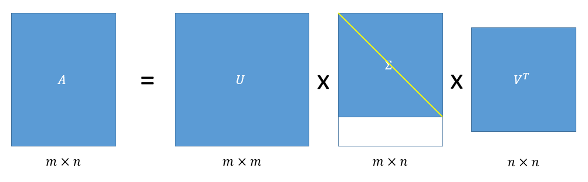
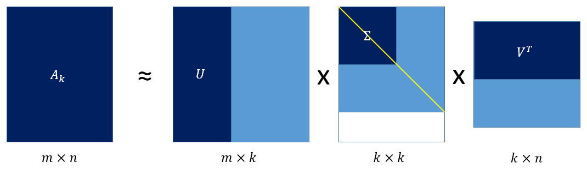
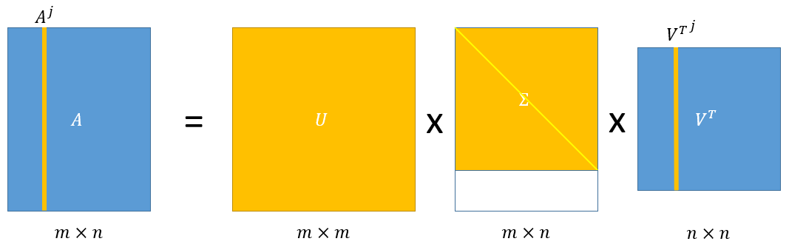
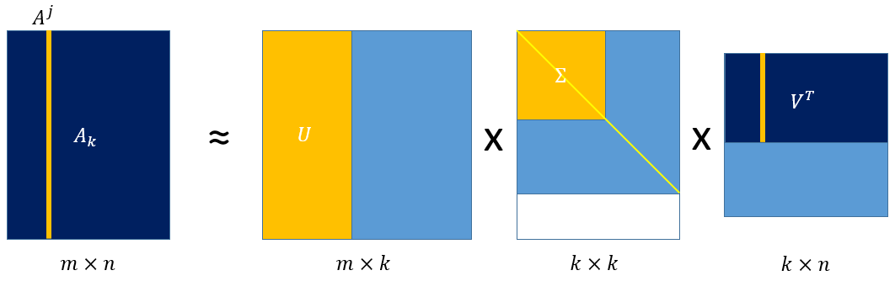

# SVD矩阵分解

# CUR矩阵分解（A=CUR）

> 主要参考论文[1]翻译而来

主成分分析（PCA）和更一般的奇异值分解（SVD）是基本的数据分析工具，它们将数据矩阵表示为重要性递减的正交或不相关向量序列。但是，这些向量是最多所有数据点的线性组合，在数据和生成数据的过程中，这些向量很难解释。CUR分解是以数据矩阵的少量实际列/行来显式表示的低秩矩阵分解。由于CUR分解是由实际的数据元素构造而成，因此，具备很强的可解释性。

## 前言：SVD矩阵分解

对于原始矩阵$A_{m\times n}$最常见的矩阵压缩方法是在前$k<<\min\{m,n\}$项截断奇异值分解（SVD）。例如，主成分分析（Principal Components Analysis，PCA）就是将这一过程应用于适当归一化的数据相关矩阵。

一般矩阵$A_{m\times n}$的SVD：

给定矩阵$A \in \mathbb{R}^{m \times n}$，存在正交矩阵$U=\left[u^1 u^2 \ldots u^m\right] \in \mathbb{R}^{m \times m}$和$V=\left[v^1 v^2 \ldots v^n\right] \in \mathbb{R}^{n \times n}$，其中$\left\{u^t\right\}_{t=1}^m \in \mathbb{R}^m$ 和$\left\{v^t\right\}_{t=1}^n \in \mathbb{R}^n$，使得：
$$
U^T A V=\Sigma=\operatorname{diag}\left(\sigma_1, \ldots, \sigma_\rho\right)
$$
其中，$\Sigma \in \mathbb{R}^{m \times n}, \rho=\min \{m, n\}, \sigma_1 \geq \sigma_2 \geq \ldots \geq \sigma_\rho \geq 0$，$diag( · )$表示对角线上具有指定元素的对角矩阵。进而可得：
$$
A=U \Sigma V^T
$$
$\sigma_i$是A的奇异值，并且向量$u^i$和$v^i$分别是第i个左奇异向量和第i个右奇异向量，计算它们的时间复杂度为$O\left(\min \left\{m n^2, m^2 n\right\}\right)$。

SVD如下图所示，$\Sigma$矩阵下面比对角矩阵多出来的空白部分全为0，黄色的对角线表示这实际上是一个对角矩阵：

SVD被广泛应用于数据分析，这很大程度上是因为向量（将SVD截断为前k项奇异值得到）所张成的子空间为矩阵A提供了最佳的秩k近似。如果$k \leq r=\operatorname{rank}(A)$并且我们定义：
$$
A \approx A_k=\sum_{t=1}^k \sigma_t u^t {v^t}^T
$$
即$A_k$为A最大的前k个奇异值及其左右奇异向量乘积所得mxn矩阵的加和，则：
$$
\left\|A-A_k\right\|_F^2=\min _{X \in \mathbb{R}^{m \times n}: \operatorname{rank}(X) \leq k}\|A-X\|_F^2
$$
即用Frobenius范数去衡量矩阵间的距离的话，在所有秩不大于k的同型矩阵中，$A_k$是最逼近A的矩阵。

截断的SVD如下图深色部分所示：

尽管截断的SVD应用广泛，但是奇异向量缺乏可解释性，奇异向量是可以对任意数据矩阵进行计算的数学抽象，它们不是具有“物性”现实的“物”。

## 之前的一些CUR矩阵分解方法

在数值线性代数界：

- Stewart发展了quasi-Gram–Schmidt（拟Gram–Schmidt）方法，并将其应用于矩阵及其转置，得到CUR矩阵分解。
- 类似地，Goreinov，Tyrtyshnikov和Zamarashkin提出了CUR矩阵分解（a pseudoskeleton approximation（a伪骨骼近似）），并将列和行的选择与“最大不相关性”概念联系起来。

在理论计算机科学界：

- Frieze，Kannan和Vempala根据依赖于列的欧氏范数的概率分布随机采样A的列。

## 基于统计杠杆（Statistical Leverage）的CUR矩阵分解方法

为了构造C （R也类似），我们将为A的每一列计算一个"重要性评分"，并将该评分作为重要性抽样概率分布从A中随机抽取少量列。==该“重要性评分”具有一种自然的解释：该列对矩阵A最佳低秩拟合的“统计杠杆”或“影响”。==通过优先选择对矩阵A的最佳低秩拟合影响大的列（不同于之前采样有更大欧氏范数或者经验方差的列的方式），CUR捕捉矩阵A的主要成分的效果与$A_k$几乎一样好。

基于上文提到的SVD分解，我们将矩阵A的第j列（$A^j$）表示为：
$$
A^j=\sum^r_{\xi=1}(\sigma_\xi u^\xi)v^\xi_j
$$
其中，$r=rank(A)$，并且$v^\xi_j$是A的第$\xi$个右奇异向量的第$j$个元素。即A的第j列是所有左奇异向量和奇异值的线性组合，V的第j行元素为系数。$A^j$的计算如下图橙色部分所示：

因此，于截断的SVD相对应，我们可以将$A_j$近似为前k个左奇异向量和相应奇异值的线性组合：
$$
A^j \approx \sum_{\xi=1}^k\left(\sigma_{\xi} u^{\xi}\right) v_j^{\xi}
$$
$A^j$的近似（截断）计算如下图橙色部分所示：

我们找到A中与前k个右奇异向量同时相关的列，然后计算==归一化的统计杠杆得分==：
$$
\pi_j=\frac{1}{k} \sum_{\xi=1}^k\left(v_j^{\xi}\right)^2
$$
其中，$j=1,...,n$。从这个归一化中可以直观得出$\pi_j \geq 0$并且$\sum_{j=1}^n \pi_j=1$，因此这些得分形成了n列上的概率分布。

因此便可引出CUR的==列选择算法ColumnSelect==：

输入：$A \in \mathbb{R}^{m \times n}$、秩$k$、误差参数$\epsilon$。

输出：C矩阵。

执行如下步骤：

1. 计算$v^1,...,v^k$（$A$的前$k$个右奇异向量），并且根据$\pi_j=\frac{1}{k} \sum_{\xi=1}^k\left(v_j^{\xi}\right)^2$计算正则化的统计杠杆得分。
2. 令$A$的第$j$列的概率为$p_j=\min\{1,c\pi_j\}$，其中$j\in \{1,...,n\},c=O(k\log k/\epsilon^2)$。
3. 按概率选择若干列，并返回包含选择列的矩阵C。

至于==行选择算法RowSelect==，只需要对$A^T$执行列选择算法即可。

**CUR矩阵分解算法AlgorithmCUR：**

1. 对A执行==列选择算法==得到矩阵C。
2. 对A执行==行选择算法==得到矩阵R。
3. 计算U矩阵：$U=C^{+} A R^{+}$。其中$X^{+}$表示$X$的Moore–Penrose广义逆（Moore–Penrose generalized inverse）。

>**Moore–Penrose广义逆**：广义逆 (generalized inverse), 也称伪逆(pseudoinverse), 一般是指 Moore–Penrose 广义逆矩阵 (Moore–Penrose pseudoinverse)。只有方阵才有逆，广义逆则是逆在一般矩阵（可以是非方阵）上的推广。
>
>**起源**
>
>设 $\boldsymbol{A}$ 是 $n \times n$ 可逆方阵, $\boldsymbol{b}$ 是任意一个 $n$ 维向量, 则方程组
>$$
>\boldsymbol{A x}=\boldsymbol{b}
>$$
>总有解, 且解 $\boldsymbol{x}$ 可表为
>$$
>\boldsymbol{x}=\boldsymbol{A}^{-1} \boldsymbol{b} .
>$$
>现设 $\boldsymbol{A}$ 是任意 $m \times n$ 阵, $\boldsymbol{b}$ 是一个 $m$ 维向量, 是否存在 $n \times m$ 矩阵 $\boldsymbol{G}$, 使 得只要方程 $\boldsymbol{A} \boldsymbol{x}=\boldsymbol{b}$ 有解, 则
>$$
>\boldsymbol{x}=\boldsymbol{G} \boldsymbol{b}
>$$
>就是解?
>这样的矩阵 $\boldsymbol{G}$ 就涉及到广义逆的概念。
>
>**定义**
>
>广义逆有Moore定义和Penrose定义，二者是等价的，所以叫Moore–Penrose广义逆。下面介绍第二种定义。
>
>设 $\boldsymbol{A} \in \mathbb{C}^{m \times n}$, 如果 $\boldsymbol{G} \in \mathbb{C}^{n \times m}$ 满足
>(1) $\boldsymbol{A} \boldsymbol{G A}=\boldsymbol{A}$,
>(2) $\boldsymbol{G} \boldsymbol{A} \boldsymbol{G}=\boldsymbol{G}$,
>(3) $(\boldsymbol{A} \boldsymbol{G})^{\mathrm{H}}=\boldsymbol{A} \boldsymbol{G}$,
>(4) $(\boldsymbol{G A})^{\mathrm{H}}=\boldsymbol{G A}$,
>则称 $\boldsymbol{G}$ 为 $\boldsymbol{A}$ 的 Penrose 广义逆矩阵, 简称为 Penrose 广义逆, 记为 $\boldsymbol{A}^{+}$, 或 $\boldsymbol{A}^{\dagger}$。
>
>注：$A^H$ 为 $A$ 的转置共轭矩阵。
>
>**转置共轭矩阵**
>
>矩阵 $A$ 的共轭转置 (英语: conjugate transpose，又称埃尔米特共轭、埃尔米特转置 (Hermitian transpose) ) $A^H$ 的定义为：
>$$
>\left(A^H\right)_{i, j}=\overline{A_{j, i}}
>$$
>其中 $(\cdot)_{i, j}$ 表示矩阵i行迾上的元素， $\overline{(\cdot)}$ 表示标量的复共轭。
>这一定义也可以写作:
>$$
>A^H=(\bar{A})^{\mathrm{T}}=\overline{A^{\mathrm{T}}}
>$$
>其中 $A^{\mathrm{T}}$ 是矩阵 $\mathrm{A}$ 的转置， $\bar{A}$ 表示对矩阵 $\mathrm{A}$ 中的元素取复共轭。
>
>> 更多参见参考资料wiki[2] [3]

> 参考资料：
>
> 1. Mahoney, M. W., & Drineas, P. (2009). CUR matrix decompositions for improved data analysis. *Proceedings of the National Academy of Sciences*, *106*(3), 697-702.
> 2. https://zh.wikipedia.org/wiki/%E6%91%A9%E5%B0%94-%E5%BD%AD%E8%8B%A5%E6%96%AF%E5%B9%BF%E4%B9%89%E9%80%86
> 3. https://zh.wikipedia.org/wiki/%E5%85%B1%E8%BD%AD%E8%BD%AC%E7%BD%AE 