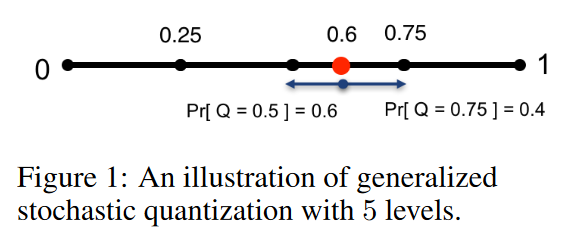

# QSGD(Quantized Stochastic Gradient Descent)

> 论文：QSGD: Communication-efficient SGD via gradient quantization and encoding

 $log$ 表示以2为底，浮点数用32bits表示。对于向量$\boldsymbol{v} \in \mathbb{R}^n$，令$\|\boldsymbol{v}\|_0$表示$\boldsymbol{v}$中非0元素的数量。对于比特串$\omega \in\{0,1\}^*$，令$|\omega|$表示其长度。对于标量$x\in \mathbb{R}$，令$\operatorname{sgn}(x) \in\{-1,+1\}$表示其符号，其中$\operatorname{sgn}(0)=1$。

## 随机量化

我们现在考虑一个通用的、参数化的随机梯度向量的==有损压缩==方案。量化函数为$Q_s(\boldsymbol{v})$，其中$s\ge 1$为调节参数，对应于我们实现的量化等级（level）的数量。

我们在0到1之间定义了$s$个均匀分布的等级，每个值都以保持期望值的方式量化，并引入最小方差。（如下图所示，$s$为非0端点的数量，即$s=4$有5个量化等级）

对于任意非0向量$\boldsymbol{v} \in \mathbb{R}^n$，量化函数定义为（下式是对每个元素量化）：
$$
Q_s\left(v_i\right)=\|\boldsymbol{v}\|_2 \cdot \operatorname{sgn}\left(v_i\right) \cdot \xi_i(\boldsymbol{v}, s)
$$
其中，$\xi_i(\boldsymbol{v}, s)$是独立随机变量，定义如下。令$0 \leq \ell<s$是一个整数使得$\left|v_i\right| /\|\boldsymbol{v}\|_2 \in[\ell / s,(\ell+1) / s]$，即$[\ell / s,(\ell+1) / s]$是$\left|v_i\right| /\|\boldsymbol{v}\|_2$所在的量化区间。
$$
\xi_i(\boldsymbol{v}, s)= \begin{cases}\ell / s & \text { with probability } 1-p\left(\frac{\left|v_i\right|}{\|\boldsymbol{v}\|_2}, s\right) \\ (\ell+1) / s & \text { otherwise }\end{cases}
$$
其中，对于任意$a\in [0,1]$，$p(a, s)=a s-\ell$。如果$\boldsymbol{v}=\mathbf{0}$，则$Q(\boldsymbol{v}, s)=\mathbf{0}$。

$\xi_i(\boldsymbol{v}, s)$的分布有最小方差，其期望满足$\mathbb{E}\left[\xi_i(\boldsymbol{v}, s)\right]=\left|v_i\right| /\|\boldsymbol{v}\|_2$。

> $\left|v_i\right| /\|\boldsymbol{v}\|_2$操作即对向量中的元素$\left|v_i\right|$进行归一化，使其映射到0到1区间上。
>
> $\ell / s$将[0,1]划分成一个个量化区间。

**总结。**不考虑符号，其实就是将$\left|v_i\right|=\|\boldsymbol{v}\|_2 \cdot \left|v_i\right| /\|\boldsymbol{v}\|_2$量化成了$\|\boldsymbol{v}\|_2 \cdot \xi_i(\boldsymbol{v}, s)$，即将原数字归一化后分配到相近的量化等级上再还原。

---

**Lemma 3.1.** For any vector $\boldsymbol{v} \in \mathbb{R}^n$, we have that 

$(i) \mathbb{E}\left[Q_s(\boldsymbol{v})\right]=\boldsymbol{v}$ (unbiasedness), 

($ii$) $\mathbb{E}\left[\| Q_s(\boldsymbol{v})-\right.\left.\boldsymbol{v} \|_2^2\right] \leq \min \left(n / s^2, \sqrt{n} / s\right)\|\boldsymbol{v}\|_2^2$ (variance bound),

($iii$) $\mathbb{E}\left[\left\|Q_s(\boldsymbol{v})\right\|_0\right] \leq s(s+\sqrt{n})$ (sparsity).

---

## 梯度的高效编码

对于向量$\boldsymbol{v}$，量化函数$Q_s\left(\boldsymbol{v} \right)$输出表示为一个元组$\left(\|\boldsymbol{v}\|_2, \boldsymbol{\sigma}, \boldsymbol{\zeta}\right)$，$\boldsymbol{\sigma}$为向量$\boldsymbol{v}$中每个元素的符号组成的向量，$\boldsymbol{\zeta}$为正整数$s \cdot \xi_i(\boldsymbol{v}, s)$组成的向量。

- 用32-bits浮点数编码$\|\boldsymbol{v}\|_2$。
- 用[Elias omega coding](https://changtiwu.github.io/myBase/#/scitech/Other/%E7%BC%96%E7%A0%81%E6%8A%80%E6%9C%AF)编码$\boldsymbol{\zeta}$中第一个非0元素的位置。（Elias coding只能编码正整数）
- 对于每个非0元素：
  - 用1-bit编码符号$\boldsymbol{\sigma}_i$。
  - 用Elias omega coding编码$\boldsymbol{\zeta}_i$，即$\operatorname{Elias}(\boldsymbol{\zeta}_i)=\operatorname{Elias}\left(s \cdot \xi_i(\boldsymbol{v}, s)\right)$。
- 用Elias omega coding编码下一个非0元素与当前元素之间的距离。
- ...对于下一个非0元素循环往复。

解码：

- 先读出32bits恢复出$\|\boldsymbol{v}\|_2$。
- 按照上述编码的逆操作依次恢复出$\boldsymbol{\sigma}_i$和$\boldsymbol{\zeta}_i$。

> 为什么不直接编码$\xi_i(\boldsymbol{v}, s)$而是$s \cdot \xi_i(\boldsymbol{v}, s)$，因为前者是浮点数，后者是正整数方便用Elias coding压缩编码。

---

**Theorem 3.2.** Let $f: \mathbb{R}^n \rightarrow \mathbb{R}$ be fixed, and let $\boldsymbol{x} \in \mathbb{R}^n$ be arbitrary. Fix $s \geq 2$ quantization levels. If $\widetilde{g}(\boldsymbol{x})$ is a stochastic gradient for $f$ at $\boldsymbol{x}$ with second moment bound $B$, then $Q_s(\widetilde{g}(\boldsymbol{x}))$ is a stochastic gradient for $f$ at $\boldsymbol{x}$ with variance bound $\min \left(\frac{n}{s^2}, \frac{\sqrt{n}}{s}\right) B$. Moreover, there is an encoding scheme so that in expectation, the number of bits to communicate $Q_s(\widetilde{g}(\boldsymbol{x}))$ is upper bounded by
$$
\left(3+\left(\frac{3}{2}+o(1)\right) \log \left(\frac{2\left(s^2+n\right)}{s(s+\sqrt{n})}\right)\right) s(s+\sqrt{n})+32 \text {. }
$$

---

## 稀疏策略

在$s=1$的情况下（即量化等级为-1,0,1），梯度稀疏度为$O(\sqrt{n})$（根据**Lemma 3.1**），二阶矩（方差）$\leq \sqrt{n}$。直觉上，这意味着每次迭代将会使用$O(\sqrt{n} \log n)$bits（根据**Theorem 3.2**），但是收敛时间将会增加$O(\sqrt{n})$。

> 绝对值只量化到两个值上，就会有相当一部分归一化后的小数值被量化成0。自然量化后的值稀疏度高。

## 密集策略

若$s=\sqrt{n}$方差被最小化到至多2。这种情况下，与全精度编码方式相比，编码长度缩短了一个数量级。

> 增加量化等级，归一化后被量化到0上的数就会变少。

当被量化后的梯度多数是非0的时候，每一个非0值后用Elias编码储存下一个非0值的位置将不会有优势，因为多数情况下，下一个非0值就在相邻位置。所以在这种情况下，我们将压缩方法改进一下：

==采用$\operatorname{Elias}^{\prime}(k)=\operatorname{Elias}(k+1)$编码所有非负自然数。==这样可以编码所有$\boldsymbol{\zeta}$中的元素，而不用储存下一个非0值的位置。QSGD变为：

对于向量$\boldsymbol{v}$，量化函数$Q_s\left(\boldsymbol{v} \right)$输出表示为一个元组$\left(\|\boldsymbol{v}\|_2, \boldsymbol{\sigma}, \boldsymbol{\zeta}\right)$，$\boldsymbol{\sigma}$为向量$\boldsymbol{v}$中每个元素的符号组成的向量，$\boldsymbol{\zeta}$为正整数$s \cdot \xi_i(\boldsymbol{v}, s)$组成的向量。

- 用32-bits浮点数编码$\|\boldsymbol{v}\|_2$。
- 对于每个$\boldsymbol{\zeta}$中的元素：
  - 用1-bit编码符号$\boldsymbol{\sigma}_i$。
  - 用$\operatorname{Elias}^{\prime}$编码$\boldsymbol{\zeta}_i$，即$\operatorname{Elias}'(\boldsymbol{\zeta}_i)=\operatorname{Elias}\left(s \cdot \xi_i(\boldsymbol{v}, s)+1\right)$。

---

**Corollary 3.3.**令$f, \boldsymbol{x},\widetilde{g}(\boldsymbol{x})$如**Theorem 3.2**所说。那么存在$Q_{\sqrt{n}}(\widetilde{g}(\boldsymbol{x}))$的编码方案在期望上编码长度至多为$2.8n+32$。

---

Elias omega coding的一些编码结果举例：

| Value |      Code      |
| :---: | :------------: |
|   1   |       0        |
|   2   |      10 0      |
|   3   |      11 0      |
|   4   |    10 100 0    |
|   5   |    10 101 0    |
|   6   |    10 110 0    |
|   7   |    10 111 0    |
|   8   |   11 1000 0    |
|   9   |   11 1001 0    |
|  10   |   11 1010 0    |
|  11   |   11 1011 0    |
|  12   |   11 1100 0    |
|  13   |   11 1101 0    |
|  14   |   11 1110 0    |
|  15   |   11 1111 0    |
|  16   | 10 100 10000 0 |

在实际过程中，采用4-8bits的QSGD就够了，即每一个元素编码长度为4-8bits，去掉符号位Elias编码长度为3-7bits，参照上表，也就是说量化等级在2-15时就足够了。

总的来说，我们注意到4bit或8bit的梯度量化足以恢复甚至略微提高全精度。

> 参考资料：
>
> 1. Alistarh, D., Grubic, D., Li, J., Tomioka, R., & Vojnovic, M. (2017). QSGD: Communication-efficient SGD via gradient quantization and encoding. *Advances in neural information processing systems*, *30*.