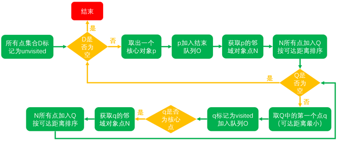
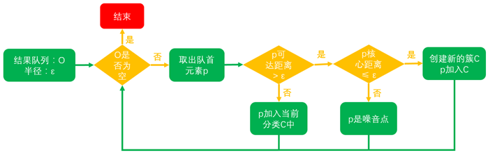

# OPTICS算法

OPTICS（Ordering Points to identify the clustering structure）是对[DBSCAN](https://www.biaodianfu.com/dbscan.html)的一个扩展算法。该算法可以让算法对半径Eps不再敏感。只要确定minPts的值，半径Eps的轻微变化，并不会影响聚类结果。OPTICS并不显示的产生结果类簇，而是为聚类分析生成一个增广的簇排序（比如，以可达距离为纵轴，样本点输出次序为横轴的坐标图），这个排序代表了各样本点基于密度的聚类结构。它包含的信息等价于从一个广泛的参数设置所获得的基于密度的聚类，换句话说，从这个排序中可以得到基于任何参数eps和minPts的DBSCAN算法的聚类结果。

## 基本概念

给定最小邻点数MinPts和eps，
- 核心点（core point）：如果核心距离小于等于**eps**, 则样本为核心样本点；如果核心距离大于eps, 则样本点不是核心样本点。
- 核心距离（core distance）：使一个样本点成为核心点（core points）的最小半径。假设一个样本点为核心点，以其为圆心，距其最近的**最小邻点数minPts**处的点的距离称为核心距离。
- 可达距离（reachability distance）：样本点与核心点之间的距离。对于核心点x来说，其他点x1,x2,...,xn到该核心点x的距离为$\max\{d(x,x_i), core distance\}$。

## 算法描述

- D: 待聚类的集合
- Q: 有序队列，元素按照可达距离排序，可达距离最小的在队首
- O: 结果队列，最后输出结果的点集的有序队列

得到结果队列后，使用如下算法得到最终的聚类结果：

- 从结果队列中按顺序取出点，如果该点的可达距离不大于给定半径ε，则该点属于当前类别，否则至步骤2
- 如果该点的核心距离大于给定半径ε，则该点为噪声，可以忽略，否则该点属于新的聚类，跳至步骤1
- 结果队列遍历结束，则算法结束

> 参考资料：
>
> - https://www.biaodianfu.com/optics.html