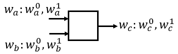

# BMR协议

>- 支持的参与方数量：多方
>- 协议的执行轮数：常数
>- 支持的电路类型：布尔电路

BMR协议实际上是一个生成混淆真值表（乱码电路/混淆电路）的协议。由于GC在两方中乱码电路是由Alice生成，如果简单扩展成多方，依然由一个参与方$P_1$来生成混淆电路，那么$P_1$就会知道电路的所有可能的真实输入值与其对应的导线标签（混淆密钥）的对应关系，此时如果$P_1$跟任意电路的求值方合谋，求值方知道各方的激活标签（即各方输入所对应的导线标签），从而可以根据对应关系得到各方的输入真值了。

因此，混淆电路的生成不应该由单个参与方生成，而是由所有参与方共同生成。

## Basic Idea

对于一个逻辑门，输入导线为$w_a,w_b$，输出导线为$w_c$。其中，导线$w_a$上真值$v_a\in \{0,1\}$所对应的导线标签（混淆密钥）为$w_a^{v_a}$，其他导线同理。

与GC同理，如果要生成混淆电路（混淆真值表），首先需要生成各个导线上真值所对应的导线标签。然后根据输入导线的导线标签加密输出导线的导线标签。最终得到混淆真值表。

如何让各个参与方共同生成导线标签$w_a^{v_a},w_b^{v_b},w_c^{v_c}$？

级联。对于每个导线$w_i$，令每个参与方$P_j$随机生成长度为$l$bits的子导线标签$w_{i,j}^{v_i}$，然后将每个参与方在该导线上的子导线标签级联起来$w_i^{v_i}=w_{i,1}^{v_i}||...||w_{i,n}^{v_i}$。（一共有$n$个参与方）

如何根据输入导线的导线标签加密输出导线的导线标签？

采用PRF（伪随机函数）或哈希函数配合异或实现。导线标签$w_c^{v_c}$的加密方法如下：
$$
e_{v_a, v_b}=w_c^{v_c} \bigoplus_{j=1, \ldots, n}\left(F\left(a, w_{a, j}^{v_a }\right) \oplus F\left(b, w_{b, j}^{v_b }\right)\right)
$$
其中，$F$为PRF（伪随机函数）或哈希函数，其将$l+1$bits作为输入，输出$ln$bits，第一个参数为该导线的序号。如此一来，便生成了如下混淆真值表：

| $w_a^{v_a}$ | $w_b^{v_b}$ | $e_{v_a, v_b}$                                               |
| ----------- | ----------- | ------------------------------------------------------------ |
| $w_a^0$     | $w_b^0$     | $e_{0, 0}=w_c^{v_c} \bigoplus_{j=1, \ldots, n}\left(F\left(a, w_{a, j}^{0}\right) \oplus F\left(b, w_{b, j}^{0}\right)\right)$ |
| $w_a^0$     | $w_b^1$     | $e_{0, 0}=w_c^{v_c} \bigoplus_{j=1, \ldots, n}\left(F\left(a, w_{a, j}^{0}\right) \oplus F\left(b, w_{b, j}^{1}\right)\right)$ |
| $w_a^1$     | $w_b^0$     | $e_{0, 0}=w_c^{v_c} \bigoplus_{j=1, \ldots, n}\left(F\left(a, w_{a, j}^{1}\right) \oplus F\left(b, w_{b, j}^{0}\right)\right)$ |
| $w_a^1$     | $w_b^1$     | $e_{0, 0}=w_c^{v_c} \bigoplus_{j=1, \ldots, n}\left(F\left(a, w_{a, j}^{1}\right) \oplus F\left(b, w_{b, j}^{1}\right)\right)$ |

其中，$v_c = g(v_a, v_b)$，$g$为该逻辑门运算。

最后将混淆真值表交付给求值方，然后各参与方将自己的激活标签交付给求值方，最后由求值方评估电路，得到最后的计算结果。

## BMR

### 翻转比特

上述Basic Idea存在一个问题，由于导线标签是采用子导线标签级联的方式生成的，所以电路求值方的子导线标签也包含在里面，而求值方知道自己的子导线标签对应的真值，因此会造成其他参与方输入的泄露。

例如，$P_1$为求值方，其收到激活标签$w_i^{v_i}=w_{i,1}^{v_i}||...||w_{i,n}^{v_i}$，由于其中的$w_{i,1}^{v_i}$是自己贡献的，$P_1$知道$w_{i,1}^{v_i}$对应的真值是$v_i$，各方就暴露了输入了。因此，还需要对子导线标签的对应关系进行进一步的混淆：

应用翻转比特。首先，对于导线$w_i$，每个参与方$P_j$本地生成1bit的子翻转比特$f_{i,j}\in \{0,1\}$，提交给MPC协议。

MPC协议收到各参与方的子翻转比特后，做异或得到导线$w_i$上的翻转比特：
$$
f_i=\bigoplus_{j=1, \ldots, n} f_{i, j}
$$

- 如果$f_{i}=0$，那么真值与导线标签的对应关系为：$w_{i}^{0}$对应0，$w_{i}^{1}$对应1；
- 如果$f_{i}=1$，那么真值与导线标签的对应关系为：$w_{i}^{0}$对应1，$w_{i}^{1}$对应0。

其实，就相当于真值$v_i$所对应的$P_j$的导线标签为$w_{i}^{v_i \oplus f_{i}}$。如此一来，经过翻转比特的随机标签翻转后，混淆电路的最后一列变成了如下式子：

$$
e_{v_a, v_b}=w_c^{v_c \oplus f_c} \bigoplus_{j=1, \ldots, n}\left(F\left(a, w_{a, j}^{v_a \oplus f_a}\right) \oplus F\left(b, w_{b, j}^{v_b \oplus f_b}\right)\right)
$$
可见，每个导线标签都经过了随机翻转。由于导线标签是否翻转（翻转比特为0还是1）各方无从得知，因此求值方也搞不清楚自己收到的激活导线标签对应的真值是什么，即无法推知其他参与方的输入了。

### 标识置换

与GC同理，BMR也需要point-and-permute来帮助求值方快速锁定混淆真值表中的条目。

首先，对于导线$w_i$，每个参与方$P_j$为每个子导线标签$w_{i,j}^{v_i}$随机生成1bit标识比特$p_{i,j}^{v_i}$，并且$w_{i,j}^{0}$对应的标识比特$p_{i,j}^{0}$与$w_{i,j}^{1}$对应的标识比特$p_{i,j}^{1}$是互斥/相反的（$p_{i,j}^{1}=1-p_{i,j}^{0}$），附在原子导线标签后面。现在子导线标签由$l$bits变成了$l+1$bits：
$$
w_{i,j}^{v_i} \leftarrow w_{i,j}^{v_i} || p_{i,j}^{v_i}
$$

> 参考资料：
>
> - 【隐私计算笔谈】MPC系列专题（五）：Beaver 三元组和 BMR 协议 https://segmentfault.com/a/1190000042985680
