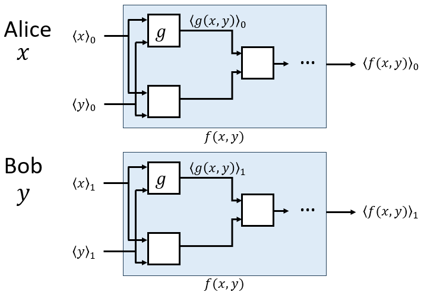

# GMW协议

Goldreich-Micali-Wigderson (GMW)

与Yao’s GC的区别：

无需混淆真值表，不需要查表和解密，降低了计算开销和通信开销。GMW的思想是每个参与方本地运行电路，其中每个门的输入是电路上一个门的输出的份额，并输出该门的输出的自己持有的份额，即输入份额输出份额，一直过完整个电路，最后每个参与方获得计算结果的份额。

>- 支持的参与方数量：多方
>- 协议的执行轮数：电路深度
>- 支持的电路类型：布尔电路/算术电路

## 以布尔电路为例（单bit计算）：

只要实现了与、异或、非门的安全计算，任何目标函数都可以完备计算。

### 2个参与方

假设：Alice持有$x$，Bob持有$y$，双方想要安全计算电路$f(x,y)$（由与、异或、非门组成）。

> 电路是公开的。

Alice和Bob之间先做一轮布尔分享后：Alice持有$\langle x \rangle_0, \langle x \rangle_1, \langle y \rangle_0$；Bob持有$\langle y \rangle_0, \langle y \rangle_1, \langle x \rangle_1$

Alice用$\langle x \rangle_0, \langle y \rangle_0$作为电路输入；Bob用$\langle y \rangle_1, \langle x \rangle_1$作为电路输入。

考虑电路中的单个门$z=g(x,y)$：

1. Alice随机生成$\langle z \rangle_0 \in \{0,1\}$，并枚举$\langle z \rangle_1 =\langle z \rangle_0 \oplus g(\langle x\rangle_0\oplus \langle x\rangle_1, \langle y\rangle_0\oplus \langle y\rangle_1)$所有可能的值。一般情况下Alice只知道$\langle x \rangle_0, \langle y \rangle_0$，$\langle x \rangle_1, \langle y \rangle_1$的取值各有$\{0,1\}$两种情况，因此$\langle z \rangle_1$可能的取值有四种情况$\{ \langle z \rangle_1^{\langle x \rangle_1=0, \langle y \rangle_1=0}, \langle z \rangle_1^{\langle x \rangle_1=1, \langle y \rangle_1=0}, \langle z \rangle_1^{\langle x \rangle_1=0, \langle y \rangle_1=1}, \langle z \rangle_1^{\langle x \rangle_1=1, \langle y \rangle_1=1}\}$。注意，在刚输入第一个门的时候，Alice还知道$\langle x \rangle_1$，因此$\langle z \rangle_1$可能的取值只两种情况$\langle z \rangle_1^{\langle y \rangle_1=0}$，$\langle z \rangle_1^{\langle y \rangle_1=1}$。
2. Alice和Bob进行$OT^4_1$。Alice提供$\{ \langle z \rangle_1^{\langle x \rangle_1=0, \langle y \rangle_1=0}, \langle z \rangle_1^{\langle x \rangle_1=1, \langle y \rangle_1=0}, \langle z \rangle_1^{\langle x \rangle_1=0, \langle y \rangle_1=1}, \langle z \rangle_1^{\langle x \rangle_1=1, \langle y \rangle_1=1}\}$，Bob提供$\{\langle x \rangle_1, \langle y \rangle_1\}$的值，最终Bob获得$\langle z \rangle_1$。注意，在刚输入第一个门的时候，只需进行$OT^2_1$。在这个过程中Alice不知道Bob选了哪个（即不知道$\langle z \rangle_1$的值），Bob也只获得了$\langle z \rangle_1$。

至此，经过该门，Alice和Bob各自获得了$z$的布尔份额。Alice和Bob将该门各自的输出作为下一个门的输入，实现了Alice和Bob各自本地的电路计算中，输入是各自的份额，输出也是各自的份额。

然后，对于整个电路，双方按照同样的方式一直走下去，最后Alice得到$\langle f \rangle _0$，Bob得到$\langle f\rangle _1$。重构时将这俩布尔份额异或在一起即可。

上述过程对于所有的门都适用，其实不用那么麻烦，对于有的门本地就可以计算，不用OT。

- 对于异或门：为了获得$z=x\oplus y$的布尔份额，Alice直接本地计算$\langle z\rangle_0 = \langle x\rangle_0\oplus \langle y\rangle_0$，Bob本地计算$\langle z\rangle_1 = \langle x\rangle_1\oplus \langle y\rangle_1$。
- 对于非门：非门只有一个输入，对于$z=\overline{x}$，Alice直接本地取非即可。Bob同理。

> 在与门的计算中，
> $$
> \begin{aligned}
> z &=(\langle x\rangle_0\oplus \langle x\rangle_1) \and (\langle y\rangle_0\oplus \langle y\rangle_1) \\
> &= (\langle x\rangle_0 \and \langle y\rangle_0) \oplus (\langle x\rangle_0 \and \langle y\rangle_1) \oplus (\langle x\rangle_1 \and \langle y\rangle_0)\oplus (\langle x\rangle_1 \and \langle y\rangle_1)
> \end{aligned}
> $$
> 由于Alice不知道$\langle x\rangle_1, \langle y\rangle_1$，因此$\langle x\rangle_1 \and \langle y\rangle_0$和$\langle x\rangle_0 \and \langle y\rangle_1$可以采用Beaver三元组进行计算，最终Alice获得$\langle z\rangle_0 = (\langle x\rangle_0 \and \langle y\rangle_0) \oplus (\langle x\rangle_0 \and \langle y\rangle_1) \oplus (\langle x\rangle_1 \and \langle y\rangle_0)$，Bob获得$\langle z\rangle_1 = \langle x\rangle_1 \and \langle y\rangle_1$。
>
> 因此，对于与门的计算，可以不用OT，用Beaver三元组也是一种办法。

### n个参与方

$P_1,P_2,...,P_n$各自的输入是$x_1,...,x_n$，共同计算电路$f(x_1,...,x_n)$。

与两方场景一样，首先，$n$个参与方之间进行一轮布尔分享：

$P_i$为其他参与方$P_j$随机生成$\langle x_i\rangle_j\in \{0,1\}$，则自己持有的关于$x_i$的份额为$\langle x_i\rangle_i = x_i\oplus (\oplus_{j\neq i} \langle x_i\rangle_j)$。

例如对于一个**与门**（一个逻辑门最多有两个输入）：
$$
\begin{aligned}
z &= g(x_1,x_2) \\
&= (\oplus_{k=1}^n \langle x_1\rangle_k) \and (\oplus_{k=1}^n \langle x_2\rangle_k) \\
&= (\oplus_{i=1}^n (\langle x_1\rangle_i \and \langle x_2\rangle_j) )\oplus (\oplus_{i\neq j} (\langle x_1\rangle_i \and \langle x_2\rangle_j) )
\end{aligned}
$$
其中，$i=j$时，$\langle x_1\rangle_i \and \langle x_2\rangle_j$可以由各参与方本地计算；$i\neq j$时，可以利用OT计算$\langle x_1\rangle_i \and \langle x_2\rangle_j$：

1. 与之前提到过的一样，每个参与方$P_i$随机生成$c_{i,j}\in \{0,1\}$，并枚举出$c_{i,j} \oplus (\langle x_1\rangle_i \and \langle x_2\rangle_j)$的所有情况（两种情况），与$P_j$做$OT^2_1$，最终$P_j$得到$c_{i,j} \oplus (\langle x_1\rangle_i \and \langle x_2\rangle_j)$。
2. 对于一个参与方$P_i$可以得到$\oplus_{1\leq j\leq n, j\neq i} c_{i,j}$和$\oplus_{1\leq j\leq n, j\neq i} (c_{j,i} \oplus (\langle x_1\rangle_j \and \langle x_2\rangle_i))$。

最后，每个参与方得到各自的关于$z$的布尔份额：
$$
\begin{aligned}
\langle z\rangle_i &= (\langle x_1\rangle_i \and \langle x_2\rangle_i)\oplus (\oplus_{1\leq j\leq n, j\neq i} c_{i,j}) \oplus (\oplus_{1\leq j\leq n, j\neq i} (c_{j,i} \oplus (\langle x_1\rangle_j \and \langle x_2\rangle_i)))
\end{aligned}
$$

对于异或门和非门，与两方场景一样，可以本地计算。

## 算术电路

思路与布尔电路一样，不过，布尔分享变成了加法秘密分享，布尔份额变成了加法秘密份额。

依然是加法秘密份额输入每一个逻辑门，输出加法秘密份额。

