# 【冯登国】L1：MPC的基本概念及其组件

> 国家天元数学东南中心

## 1 MPC定义与应用

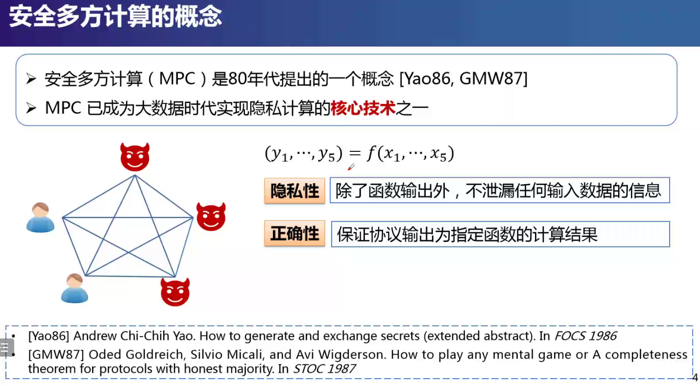

$x_i$是参与方，$y_i$是相应输出。

MPC最主要两个特征：隐私性、正确性。

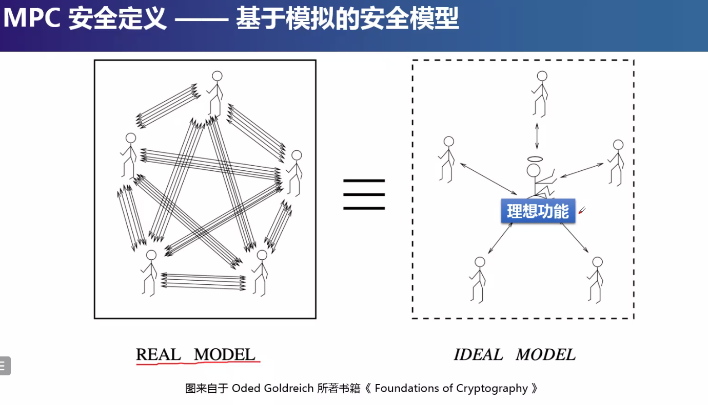

理想世界中：把理想功能函数看作一个可信第三方，所有参与方只需要将各自输入交给理想功能函数计算即可。

如果现实世界的计算结果与理想世界的计算结果不可区分，则安全。

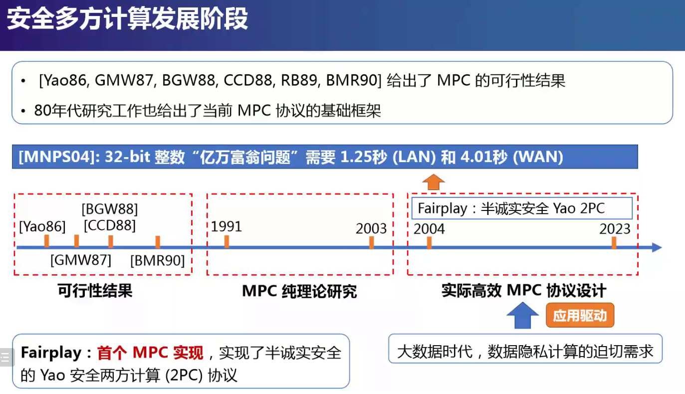

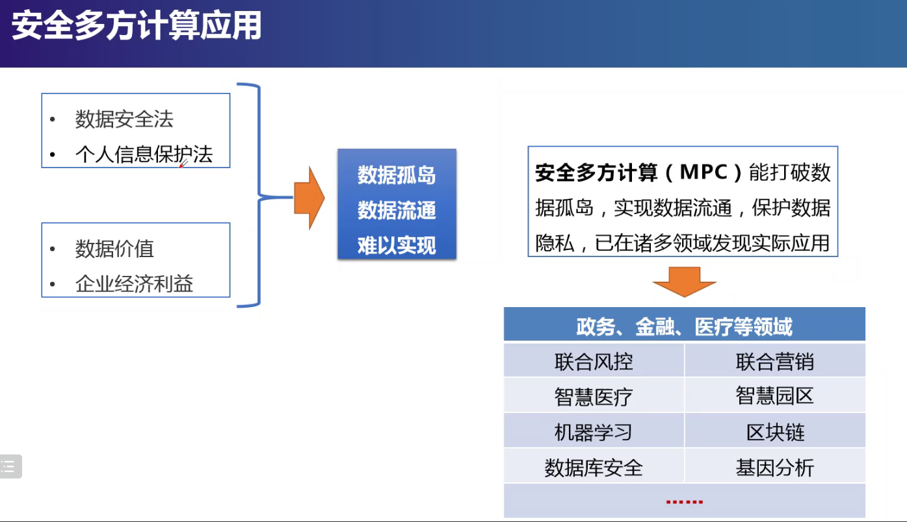

## 2 MPC分类

不诚实=恶意

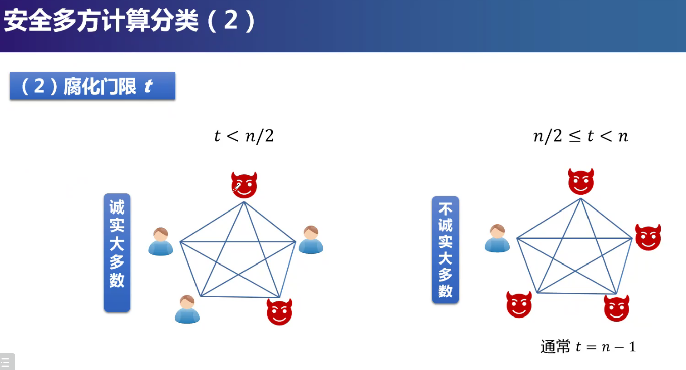

$t$为腐化的上界。

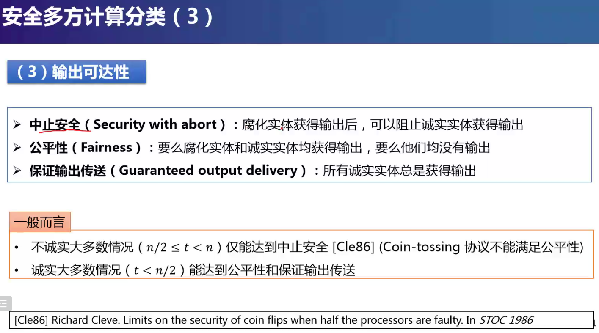

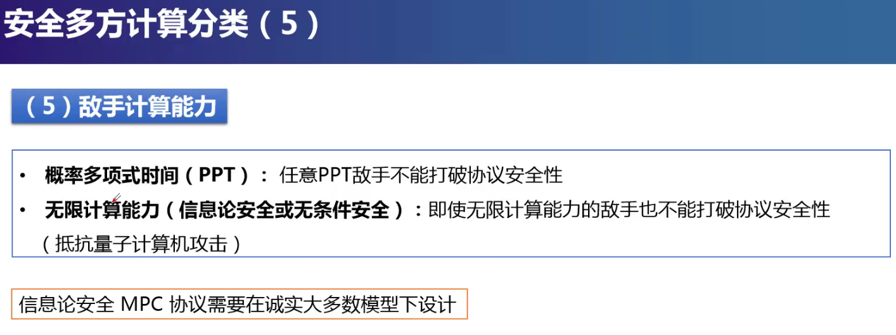

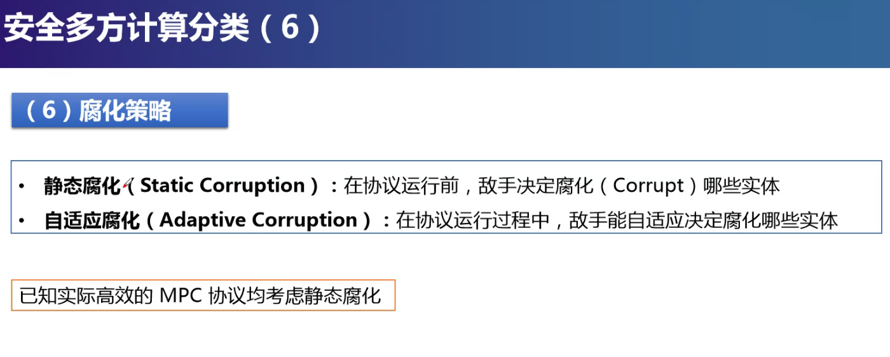

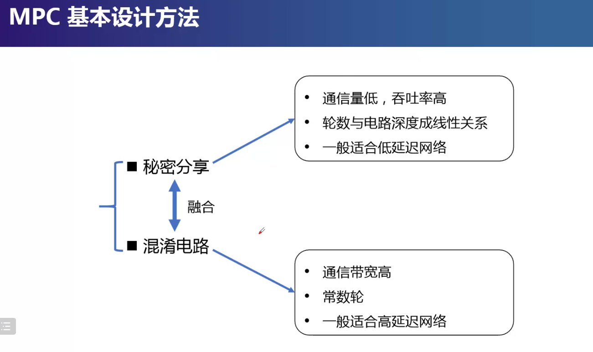

## 3 MPC基础组件

### 线性秘密分享

> 份额$x^i$不是$x$的$i$次方的意思，$i$只是表示上标，$x^i$表示第$i$个参与方的份额。

打开算法：通过每个参与方都去运行这个重构算法。

LSSS具备线性性质，也可称为加法同态性质。

#### 加法秘密分享&重复秘密分享

t为不诚实的个数，秘密分享需要保证t个参与方不能恢复出秘密，至少需要t+1个参与方，否则t个不诚实参与方就能合作恢复出秘密了。

加法秘密分享：每个参与方分别拿到$x^i$，==所有==参与方持有的份额合起来加一块重构秘密。

重复秘密分享：参与方数量需要较小，否则会组合爆炸。三方中的两方合起来便能恢复秘密，因为重复的随机份额两方都是知道的，一个人（不诚实参与方）是恢复不出秘密的。

#### shamir秘密分享及推广

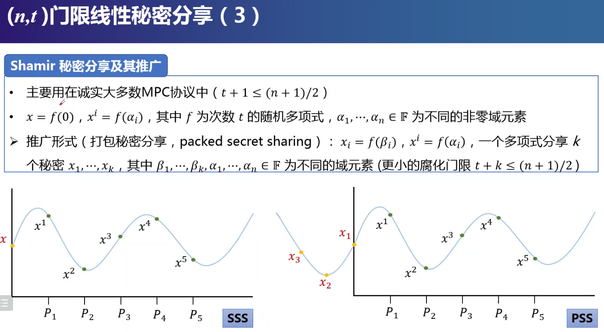

图中红色的坐标为秘密。

打包秘密分享：$x_i$表示一次分享的$k$个秘密中的第$i$个秘密。$x^i$表示第$i$个份额。 

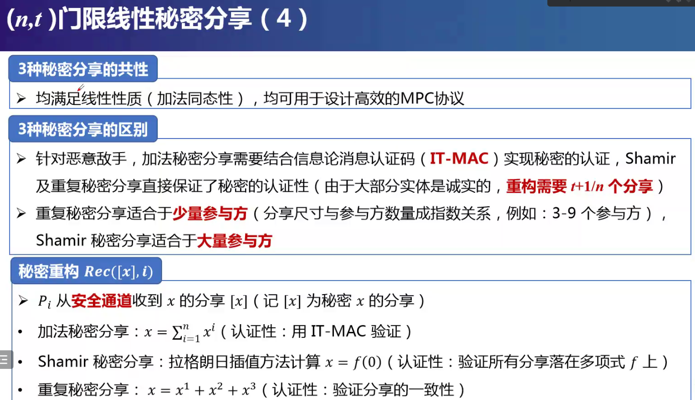

认证性：

- shamir：参与方恢复出秘密后，进而恢复多项式，然后验证份额/分享是否落在了多项式上。
- 重复秘密分享：看各个参与方之间重复的份额是否相同。

### 信息论消息认证码

当下的高效的MPC协议主要采用两类消息认证码。

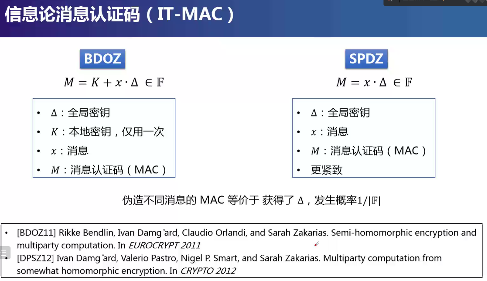

（都是域上的运算）

全局密钥：整个系统中一直要用的密钥。

本地密钥：临时性密钥，只用一次。

**在MPC协议的使用中：**

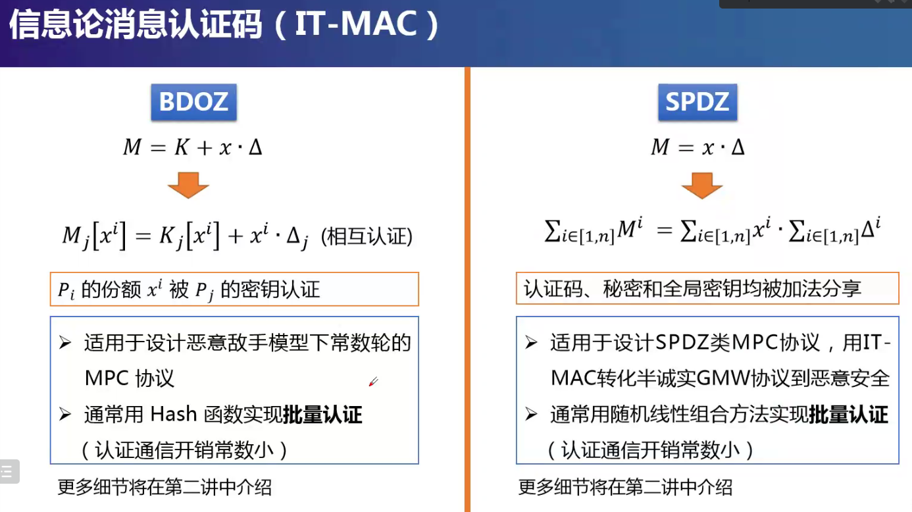

 ### 零知识证明

零知识证明：使得证明者向验证者证明一个命题/定理$x$是正确的，但不泄露证据$w$。证据$w$只有证明者知道，验证者不知道。命题$x$与证据$x$满足一个关系$R$。

零知识意味着证明者与验证者交互了半天，验证者的知识没有增长（没有获得证据的信息）。

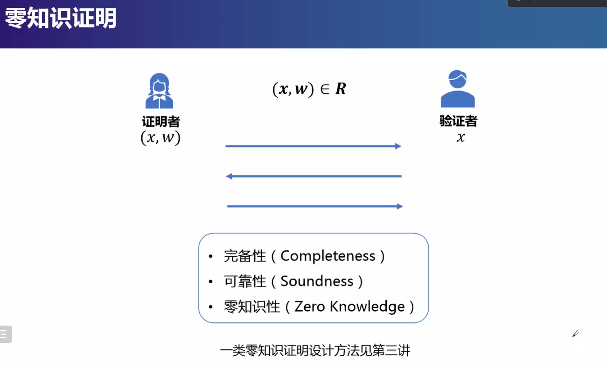

零知识证明需要满足三个性质：

- 完备性：证明者如果诚实地运行协议，验证者一定相信$x$是真的。
- 可靠性：恶意的证明者运行协议，验证者不会接受这个命题$x$。
- 零知识性：存在一个模拟器，只有拥有命题$x$的情况下，产生的模拟结果和实际在计算上不可区分。（第三讲细讲）

### 混淆电路

混淆电路通常通过一个混淆方案来定义。

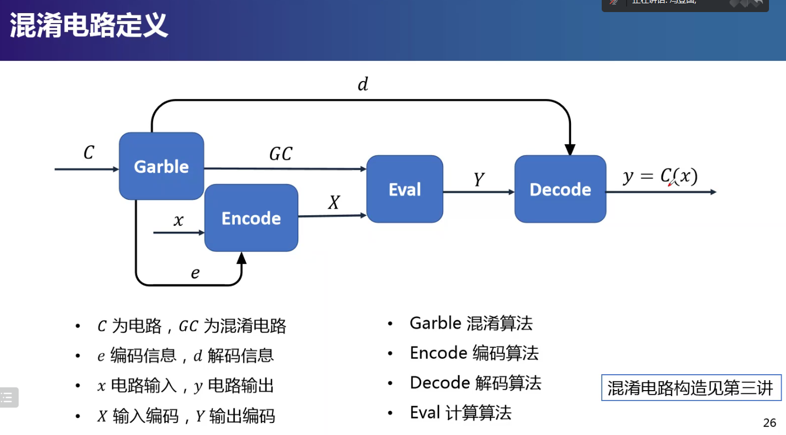

### 承诺方案

承诺方案就是为了保证承诺者言行一致，我说我发送x给你，我就把x发送给你。

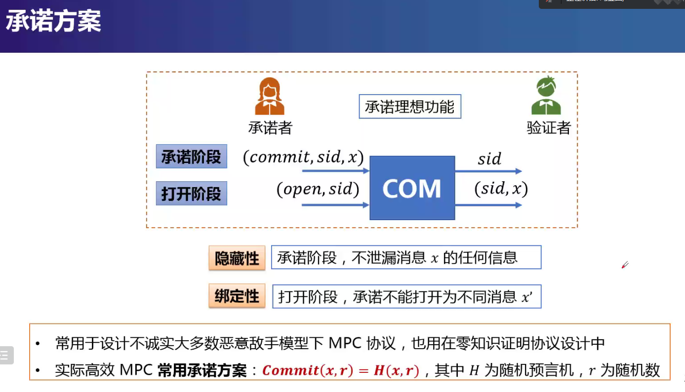

承诺方案分为两个阶段：

- 承诺阶段：
  - 目的：承诺者告诉验证者我承诺我发送$x$给你，并且承诺的过程中不能泄露关于$x$的任何信息。
  - 做法：承诺者对消息$x$进行承诺，把承诺结果$c=Commit(x)$发给验证者。
- 打开阶段：
  - 目的：承诺者才真正开始把消息$x$发送给验证者。
  - 做法：承诺者发送消息$x$给验证者，验证者验证$Commit(x)?=c$。

承诺方案须满足两个性质：隐藏性、绑定性。在实际的MPC协议中，用hash函数$H$代替随机预言机（oracle），用hash作一个承诺：

- 承诺阶段：对消息$x$进行承诺，选择一个随机数$r$，把承诺结果$c=H(x,r)$发给验证者。
- 打开阶段：把消息$x$和随机数$r$发给验证者，验证者验证$H(x,r)?=c$。

> H(x,r)就是$H(x||r)$的意思，并起来。

理想功能函数模型下，如下图所示（上图有误）：

- 承诺阶段：承诺者发送承诺指令$commit$、自己的id$sid$、消息$x$给理想功能函数$F^{Comm}$；理想功能函数$F^{Comm}$发送承诺后的$c=Commit(x)$、$sid$给验证者。
- 打开阶段：承诺者发送打开指令$open$、自己的id$sid$给理想功能函数$F^{Comm}$；理想功能函数$F^{Comm}$发送$x$、$sid$给验证者。

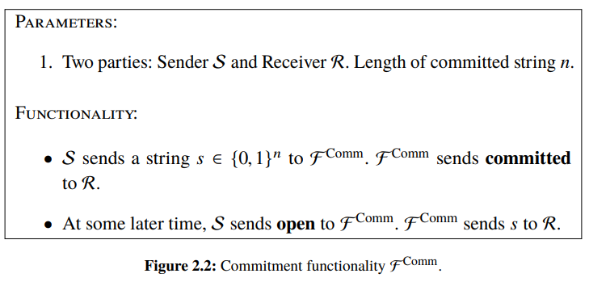

### 投币协议

用于多个参与方共同生成一个随机数$r$。

不诚实大多数MPC协议常常需要用到承诺进行设计：

1. 承诺阶段：每个参与方$P_i$随机选取一个随机数$r_i$，做承诺$Commit(r_i)$给另一个参与方$P_j$。
2. 打开阶段：把$r_i$打开。
3. 把生成的随机数放到一起进行mod 2加（也就是异或，都是二元域上的运算），生成一个随机比特串/随机数。

诚实大多数MPC协议一般不采用承诺方案，而是秘密分享的方案（第二讲）。

### 同态加密

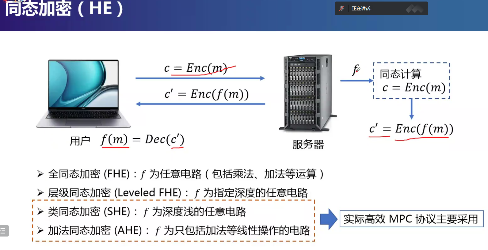

## 不经意传输及其算术变形

### 基本定义

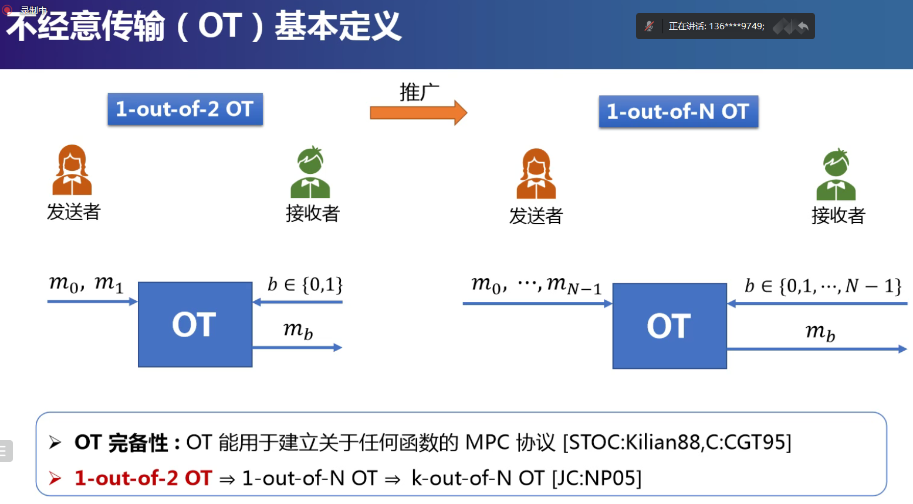

**1-out-of-2 OT**：

OT协议两个输入：

- 发送者：输入两个消息$m_0,m_1$。
- 接收者：输入自己从$\{0,1\}$里面选的一个索引$b$（选择0还是1）。

输出：接收者得到$m_b$。

发送者没有任何输出，无法获得任何信息，只能猜（1/2概率）。接收者无法知道输出之外的另一个消息。

**1-out-of-n OT**：同理。

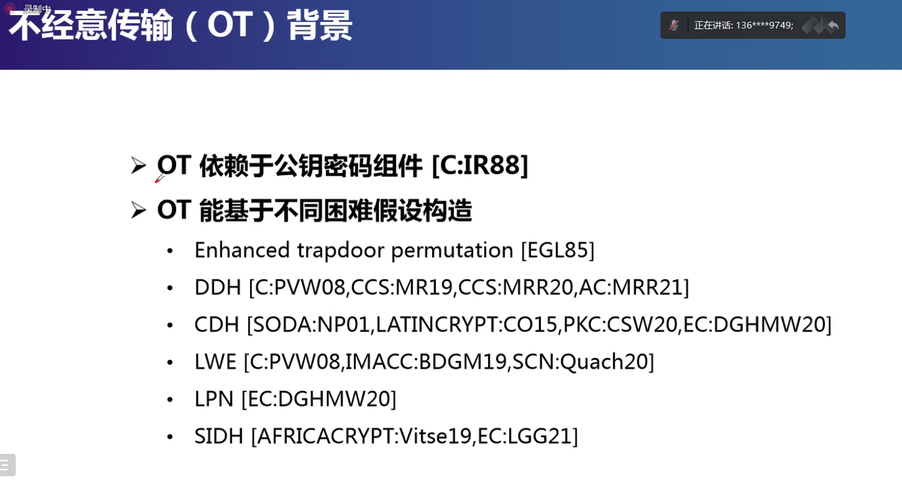

### Naor-Pinkas协议

2001年提出，建立在循环群$G$上，$q$为群的阶，$g,C$是群的两个随机的生成元。

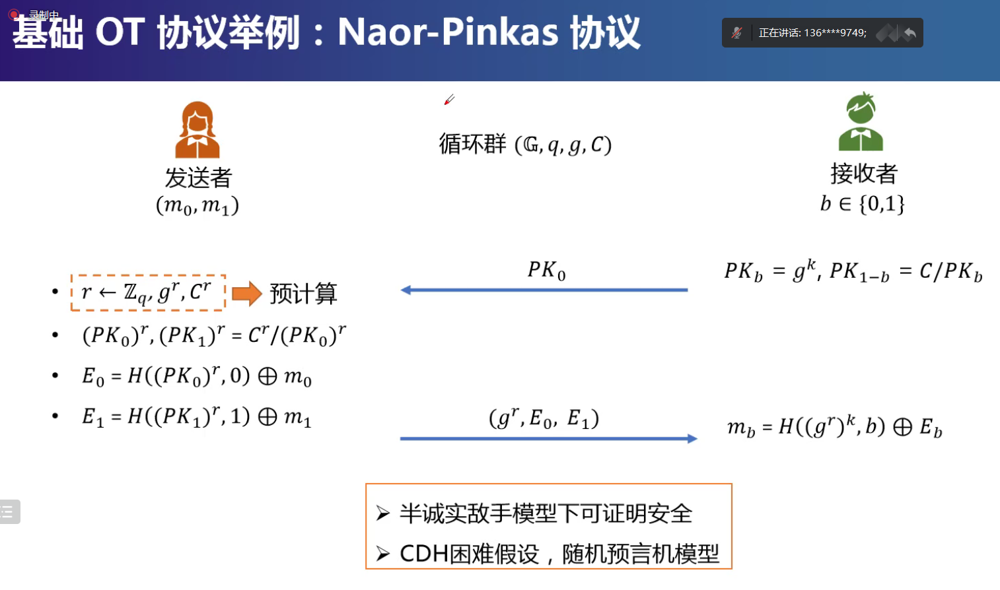

1. 接收者：选一个$b$。计算$PK_b,PK_{1-b}$。将$PK_0$发送给发送者。
2. 发送者：可以事先预计算好$g^r,C^r$（$r$是选取的一个随机数）。
3. 发送者：做如图的计算。
4. 接收者：做如图的计算。

证明中要把hash函数建模为随机预言机。

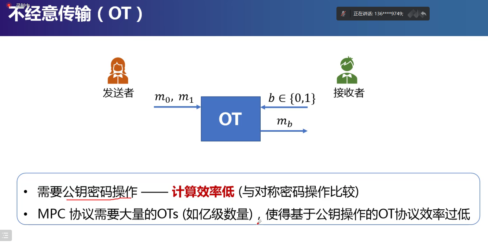

### 不经意传输拓展

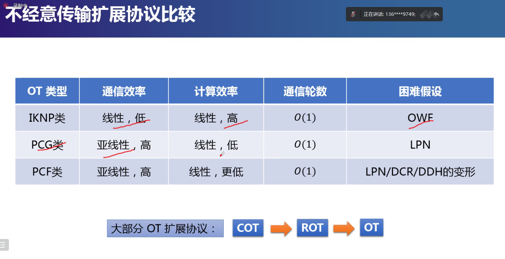

相关OT=标准化方法=>随机OT=标准化方法=>OT

设计难度逐步增加。

#### 随机OT（ROT）

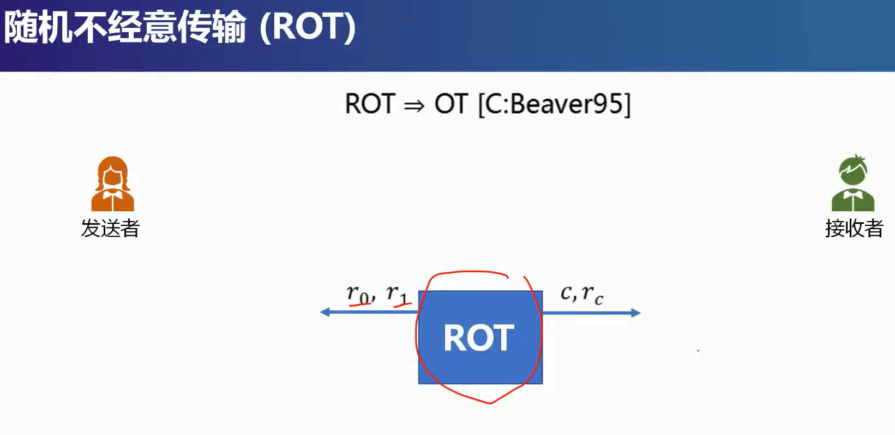

ROT协议执行后，发送者得到两个消息$r_0,r_1$，接收者只得到一个消息$r_c$（可能是$r_0$也可能是$r_1$）。它与OT有相通的地方，它可以转换为OT。

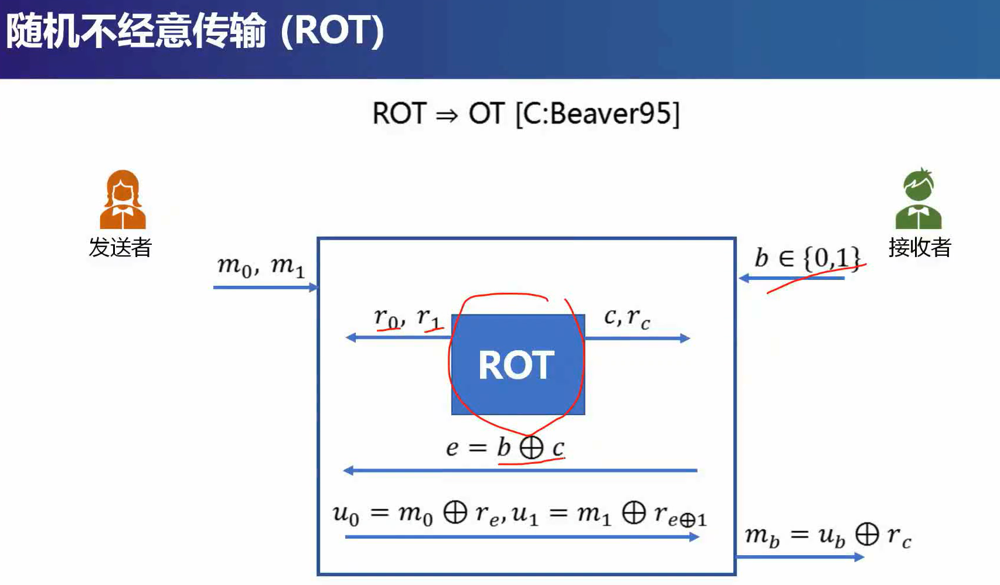

