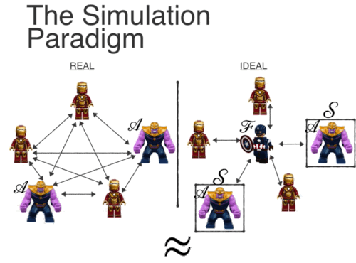

# 基于模拟的安全性证明

在零知识证明、多方安全计算等场景中，协议的参与方往往需要确保自己的秘密（输入）不能泄露给其他参与方。那么如何证明协议是安全的，参与方确实没有以某种形式泄露秘密呢？

> 什么是“模拟”?
>
> Simulation is a way of comparing what happens in the “real world” with what happens in an “ideal world” where the primitive in question is secure by definition.	-- How to Simulate It – A Tutorial on the Simulation Proof Technique

该安全性是基于“理想-现实模拟范式”进行证明的。在这个范式中，有一个模拟器试图模拟出一个理想世界，让敌手（被腐化的参与方）无法分辨出自己是在理想世界还是在现实世界。模拟器是不知道原始秘密的，因此理想世界是“零知识”的。又由于理想现实不可区分，因此在现实世界中敌手所获得的信息也是“零知识”的。因此如果存在这样一个模拟器可以模拟出这样的一个理想世界，那么该协议就满足基于模拟的安全性。

在上图中，在理想世界中，模拟器S接管了交互过程。模拟器必须做以下三件事：

1. 它必须为敌手生成一个视图，该视图与该敌手的现实视图不可区分；
2. 它必须提取敌手在协议执行过程中使用的有效输入；
3. 它必须使生成的视图与基于此输入的输出保持一致。

## 预备知识

对于一个有限集$S \subseteq\{0,1\}^*$，我们用$x \in_R S$表示$x$在集合$S$上是均匀分布的。我们用$U_n$表示集合$\{0,1\}^n$上的均匀分布。如果对于每一个正多项式$p(\cdot)$和所有的足够大的$n$，有$\mu(n)<1 / p(n)$，则函数$\mu(\cdot)$是可忽略的。最后，我们定义空串为$\lambda$。

### 计算性不可区分

一个概率集合$X=\{X(a, n)\}_{a \in\{0,1\}^* ; n \in \mathbb{N}}$是多个随机变量所组成的无穷序列。在安全计算中，$a$代表参与方的输入，$n$代表安全参数。

如果对于每一个非均匀多项式时间算法$D$，存在一个可忽略的函数$\mu(\cdot)$使得对于每一个$a \in\{0,1\}^*$和每一个$n \in \mathbb{N}$，
$$
|\operatorname{Pr}[D(X(a, n))=1]-\operatorname{Pr}[D(Y(a, n))=1]| \leq \mu(n)
$$
则两个概率集合$X=\{X(a, n)\}_{a \in\{0,1\}^* ; n \in \mathbb{N}}$和$Y=\{Y(a, n)\}_{a \in\{0,1\}^* ; n \in \mathbb{N}}$被称作计算性不可区分的，即$X \stackrel{\mathrm{c}}{\equiv} Y$。

所有参与方被假设是在安全参数下是多项式时间下运行的。（形式化地说，每个参与方都有一个安全参数纸带，上面写着$1^n$。那么该参与方在此纸带上的输入是多项式的。我们注意到，当一方的输入比它的整体运行时间更长时，则它甚至可能无法读取它的全部输入。）

### 非均匀

上述计算不可区分性的概念本质上是非均匀的，这不仅仅是因为我们允许$D$是非均匀的。

我们首先完整地写出计算不可区分的要求（不使用“不可忽略函数”的概念）：

如果对于每个非均匀多项式时间算法$D$和每个多项式$p(\cdot)$，存在一个$N \in \mathbb{N}$使得对于每个$n>N$和每个$a\in \{0,1\}^*$，
$$
|\operatorname{Pr}[D(X(a, n))=1]-\operatorname{Pr}[D(Y(a, n))=1]|<\frac{1}{p(n)}
$$
现在，矛盾的点在于，存在一个$D$和一个多项式$p(\cdot)$，使得对于每个$N \in \mathbb{N}$，存在一个$n>N$和一个$a\in \{0,1\}^*$，
$$
|\operatorname{Pr}[D(X(a, n))=1]-\operatorname{Pr}[D(Y(a, n))=1]| \geq \frac{1}{p(n)}
$$
简言之，存在一个$D$和一个多项式$p(\cdot)$，使得对于无穷多个$n$，存在一个$a\in \{0,1\}^*$，
$$
|\operatorname{Pr}[D(X(a, n))=1]-\operatorname{Pr}[D(Y(a, n))=1]| \geq \frac{1}{p(n)}
$$
具体而言，这意味着对于每一个这样的$n$，都可以有一个不同的$a$。现在，如果两个概率集合在计算上是不可区分的，那么为了执行打破某些密码学原语或假设的归约，就必须知道与给定的$n$相关联的$a$的值。因此，与$n$相关的$a$值必须写在归约算法的建议纸带上，这使得它本质上是不均匀的。

### 关于计算不可区分性的量词顺序

我们观察到，上述的计算不可区分的定义并不等同于说：对于每个$a \in\{0,1\}^*$有$\{X(a, n)\}_{n \in \mathbb{N}} \stackrel{\mathrm{c}}{\equiv}\{Y(a, n)\}_{n \in \mathbb{N}}$。因为上面的定义保证了对于每个$a$和每个非均匀概率多项式时间算法$D$，存在一个可忽略函数$\mu$使得对于每个$n,D$以至多$\mu(n)$的概率将$X(a,n)$和$Y(a,n)$区分开来。这意味着对每一个$a$都可以有一个不同的可忽略函数，并且这个函数甚至可以依赖于$a$。特别地，考虑可忽略函数
$$
\mu_a=\begin{cases}
1, & \mbox{if   } n<2^{|a|} \\
2^{-n},  & \mbox{if   } n\ge 2^{|a|}
\end{cases}
$$
该函数满足定义要求。但是这个概念太弱，没有用。例如，对于$\mathcal{N P}$中的所有语言零知识证明将变得微不足道，因为当$n<2^{|x|}$时模拟器可以输出$\perp$（$x$是待证明的陈述），只能在$n \geq 2^{|x|}$时找到证人。这个问题在实际定义中并没有出现，因为它要求对$a \in\{0,1\}^*$的所有值都存在一个可忽略的函数。

> 参考资料：
>
> - Simulation-Based Security https://aandds.com/blog/zkp-simu.html
> - How to Simulate It – A Tutorial on the Simulation Proof Technique