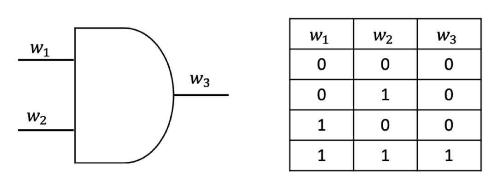
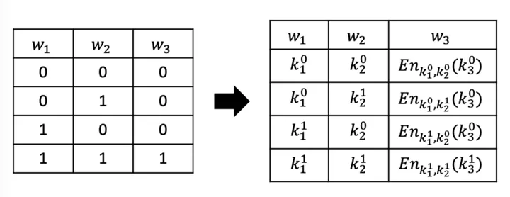
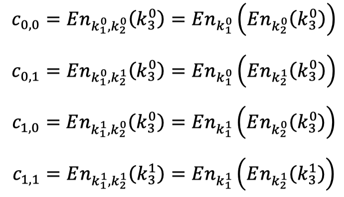
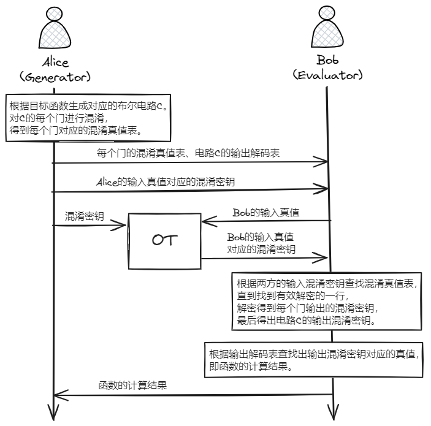

# 混淆电路

混淆电路（Garbled Circuit）的思想起源于姚期智院士，之后Beaver等人提出了混淆电路的定义。混淆电路的构造从门开始，先加密一个门再延伸到加密整个电路。

## 姚氏混淆电路

Yao’s Garbled Circuit，最早提出的混淆电路。

- 支持的电路类型：支持布尔电路（布尔运算）。

- 支持的参与方数量：两方。
- 协议执行轮数：常数。

对于布尔电路来说，与或非门即可完备实现。即与或非三个门就能描述所有的布尔函数。

以与门为例，一个常见的与门及其真值表如下图所示，将该与门的输入线记为$w_{1},w_{2}$，输出线记为 $w_{3}$。

随机生成6个混淆密钥$\left\{ k_{1}^{0},k_{1}^{1},k_{2}^{0} ,k_{2}^{1},k_{3}^{0},k_{3}^{1}\right\}$，分别表示$w_{1},w_{2},w_{3}$这三条线为0或1的两种情况。如$k_{1}^{0},k_{1}^{1}$分别表示$w_{1}$为0和$w_{1}$为1；$k_{3}^{0},k_{3}^{1}$分别表示$w_{3}$为0和$w_{3}$为1。

开始混淆：

1. 将真值表上的所有真值换成混淆密钥。
2. 将最后一列的混淆密钥用前两列的混淆密钥进行加密。
3. 打乱混淆真值表的行顺序。

输出线$w_3$上的混淆值$c$只有用前两列对应的混淆密钥一起才能解密出最后一列的混淆密钥，否则解密出的是无效值。

在电路中：

- 当一个输入线分成多条分别接入到多个门，其分出的每条线上的信号标记都相同。
- 对于一个门如有多个输出线，每条输出线的信号标记也都相同。

**具体协议**

上图中，“输出解码表”就是一个输出混淆密钥与输出真值对应的表，用于根据输出的混淆密钥来找到对应的真值。

注意：上面是Bob来计算得到最终的计算结果，所以Alice还要发送输出解码表给Bob。

有的资料上给出的混淆电路没有发送”输出解码表“给Bob，而是在最后一步：Bob经过混淆真值表得到最终的输出的混淆密钥后，Bob将该混淆密钥发回给Alice进行解出该混淆密钥对应的真值。

> 参考资料：
>
> - 【隐私计算笔谈】MPC系列专题（三）：不经意传输和混淆电路 https://zhuanlan.zhihu.com/p/376112588
> - 《实用安全多方计算导论》
