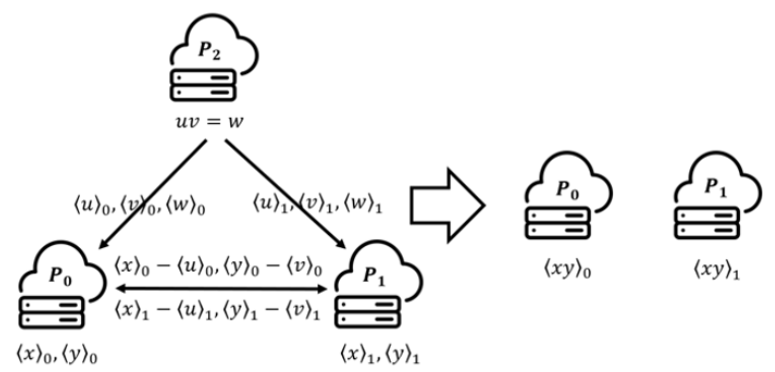

# 秘密分享

## 算术秘密分享

### 计算和

### 计算乘积

#### Beaver三元组

两方协作计算一个乘积：假设秘密$x$和$y$已经被分享，即$P_0$持有$\langle x\rangle_0,\langle y\rangle_0$，$P_1$持有$\langle x\rangle_1,\langle y\rangle_1$，两方想得到乘积$xy$的份额$\langle xy\rangle$，即$P_0$持有$\langle xy\rangle_0$，$P_1$持有$\langle xy\rangle_1$。

**威胁模型**

参与方全部诚实地执行协议。

**协议**

在协议开始之前预先生成一个beaver三元组$(u,v,w)$，随机选取$u,v\in \mathbb{Z}_{2^L}$使得$w=uv$，其中$u,v$对所有参与方保密（本例由第三方$P_2$生成）。

$P_2$生成三元组的份额$(\langle u\rangle_0,\langle v\rangle_0,\langle w\rangle_0)$和$(\langle u\rangle_1,\langle v\rangle_1,\langle w\rangle_1)$分发给$P_0,P_1$，其中$u=\langle u\rangle_0+\langle u\rangle_1, v=\langle v\rangle_0+\langle v\rangle_1, w=\langle w\rangle_0+\langle w\rangle_1$。

$P_0$计算$\langle x-u\rangle_0=\langle x\rangle_0-\langle u\rangle_0, \langle y-v\rangle_0=\langle y\rangle_0-\langle v\rangle_0$发送给$P_1$；$P_1$计算$\langle x-u\rangle_1=\langle x\rangle_1-\langle u\rangle_1, \langle y-v\rangle_1=\langle y\rangle_1-\langle v\rangle_1$发送给$P_0$。

> 这一步是为了所有参与方都能计算得到$(x-u),(y-v)$。

$P_0$计算
$$
\langle xy\rangle_0
=(x-u)(y-v)+\langle (x-u)v\rangle_0+\langle u(y-v)\rangle_0+\langle w\rangle_0 \\
=(\langle x-u\rangle_0+\langle x-u\rangle_1)(\langle y-v\rangle_0+\langle y-v\rangle_1)+(x-u)\langle v\rangle_0+(y-v)\langle u\rangle_0+\langle w\rangle_0
$$
$P_1$计算
$$
\langle xy\rangle_1
=\langle (x-u)v\rangle_1+\langle u(y-v)\rangle_1+\langle w\rangle_1 \\
=(x-u)\langle v\rangle_1+(y-v)\langle u\rangle_1+\langle w\rangle_1
$$

> 参考资料：
>
> 1. Beaver, D., 1991. Efficient multiparty protocols using circuit randomization, in: Feigenbaum, J. (Ed.), Advances in Cryptology - CRYPTO ’91, 11th Annual International Cryptology Conference, Santa Barbara, California, USA, August 11-15, 1991, Proceedings, Springer. pp. 420–432. URL: https://doi.org/10.1007/3-540-46766-1_34, doi:10.1007/3- 540- 46766- 1\_34.
> 2. Towards Secure and Practical Machine Learning via Secret Sharing and Random Permutation