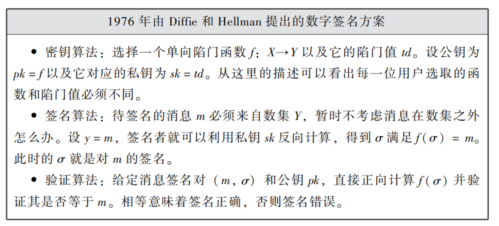
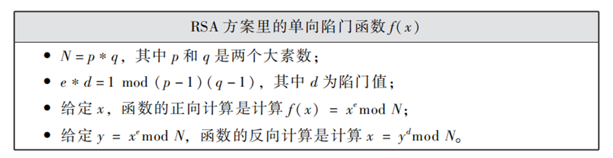
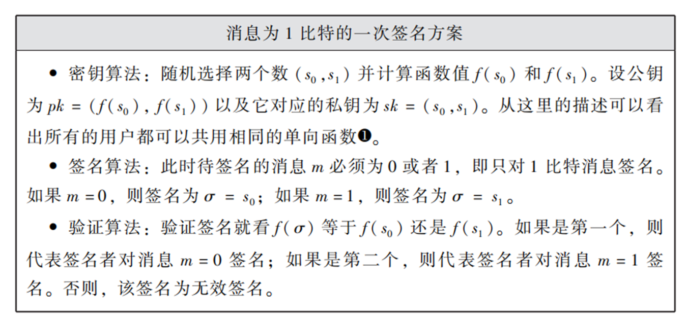
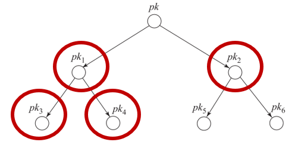
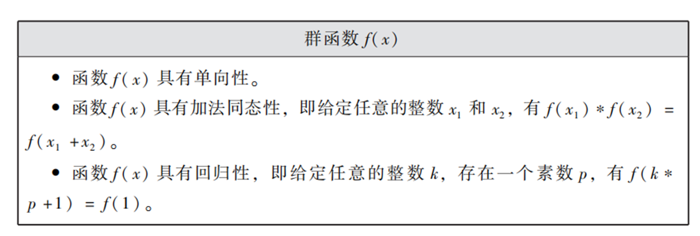
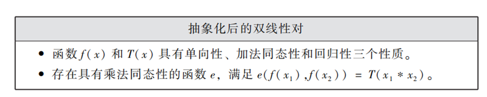
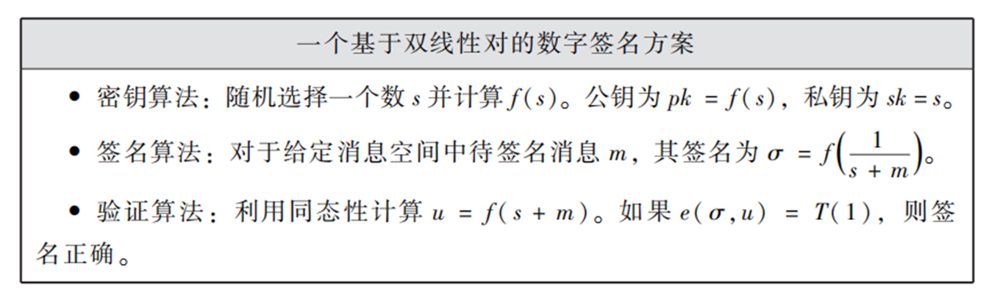

# 公钥密码学研究方法论PPT笔记L1：数字签名的构造之路

>本文主要围绕数字签名介绍
>
>郭福春《公钥密码学研究方法论》PPThttps://documents.uow.edu.au/~fuchun/methodology.html

## 从单向函数到高级的单向函数

- 什么是Cryptography Primitive？可以这么理解：

  - 它定义了用户能够做什么

  - 它定义了敌人做什么很难

- 公钥密码学里最简单和底层的Primitive是单向函数，单向函数（One-Way Function）是这么定义单向性的：
  - 给定$x$和函数$f$，正向计算$f(x)$是容易的。(用户算)
  - 给定$y$和函数$f$，反向计算满足$y=f(x)$的$x$是困难的。(敌人难)

**第一类高级的单向函数** 

单向陷门函数(One-Way Trapdoor Function)：

- 给定$x$和函数$f$，正向计算$f(x)$是容易的。
- 给定$y$和函数$f$，反向计算满足$y=f(x)$的$x$是困难的。
- 给定$y$，函数$f$和该函数对应的陷门值$td$，反向计算得到$x$是容易的。

**第二类高级的单向函数**：

单向同态函数(One-Way Homomorphic Function)：

- 给定$x$和函数$f$，正向计算$f(x)$是容易的。
- 给定$y$和函数$f$，反向计算满足$y=f(x)$的$x$是困难的。
- 给定$y_1=f(x_1)$和$y_2=f(x_2)$。计算得到$f(x_1+x_2)$是容易的，其中“$+$”可以看成数学的加法运算。$y_1×y_2=f(x_1+x_2)$

## 第一个数字签名方案：1976

说明： 1976年提出的签名方案需要用到单向陷门函数，但其如何构造当时未知。

## 第二个数字签名方案：1978

- 费马小定理（扩展欧拉定理）： 给定任意整数$k$和$x$, 如果$x$和$N$互质（两个数的最大公约数为1），那么必然有等式$x^{k(p-1)(q-1)} mod N =1$成立。
- 计算困难性：给定$N$和$e$两个数，计算$d$满足$e*d=1 mod (p-1)(q-1)$是困难的。实际上，这个困难性的保证是不够的（后面解释）。

由于多出的同态性质，RSA方案是不安全的。给定同一个私钥对$m_1$和$m_2$的签名$(S_1, S_2)$。根据函数的同态性:

$S_1*S_2 mod N$是对$m_1*m_2 mod N$的有效签名。

## 哈希函数

在20世纪80年代，得到重视的数字签名密码技术催生了另一种密码技术——哈希函数（Hash Function）的诞生。

- 用户角度：这种函数的输入可以是任意长度，但是输出的数值是固定长度或者落于一个指定的集合，比如数集Y。
- 安全角度：哈希函数是一种单向函数 (单向性)
- 安全角度：同时它具有抗碰撞性，即很难找到任意不同$x_1$和$x_2$满足$H(x_1) = H(x_2)$。
- 应用目的： 对$m$进行计算太难，那就对$H(m)$计算代替。
- 新安全问题：$m$与$H(m)$的映射问题。
  - 肯定存在多个不同$m$映射到同一个$H(m)$的值
  - 对$m_1$的签名就变成对$m_2$的签名，$iff H(m_1)=H(m_2)$
  - 抗碰撞性保证了小迪找不到多个$m$映射到同一个值。

从RSA到Hash-then-RSA签名：

- RSA: 给定消息$m$, 令$y=m$, 然后计算对应的$x$作为签名。
- HRSA：给定消息$m$，令$y=H(m)$，然后计算对应的$x$作为签名。

如此一来，Hash-Based RSA下：

$S_1*S_2 mod N$不再是对$m_1*m_2 mod N$的有效签名。

## 数字签名方案是三大改造

学术圈有四篇经典论文，它们分别是：

- 1976年的Diffie-Hellman方案《New Directions in Cryptography》。
- 1978年的RSA方案《A Method for Obtaining Digital Signatures and Public-Key Cryptosystems》。
- 1984年的ElGamal方案《A Public-Key Cryptosystem and a Signature Scheme Based on Discrete Logarithms》。
- 1986年的Fiat-Shamir转换方法《How To Prove Yourself: Practical Solutions to Identification and Signature Problems》。

第一篇文章开创了方案的通用构造：从底层任意的primitive到签名方案。

第二、三篇文章开启了方案的具体构造：从具体的primitive到签名方案。

第四篇文章首次探讨了方案的通用改装：从高级的primitive到签名方案。

### 通用构造

从单向函数到签名方案： 

1. 第一步： 从单向函数到一次签名方案（一个密钥只签名一次）。
2. 第二步：从一次签名方案到多次签名方案。

**从单向函数到一次签名方案**

**从一次签名方案到多次签名方案**

- 假设签名者的一次签名方案的密钥对是$(pk,sk)$
- 用一种固定的方法使得每次都能通过$sk$计算出相同的其它公钥
- 用父节点的公钥对子节点的两个公钥签名
- 用叶子节点公钥的私钥对消息进行一次签名（每个叶子点用一次）
- 假设签名者需要用$sk_4$对消息$m$签名
- 那么该签名就是：
  - 消息部分：$m$, 图红色圈的公钥作为附加的消息；
  - 签名部分：$sk$对子节点签名， $pk_1$对子节点签名，$sk_4$对消息m签名

### 具体构造

从具体的primitive到签名方案：

- 具体的primitive一定具有单向性。它可能带有高级的性质，比如陷门或者同态。
- 这个具体的primitive可能借助多个primitives共同构造。
- 这个具体的primitive还附带一些额外的性质。这些性质可能进一步帮助用户完成一些计算，也可能帮助敌人从一种新的角度攻破方案。

**具体的primitive 1**：循环群$(G, g, p)$ 

- $G$代表一个集合，里面都存放了所有群元。
- $g$是一个生成元，可以通过$g^x$产生整个$G$
- $p$是阶，即$G$里面有$p$个群元
- $g^x = g^{x+kp}$

抽象化表示如下：

**具体的primitive 2**：双线性对$(G, G_T, e, g, p)$  

抽象化表示如下：

> - 千万不可小瞧这个映射函数 e。 自发现（发明）后，双线性对作为公钥密码学领域最火的工具，开始横扫公钥密码学的各个研究领域, 解决了一个又一个的旧问题和新问题。
> - 它是应用密码学方向里最重要的工具。 2001 年之后, 公钥密码学方向所有学术论文有一半以上使用了双线性对。

### 通用改装

从高级的primitive到签名方案：

- 所谓的通用改装研究的就是方案与方案、协议与协议、方案与协议之间是否互通的可能性。从一种密码技术到另一种密码技术。
- 假如A和B是两个不同的密码技术(高级的primitive)，通用改装研究的就是通过A构造B，以及通过B构造A。
- 需要注意的是，如果存在从A到B的通用改装，这意味着我们可以用A概念下的任意一个方案或协议构造出B概念下的一个方案或协议。

研究方法论的例子：

- 小明提出了一个从A到B的非常漂亮的通用改装，论文发表，奖励一张大奖状。
- 小强看着眼馋，他很想做一个从C到B的通用改装，可是已经失败好多次，我们该建议小强怎么办？
  - 答： 从范围更小的C到B！

从特殊框架的认证协议到签名：

《How to Prove Yourself：Practical Solutions to Identification and Signature Problems》

### 三大构造总结

- 通用构造和具体构造侧重点不同。通用构造侧重函数的任意性，强调海纳百川；具体构造侧重构造的新奇性，强调方法独特。
- 具体构造不需要分两步走，方案一步到位后可以立即落地实现。当然，它们之间还有一个很大的区别，那就是通用构造的安全性分析比较容易、效率较低，而具体构造完全相反。
- 通用改装是高级版的通用构造。从A到B或许不难，但从更大范围的A到B也许就不那么容易了。
- 正在研究密码学的同学一定要记住一个词：Tradeoff，即鱼和熊掌不可兼得（所有方案都有这特点）。
- 构造密码方案的终极本质可以体现在从A到B这种道路探索的过程。在这里，A是起点，B是终点。
- 学术论文标题里的“from”和“based on”实际上就是用来指出与方案构造有关的起点（A）。
- 如何argue一个新方案的研究贡献是需要技巧的。可以理解为绞尽脑汁为每一个人存在的价值进行辩护。
- 假设有A，B，C，……， X， Y，Z共26个积极的评价因素。假如我们构造的方案具有A、I、C、N四个性质，那么我们只能说所构造的方案具有这四个性质，不能说我们的方案更好。
- 密码圈内的高级玩家在介绍A、I、C、N四个性质时，他们从来都不需要通过对比其它22个性质显示研究结果的重要性。他们的做法是：找一个特殊的、需要A、I、C、N这四个性质的应用场景或者切入点。
  - 以去罗马为例：
    - 密码圈的学术论文经常是这么介绍研究成果：“有一群人需要前往罗马，他们将在X领域为我们人类做出不可替代的贡献，所以他们能否安全到达罗马对我们人类在该领域很重要”。
    - 我们作者发现：这群人有Y特征，最适合他们的道路必须具有A、I、C、N四个性质，而我们开辟出来的这条路就具有这四个性质，是最适合这群人的啦！”
