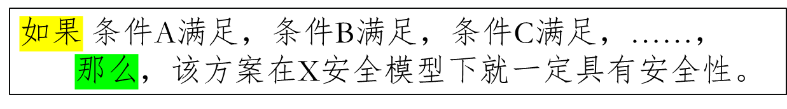
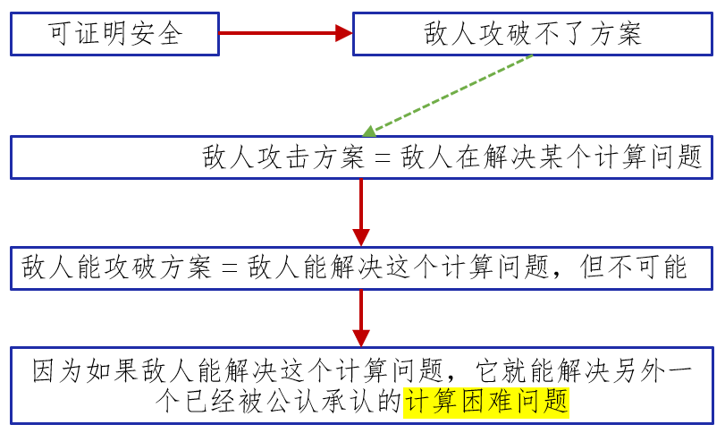
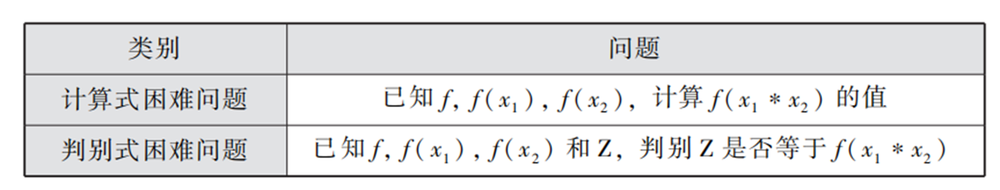
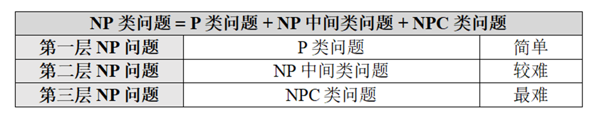
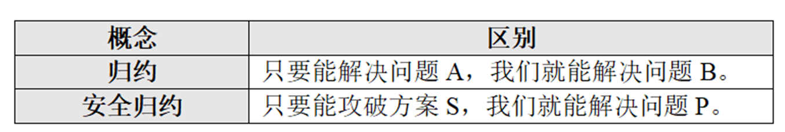
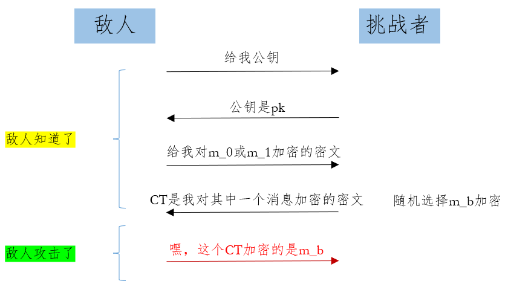
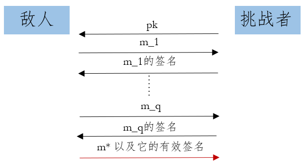

# 公钥密码学研究方法论PPT笔记L1：可证明安全以及发展之路

当我们提出一个密码方案或协议时，我们必须给出一个可说服人的分析结果，那就是该方案或协议是安全的。对应的做法叫安全分析/安全证明。

- 安全分析：这个概念比较早。它给人的感觉更像是分析一个方案协议是否能抵抗某些具体的攻击。安全分析看起来像是一种（论文作者）主观性结果。
- 安全证明：也叫可证明安全。它是一种有特殊模式的安全分析方法。可证明安全看起来像是一种客观性的结论，这种称呼让人有一种“神圣、绝对正确、必须服从”的感觉。
  - 我们是在某个安全模型下分析方案协议的安全性；
  - 我们把方案协议的安全性建立在其它困难性之上。

> 特别说明：可证明安全不意味着方案协议一定安全。更准确的结果应该是这样的：
>
> 

## 计算困难问题

公钥密码学诞生于单向函数，因此密码圈研究人员对困难性的首次认识为函数的单向性问题，即函数的反向计算很困难。公钥密码学这几十年的发展产生了两大类困难问题：

- 计算式问题（Computational Problem）。答案空间大
- 判别式问题（Decisional Problem）。答案空间T/F

单向性问题本身属于一个计算式困难问题，但是它衍生出了这两大类困难问题。数字签名方案的安全性主要和计算式困难问题相关。但有些特殊的签名方案需要借助判别式困难问题。

假设$f(x)$是一个带有加法同态性的群函数，困难问题对应的两个例子：

- 单向性问题是所有扩展出来的困难问题的基础，即解决单向性问题就能解决所有扩展后的困难问题。可以从上述两个例子看出：如果单向函数的单向性问题是简单的，那么我们可以先把$x_1,x_2$算出来，再计算$f(x_1*x_2)$，困难问题立即变成简单问题。
- 反之，解决扩展后的困难问题不一定能解决函数的单向性问题，比如上述的两个例子。(密码学研究里一个很大的方向是研究困难性)

## 计算复杂性

单向性问题是公钥密码学的安全基础，但是单向性从来没有被我们人类正经地证明过。“该函数肯定具有单向性”这种结论在接下来很长的时间内应该无法给出。密码圈能严肃得出的结论只能是“该函数在特定假设条件下具有单向性”。这是因为只要能解决上述的问题，我们就解决计算复杂性理论里闻名的P与NP问题。

在计算复杂性理论里，P和NP是两大类计算问题集。

P类问题是NP类问题的一个子集，研究人员把NP类问题按问题的困难性分为了三层（或者三个小类）：

这里的“难”指的是该问题不存在简单的解法，或者该问题存在简单解法但我们人类目前尚未找到。

- 计算复杂性理论通过一种“归约（Reduction）”技术证明第三层NP问题里所有问题难度一样。
- 然而，第二层NP问题里的每一个问题都很有个性。假如A和B都属于第二层，那么研究人员或许很难证明A比B困难、B比A困难或者A和B难度一样。
- 目前密码方案的安全性不具有第三层NP问题优点

P≠ NP 是公钥密码学存在的必要但不充分条件，即公钥密码存在需要满足以下条件：

1. P≠ NP 是成立的
2. 条件2， 
3. 条件3，
4. ……

|              | **NP里的计算困难** | **公钥密码要求的计算困难**              |
| ------------ | ------------------ | --------------------------------------- |
| **计算模型** | 确定图灵机         | 概率图灵机Probabilistic  Turing Machine |
| **时间统计** | Worst-Case         | Average Case                            |
| **问题类型** | 判别式问题         | 计算式问题，判别式问题                  |

## 规约和安全规约

密码学的可证明安全发展至今有多种不同的安全分析方法。最适合数字签名的安全分析方法是安全归约（Security Reduction）。

安全归约是一种起源于计算复杂性理论的归约技术。归约和安全归约的目的不一样的:

- 前者用于证明解决困难问题A比解决困难问题B更难;
- 后者用于证明攻破密码方案S比解决困难问题P更难。

发明安全归约技术的背后无奈： N≠NP问题还没有解决

- 攻击一个密码方案可以抽象为解决一个计算问题C。
- 由于P≠NP这个基础问题尚未得到证明，研究人员也就没有办法直接证明解决计算问题C是困难的，否则该证明的存在意味着P≠NP。
- 因此，密码圈人员就通过比较的方法分析方案的安全性。具体而言，一些有威望的研究人员画了若干条红线，断言若干计算问题应该是计算困难问题，然后密码方案设计者只需要通过安全归约的方法证明攻破方案可以解决这些被预定义的计算困难问题即可。
- 有了红线作为参照线，研究人员分析方案的安全性就容易多了，安全结论既客观又回避了P是否等于NP这个问题。

## 计算模型Computational Model

计算模型是对计算能力建模。我们人类利用计算机可以简单解决的计算问题集合究竟有多大？这个有关集合大小的问题无法回答，因为这个问题取决于人类能够设计开发出来的计算机运算能力有多强。

怎么办呢？先定义若干种最基本的逻辑计算，再强制计算机里所有的计算都只能调用这些最基本的计算。有了最底层的基本计算定义之后，我们人类就有办法算出计算机的能力上限，即能力最大值可以达到多少，最后利用这个能力最大值去探索简单计算问题集合大小的上限。这就是计算模型及其应用。

图灵机就是一种计算模型，但我们人类目前还没有把图灵机的计算能力上限理解清楚。

密码学关注计算模型的最大理由： 给敌人画范围！

==We say it is secure if no PPT adversary can break it.==

- PPT (Probabilistic Polynomial Time)就是敌人的集合。这里指的是敌人在多项式时间内完成的，采用概率算法的的敌人。
- no PPT必须考虑最强、最厉害的敌人。
- 我们考虑的不仅是已知的，还有未来的敌人。

## 安全模型Security Model

安全模型可以从数学的角度定义：

- 小迪在攻击之前知道什么，
- 小迪的攻击目标是什么。

安全模型把攻击一个方案转换严谨表达成求解一个计算问题（知道……求……）。

数学下计算问题的表达形式：

- 输入：X

- 输出：Y

安全模型下的计算问题表达形式

- 敌人知道了：X

- 敌人将攻击：Y

安全模型的表达有多样

- 游戏Game的方式（挑战者和敌人的交互）

- 概率Probability方式的表达（P[知道的内容: 攻击的目标]）

上述的安全模型可以简洁成：

$Pr[(pk,sk)←密钥算法;(m_0,m_1)← A; b ←{0,1};CT←E(pk,m_b): A(CT)=b]$

一个新密码技术概念，其诞生由两部分组成的定义：

- 算法定义，包括了正确性定义。
- 安全定义，即给予安全模型定义。

## 可证明安全发展的三个阶段（数字签名）

- 1979-1992年：困难时期，每走一步都不容易。

- 1993-2000年：出现外挂，技术积累等待爆发。

- 2001-2021年：工具逆天，各种鬼技陆续出现。

### 第一阶段：1979-1992

Goldwasser、Micali和Riverst于1984年发表了可证明安全方面里程碑式的论文《A "Paradoxical" Solution to the Signature Problem》正式地把“安全模型”从公钥加密引进到数字签名及其可证明安全 的研究。作者们提出的自适应选择消息攻击下存在不可伪造性（EUF-CMA）安全模型已经成为了当今数字签名的标准安全模型。

EUF-CMA = Existential Unforgeability Under Adaptive Chosen Message Attacks

- 敌人要求首先看到公钥pk，不见签名公钥就不点炮。

- 敌人其次可以随心所欲地得到任意消息m_i的有效签名。

- 敌人将伪造任意一个==新==消息(记为m*)的有效签名。

这个安全模型有个特点叫做自适应安全（Adaptive），指的是敌人可以自行选择任意消息用于签名询问和相应签名的伪造，而且是挑战者无法提前知道的消息。

但是这个标准安全模型EUF-CMA实在是太”矛盾“了：

原因：如果安全归约成功，这意味着我们证明者不仅能为敌人提供它指定的任意消息的签名，也能利用敌人伪造的签名解决困难问题。这好矛盾啊，既然我们证明者能为敌人提供消息的签名，为何还需要敌人伪造的签名才可以解决困难问题？证明者可以自己计算一些签名再利用这些签名解决困难问题，完全不需要敌人的帮忙。

### 第二阶段：1993-2001

在1993年第一届的ACM CCS会议上，来自加州大学分校的两位作者Mihir Bellare和Phillip Rogaway发表了《Random Oracles are Practical: A Paradigm for Designing Efficient Protocols》，降低了安全证明的难度。

该篇论文的核心思想是把哈希函数$H(x)$当做一个随机预言机（Random Oracle）之后，我们能使用的技巧：

- 敌人的询问$x$我们都看得到

- 敌人的询问$x$都由我们证明者给予反应(response), $y=H(x)$

在EUF-CMA安全模型里，证明的其中一个难点是敌人选择消息的不可预测性。在random oracle下，这个问题不再困难：

- 假设证明者可以对随机消息$X1,X2,...,Xq$计算签名，并能利用敌人对随机值$X^*$的签名解决困难问题。
- 在RO下，我们把消息$m_1$映射到$Xi$， 把$m$映射到$X^*$。 
- 在RO下的安全证明里，我们就有证明者可以对由敌人决定的消息$m_1, m_2,  ..., m_q$计算签名，并能利用敌人对消息$m^*$的签名解决困难问题。

### 第三阶段：2001-2021

在2001年的美密会上，Dan Boneh和Matthew Franklin发表了论文《Identity-Based Encryption from the Weil Pairing》。这篇论文首次构造了IBE方案，而且提供了非常强大的方案构造工具：双线性对。

在同年的亚密会上，Dan Boneh、Ben Lynn和Hovav Shacham 发表了论文《Short Signatures from the Weil Pairing》，把双线性对这个工具正式应用到了数字签名方案的构造。这篇论文所提出的签名方案被后人尊称为BLS方案。 这是一个高效、安全、极简、非常经典的数字签名方案。

## 可证明安全补充

安全归约不是可证明安全的唯一技术，但数字签名方案的可证明安全主要以安全归约为主。

在密码圈，方案和协议的证明方法不太一样。

- 方案的证明主要采用安全归约 (Security Reduction)，
- 协议的证明主要采用模拟证明方法（Simulation-Based Proofs）。

>Game Hopping是一种更高级的方法，它即用于安全归约，也用于模拟证明。但是，Game Hopping它更多局限用于证明“不可区分性(Indistinguishability)”. 比如，加密的密文里，其加密的消息可能是m_0或m_1, 无法区分。Game Hopping不能直接用于证明“伪造签名”的困难。