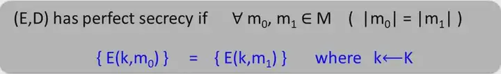
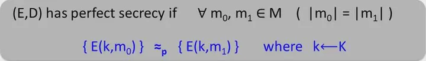
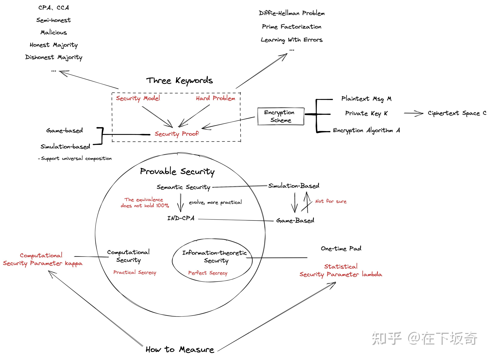

# 安全性定义

在加密方案中，有两种基础的安全性定义（definition of seccurity），一个是语义安全（semantic security），一个是密文的不可区分性（indistinguishability of encryptions），这两个定义后来被证明是等价的。这些安全性定义不仅仅是说从密文中恢复出明文是不可行的，毕竟恢复出部分明文信息也是不可容忍的，因此，我们要求从密文中获取关于明文的任何信息都是不可行的。此外，在大多数应用中，明文可能不是均匀分布的，关于它的一些先验信息可能对敌手是可用的。语义安全的定义考虑了这一切。

**多明文的安全性**：在下面的介绍中首先从单个加密明文的安全性方面给出了定义。然而，在许多情况下，希望使用相同的加密密钥加密许多明文，并且这些情况下的安全性也需要保留。这个后面再讨论。

**非一致性复杂度公式**：为了简化论述，我们用非一致复杂度来定义安全性。我们将高效敌手（和算法）的范畴扩展到包含非一致性多项式尺寸的电路上，而不仅仅是概率多项式的机器上。同样，我们对消息的概率分布和这些消息的先验信息不作任何计算限制。

## 完美保密性

一个加密算法有三个必备的东西：被加密的消息$m$、加密密钥$k$，以及加密算法对$(E, D)$（加解密算法）。

我们加密一个消息，最终的目的是什么呢？最直观地，就是让别人在没有密钥的条件下，无法从加密结果中恢复出原始的消息。那么如何用数学描述呢？信息论始祖Shannon给出了一个形式化的定义，即完美保密性（Perfect Secrecy）：

该定义的意思是，对于任意等长的两个消息$m_0,m_1$，经过加密后加密结果“看起来都一样”（不可区分）。密码学中证明了，唯一能达到这个安全条件的加密算法叫做一次一密（One-Time Pad）。

>**一次一密**：
>
>“一次一密”是指在密码学中使用**一次性密码本（One-Time Pad）**进行加密和解密的技术。
>
>一次性密码本的基本原理是通过将明文与随机生成的密钥（从均匀分布中随机采样）进行异或运算来实现加密和解密。密钥必须具备以下特点：与明文等长、完全随机、只使用一次。并且发送者和接收者在事先安全共享同一密钥。在使用一次性密码本进行加密时，发送者将明文与密钥进行异或运算，生成密文，并将其发送给接收者。接收者收到密文后，再将密文与事先共享的相同密钥进行异或运算，即可还原出明文。
>
>一次一密在理论上无法通过数学或统计学方法破解，是信息论安全的，即无论攻击者使用何种算法或计算资源，都无法从密文中获得有关明文的任何信息。通俗来讲，可以说一次一密是绝对安全的。
>
>注意，一次性密码本不提供完整性和认证，仅提供机密性保护。

一次一密要求密钥长度与明文等长，既然我都可以安全传输一个与明文等长的密钥了，为啥不直接安全传输明文呢？因此一次一密是不实际的。

完美保密定义说的是加密结果让任何人看，“看起来都一样”。那干脆，我们选一个迄今为止计算能力最强的人来看加密结果，要是他都觉得“看起来都一样”，是不是就够了？到现在为止，计算能力最强的就是计算机了，我们就让一个计算机来看，如果他觉得“看起来都一样”，那应该没问题了。这就是我们所说的实际保密性（Practical Secrecy）：

与上面相比，就一个符号改变了，就是等号变成了约等于号。计算机最多能计算多项式时间内能解决的问题，并且计算机最多有多项式大的存储空间。所以，只要计算机在多项式复杂度内看加密结果，觉得“看起来都一样”，那就成功了，即实现了计算安全性。

> 完美保密要求任意两个消息加密后的密文是不可区分的（indistinguishable）。
>
> 实际保密要求任意两个消息加密后的密文是计算不可区分的（computationally indistinguishable）。

## 语义安全

“To be somewhat more accurate, semantic security means that whatever can be efficiently computed from the ciphertext can be efficiently computed when given only the length of the plaintext.”

换句话说，语义安全意味着从密文中获得的知识不会多于从明文长度中获得的知识，更暴论地说，这意味着，除了明文长度，从密文中无法获得更多的知识。我们强调，除了关于明文长度的信息外，密文不需要提供关于明文的任何信息。

接下来我们对这一讨论进行扩展，要求即使在存在关于同一明文的其他辅助部分信息的情况下，获得明文信息的不可行性仍然有效。

“Namely, whatever can be efficiently computed from the ciphertext and additional partial information about the plaintext can be efficiently computed given only the length of the plaintext and the same partial information.”

在下面的定义中，敌手试图获得的关于明文的信息用函数$f$表示，而关于明文的先验部分信息用函数$h$表示。对于任意分布的明文（用概率集合$\{X_n\}_{n∈\mathbb{N}}$表示），需要满足获取明文信息的不可行性。安全性只对安全参数中长度多项式的明文成立。这在下面的定义中通过限制$\left|X_n\right| \leq \operatorname{poly}(n)$来捕捉，其中poly表示任意（未指定）多项式。同样地，我们限制函数$f$和$h$是多项式有界的，即$|f(z)|,|h(z)| \leq \operatorname{poly}(|z|)$。

> 我们不可能为明文长度不做限制（或指数级）的明文提供计算安全性。

私钥加密方案（对称加密）与公钥加密方案的区别体现在安全性的定义上。在后一种情况下，敌手（它试图获得关于明文的信息）被赋予加密密钥，而在前一种情况下，敌手不被赋予加密密钥。因此，这些方案之间的差异就相当于敌手模型（在安全的定义中考虑了）中的差异。

**定义：semantic security – private-key**：An encryption scheme, $(G, E, D)$, is semantically secure (in the private-key model) if for every probabilistic polynomial-time algorithm $A$ there exists a probabilistic polynomial-time algorithm $A'$ such that for every probability ensemble $\{X_n\}_{n∈\mathbb{N}}$, with $\left|X_n\right| \leq \operatorname{poly}(n)$, every pair of polynomially bounded functions $f, h:\{0,1\}^* \rightarrow\{0,1\}^*$, every positive polynomial $p$ and all sufficiently large $n$
$$
\begin{aligned}
& \operatorname{Pr} {\left[A\left(1^n, E_{G_1\left(1^n\right)}\left(X_n\right), 1^{\left|X_n\right|}, h\left(1^n, X_n\right)\right)=f\left(1^n, X_n\right)\right] } \\
& \quad<\operatorname{Pr}\left[A^{\prime}\left(1^n, 1^{\left|X_n\right|}, h\left(1^n, X_n\right)\right)=f\left(1^n, X_n\right)\right]+\frac{1}{p(n)}
\end{aligned}
$$
(The probability in these terms is taken over $X_n$ as well as over the internal coin tosses of either algorithms $G$, $E$, and $A$ or algorithm $A'$.)

> 其中$G$是密钥生成算法，输入为$1^n$，输出为两个比特串，分别是加密密钥和解密密钥，分别用$G_1(1^n), G_2(1^n)$表示。

这两个算法$A,A'$试图猜$f\left(1^n, X_n\right)$的值，即试图推理关于明文$X_n$的值。通俗地说，在一个语义安全的加密方案中密文对这个推理没有帮助。也就是说，任何一个给定密文的高效算法（即算法$A$）的成功概率，都可以被一个完全不给定密文的高效算法（即算法$A'$）的成功概率匹配到一个可忽略不计的分数。

在公钥加密中，加密密钥$G_1(1^n)$就得给敌手了，作为额外的输入。

**定义：semantic security – punlic-key**：An encryption scheme, $(G, E, D)$, is semantically secure (in the public-key model) if for every probabilistic polynomialtime algorithm $A$, there exists a probabilistic polynomial-time algorithm $A'$ such that for every $\{X_n\}_{n∈\mathbb{N}}$,$f$, $h$, $p$, and $n$ as in “Definition semantic security – private-key”
$$
\begin{gathered}
\operatorname{Pr}\left[A\left(1^n, G_1\left(1^n\right), E_{G_1\left(1^n\right)}\left(X_n\right), 1^{\left|X_n\right|}, h\left(1^n, X_n\right)\right)=f\left(1^n, X_n\right)\right] \\
\quad<\operatorname{Pr}\left[A^{\prime}\left(1^n, 1^{\left|X_n\right|}, h\left(1^n, X_n\right)\right)=f\left(1^n, X_n\right)\right]+\frac{1}{p(n)}
\end{gathered}
$$
这里将$G_1(1^n)$给$A'$是没有意义的，因为加密密钥和$A'$的主要输入没有关系。

对于上述定义，$h$的引入使得定义隐含了非一致性（可以简单理解为引入了建议纸带）。一般来说，根据安全参数，函数$h$可以编码关于其主输入和非一致建议的信息。这些定义等价于允许$A$和$A'$是非一致电路的相关族，这里的相关意味着$A'=\left\{A_n'\right\}_{n \in \mathbb{N}}$族中的电路可以从$A=\left\{A_n\right\}_{n \in \mathbb{N}}$族中的相应电路高效计算。

## 密文的不可区分性

该定义指区分（等长的）两个明文的密文是不可行的。也就是说，这些密文在计算上是不可区分的。

**定义：indistinguishability of encryptions – private-key**：An encryption scheme, $(G, E, D)$, has indistinguishable encryptions (in the private-key model) if for every polynomial-size circuit family $\{Cn\}$, every positive polynomial $p$, all sufficiently large $n$, and every $x, y \in\{0,1\}^{\operatorname{poly}(n)}$ (i.e., $|x|=|y|$),
$$
\left|\operatorname{Pr}\left[C_n\left(E_{G_1\left(1^n\right)}(x)\right)=1\right]-\operatorname{Pr}\left[C_n\left(E_{G_1\left(1^n\right)}(y)\right)=1\right]\right|<\frac{1}{p(n)}
$$
The probability in these terms is taken over the internal coin tosses of algorithms $G$ and $E$.

该电路既对敌手的策略进行建模，又对敌手的先验信息进行建模。

**定义：indistinguishability of encryptions – public-key**：An encryption scheme, $(G, E, D)$, has indistinguishable encryptions (in the public-key model) if for every polynomial-size circuit family $\{Cn\}$, and every $p$, $n$, $x$, and $y$ as in “Definition indistinguishability of encryptions – private-key”
$$
\left|\operatorname{Pr}\left[C_n\left(G_1\left(1^n\right), E_{G_1\left(1^n\right)}(x)\right)=1\right]-\operatorname{Pr}\left[C_n\left(G_1\left(1^n\right), E_{G_1\left(1^n\right)}(y)\right)=1\right]\right|<\frac{1}{p(n)}
$$
同样，在公钥加密中，加密密钥$G_1(1^n)$就得给敌手了，作为额外的输入。

> 一个密文不可区分的公钥加密方案不能使用一个确定性加密算法（即对于同一个明文的加密结果不能是一个固定的字符串）。

## 可证明安全概览

> 参考资料：
>
> - https://www.zhihu.com/question/37203836
> - https://www.cnblogs.com/max1z/p/15992505.html#%E4%B8%8D%E5%8F%AF%E5%8C%BA%E5%88%86%E6%80%A7
> - https://www.zhihu.com/search?hybrid_search_extra=%7B%22sourceType%22%3A%22answer%22%2C%22sourceId%22%3A70932036%7D&hybrid_search_source=Entity&q=%E4%B8%80%E6%AC%A1%E4%B8%80%E5%AF%86&search_source=Entity&type=content
> - https://zhuanlan.zhihu.com/p/430149099
> - O. Goldreich. Foundations of Cryptography Vol. II – Basic Applications. Cambridge University Press, 2004.