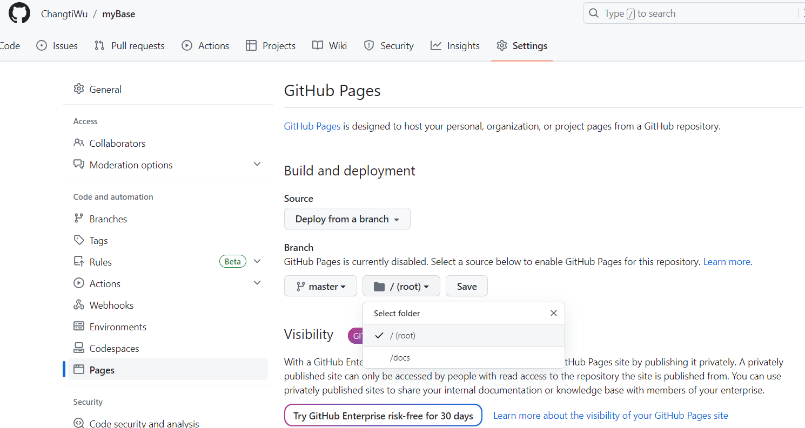

# Docsify搭建个人网站

# Node.js安装

首先安装Node.js，直接官网下载。

检验安装是否成功：

```bash
node -v：显示安装的nodejs版本
npm -v：显示安装的npm版本
```

安装成功则显示版本号。

# docsify-cli安装

cmd命令行：

```bash
npm install -g docsify-cli
```

检验安装是否成功：

```bash
docsify -v
```

# 网站初始化

## 新建项目

进入自己用于作为知识库（个人网站）的文件夹（需要新建，不然会覆盖原来的文件）R:\myBase进行初始化：

```bash
docsify init
```

或者直接在cmd终端输入：

```bash
docsify init R:\myBase
```

初始化成功后，命令行会输出相应的提示成功的信息。

## 本地运行预览docsify创建的项目

进入项目所在文件夹的上级文件夹，dos命令运行：

```bash
docsify serve myBase
```

或直接进入项目所在文件夹，dos命令：

```bash
docsify serve
```

启动本地服务器。然后在本地浏览器中打开：

```bash
http://localhost:3000
```

## 一些配置项

==具体配置详见官网==https://docsify.js.org/#/zh-cn/

命令成功初始化网站后，docsify会在项目文件夹里自动帮我们生成以下两个文件：

- index.html
  ：网站主入口文件和配置文件
- README.md
  ：网站内容文件。支持Markdown格式，docsify可以帮我们把该Markdown源文件渲染成网页进行展示。
- .nojekyll

  ：用于阻止 GitHub Pages 忽略掉下划线开头的文件。

# 部署

此处部署在GitHub Page上。

首先进入自己的项目文件夹，将自己的项目库初始化为git仓库：

```bash
git init
```

在github上新建一个远程仓库myBase并将其与本地库关联。将本地库add commit push上远程库。最后在github的myBase项目界面--settings--pages--选中master分支，选择对应文件源目录，可以是选择一个文件，也可以是根目录（这里当然是根目录了）--save。




> 参考资料：
>
> - https://www.liaoxuefeng.com/wiki/896043488029600/898732864121440

# 兼容问题

## letax数学公式显示

添加插件：

```html
  <!-- LaTeX display engine script Here -->
  <script src="https://cdn.jsdelivr.net/npm/mathjax@2/MathJax.js?config=TeX-AMS_CHTML"></script>
  <script src="https://cdn.jsdelivr.net/npm/docsify-latex@0"></script>
```

## md扩展语法：高亮==

添加代码：

```javascript
window.$docsify = {
    plugins: [
		  function(hook, vm) {
			hook.beforeEach(function (html) {
			  //适配Markdown的====高亮语法
			  let res = html.match(/==(.+?)==/g);
			  if(res){
				for (var i = 0; i < res.length; i++) {
				  html = html.replace(res[i],`<mark>`+res[i].replace(/==/g,"")+`</mark>`);
				}
			  }
				//将更新时间加到文档的最顶部
				return '> Last Modified {docsify-updated}'
					  + '\n----\n'
					  + html;
			})
	}]
}
```


# Bug

## 404

如果网页加载不出来，因为

```
https://cdn.jsdelivr.net/npm/docsify@4/lib/themes/vue.css
https://cdn.jsdelivr.net/npm/docsify@4
```

这两个文件国内访问超时。

将其保存为本地文件，修改index.html的引用链接为本地即可。

## 侧边栏显示异常

在_sidebar.md _navbar.md等文件中写列表尽量用*而不用-，否则有时会识别异常。


> 参考资料：
>
> - https://zhuanlan.zhihu.com/p/525653345?utm_id=0
> - https://www.dongchuanmin.com/operate/5296.html
> - https://www.cnblogs.com/Can-daydayup/p/15413267.html
> - https://docsify.js.org/#/zh-cn/（官网可以转中文）