==写在前面：==

==用MobaXterm上传文件到远程服务器，剩下的代码编辑调试运行用vscode连接远程服务器操作即可。==

==MobaXterm、vscode自行下载，不再赘述。==

# 1 MobaXterm远程连接服务器并上传文件

## 1.1 连接远程服务器

Session->SSH->输入远程服务器ip地址和用户名，点击OK。

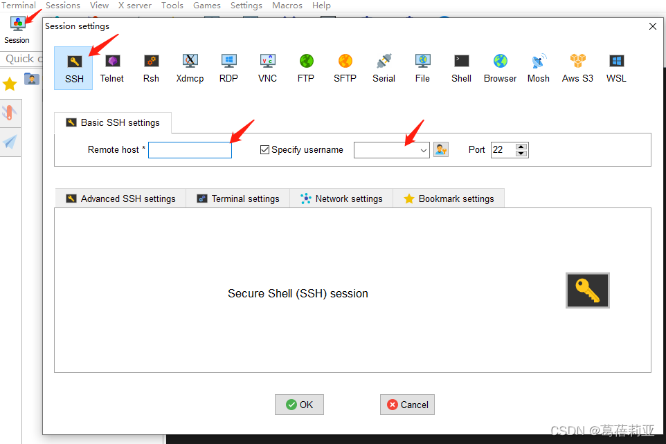

然后会出现命令行输入密码（命令行输入密码不显示）。连接成功。

## 1.2 上传/下载文件

上传可以直接在文件夹区拖拽文件上传。

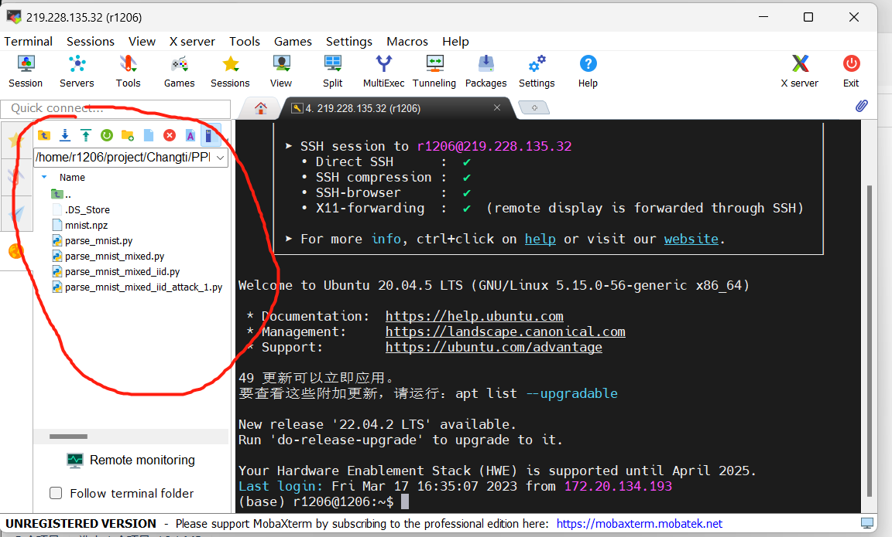


> 参考资料：
>
> 1. https://blog.csdn.net/qq_42552025/article/details/123955462

# 2 VSCode远程连接服务器

## 2.1 安装拓展

打开vscode安装拓展remote-ssh，左侧会出现remote-ssh的小图标。

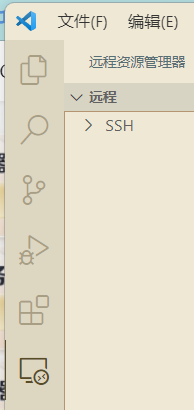

## 2.2 添加服务器连接配置

点击左侧remote-ssh小图标，点击“小齿轮”，输入自定义ssh配置文件的绝对路径，自定义ssh配置信息存储的位置。（注意是文件不是文件夹）也可采用默认的`C:\Users\12576\.ssh\config`。

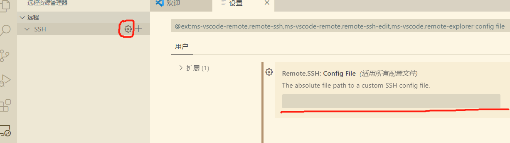

点击SSH项的“加号”，输入远程服务器的地址（账号@ip地址），不要忘了命令前面有个`ssh`。

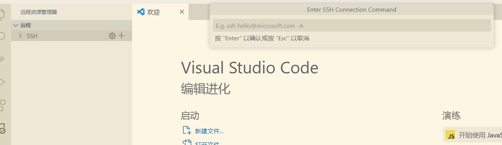

选择ssh配置信息存储的位置。

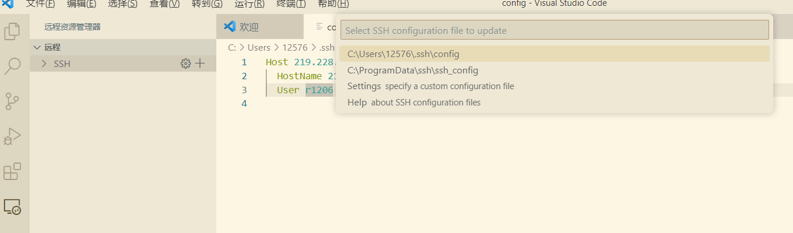

> 可以顺便打开config文件看一下。
>
> 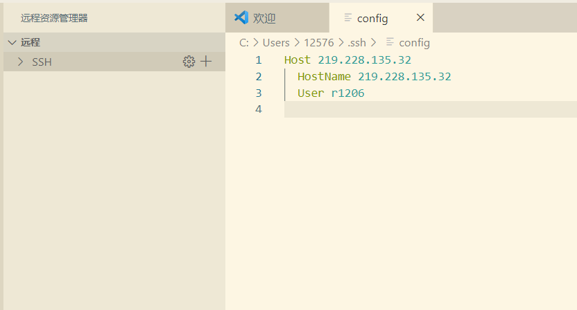
>
> 可以在SSH项下拉菜单看到刚刚添加的host。
>
> 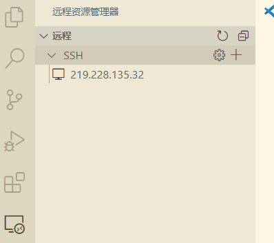

## 2.3 连接远程服务器

找到目标host连接。

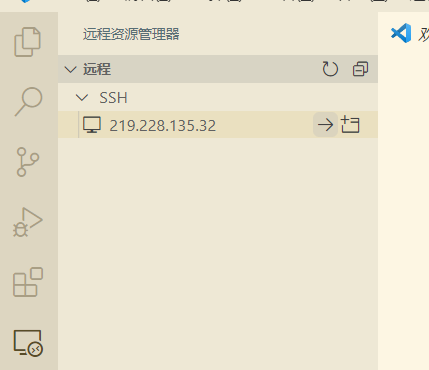

输入密码。

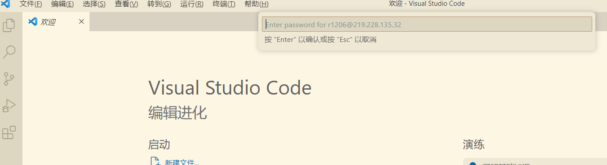

连接成功。

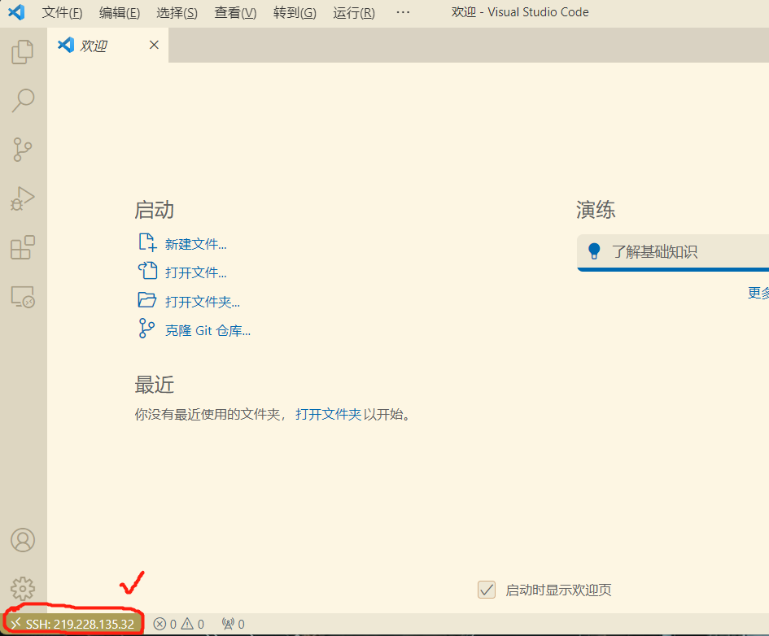

点击打开文件夹，再输一遍密码。

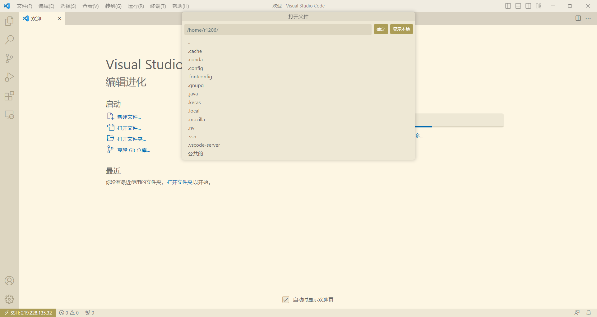

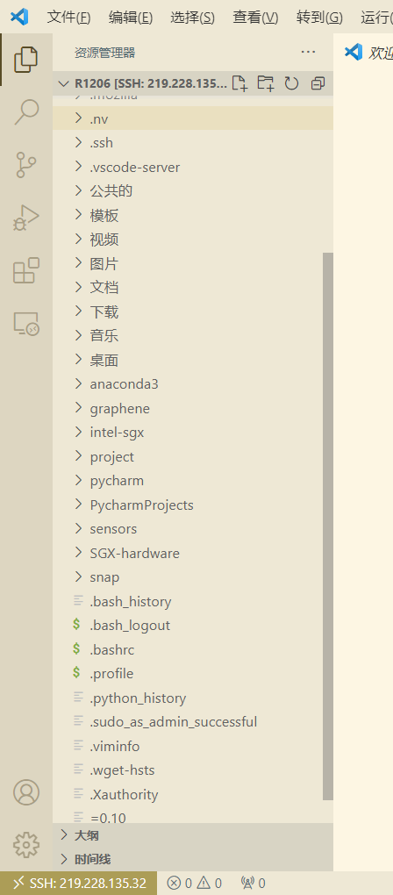

# 3 其他拓展工具

## 3.1 tmux

### 功能

- 对终端实现分屏功能和便捷的多任务切换。
- 允许断开terminal之后，继续后台运行执行中的进程。

### tmux的结构

一个tmux里可以包含多个会话`sessions`，一个session可以有多个窗口`windows`，一个window可以有多个窗格`panes`。

==所有的tmux命令都以`Ctrl + b`为前缀（特指进入tmux后的所有指令，在terminal里的指令不需要）。具体操作是先按下`Ctrl + b`后手指松开，然后再按其他键。在下面的表示中将其表示为`Ctrl + b` `<key>`。==

### tmux指令

可以新建一个session，其中包含一个window，该window中包含一个pane，pane里打开了一个shell对话框。

```bash
$ tmux
```

tmux创建的session的名字默认都是按数字排序，所以可以在进入tmux时对session自定义名字。

```bash
$ tmux new -s [session_name]
```

在tmux里，如果需要重新退回terminal，可输入下面的命令。其中d表示**detaching**，运行后并不会真正关闭session，而是将session挂起，在tmux session里面的程序还是会在后台继续运行。

`Ctrl+b` `d`

如果想要重新连接刚才退出的tmux session，可以输入下面命令。

```bash
$ tmux attach
$ tmux a
```

如果想连接到特定的session。

```bash
$ tmux attach -t [session_name]

#也可以将attach简写成a
$ tmux a -t [session-name]
```

**注意**：如果这时输入tmux，会默认重新开启一个新的session。

在session里时，`Ctrl + b` + `$` 对当前session进行重命名。

在terminal里，可直接对某个特定session重命名：

```bash
$ tmux rename-session -t 0 [session_new_name]
```

`Ctrl + b` + `s` 可视化选择任意session，同时，按下左右键可以对当前session的windows进行展开和收起，以及对某个windows的panes进行展开并选择某一pane。

如果不知道当前存在哪些session，可以输入下方命令查看。

```bash
$ tmux ls
```

如果要关闭某个会话：

```bash
# 使用会话编号或具体名字
$ tmux kill-session -t 0
$ tmux kill-session -t <session-name>
```

在`tmux ls`中可以看到，第一列显示的是session名字，默认创建时名字是从0开始的整数，然后表示当前session里有几个windows。创建一个session的时候，默认只有一个窗口。

在某个session里时，

`Ctrl + b` `c`可以创建新的window。

`Ctrl+b` `0` 可以切换到0号window。

`Ctrl + b` `p`切换到上一个window。

`Ctrl + b` `n`切换到下一个window。

`Ctrl+b` `,` 对当前window进行重命名。

`Ctrl+b` `w` 可以从window列表里选择window，该显示结果与`Ctrl + b` + `s` 一样。

在新建的一个window里，默认只有一个pane，但是可以对其进行切分：

`Ctrl+b` `%` 可以将当前pane分成左右两个panes。

`Ctrl+b` `"` 可以将当前pane分成上下两个panes。

`Ctrl+b` `o`可以移动到下一个pane里。

`Ctrl+b` `;`可以切换到上一个pane里。

`Ctrl + b` `<arrow key>`也可以直接通过上下左右箭头来切换panes。

`Ctrl+b` `x`关闭当前所在pane，这种关闭，会在关闭前进行确认。

`Ctrl + b` `z` 可以将当前的pane进行放大/缩小。

`Ctrl + d` 或者 直接输入`exit`：直接关闭当前pane；如果当前window的所有pane均已关闭，则自动关闭当前window；直至所有window均已关闭，则自动关闭当前session。

> 参考资料：
>
> 1. https://zhuanlan.zhihu.com/p/414295937
