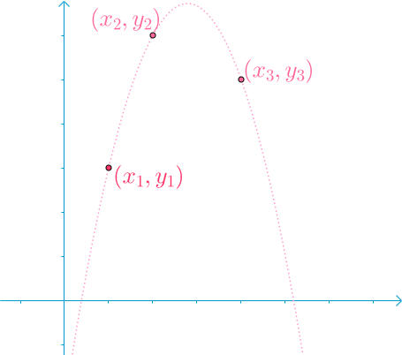
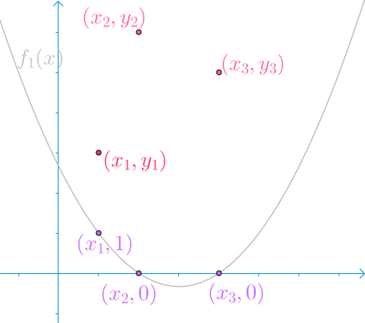
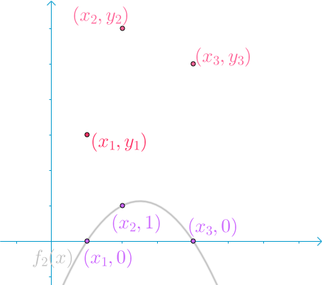
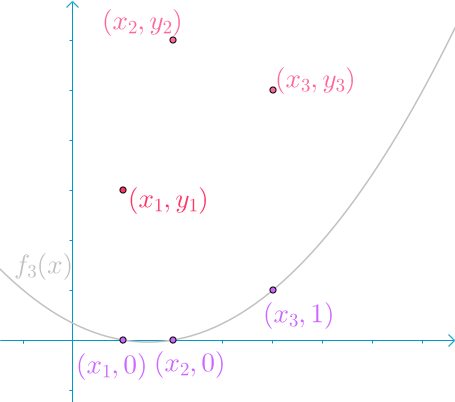

# 插值法

插值是数值分析中的通过已知的离散数据求未知数据的过程或方法。

## 拉格朗日插值法

Lagrange Interpolation

假设已知下面这几个点，我想找到一条穿过它们的曲线。

用多项式完全可以画出这条曲线。

我们可以合理的假设，这根曲线是一个二次多项式：
$$
y=a_0 + a_1x + a_2x^2
$$
有三个已知的点，可以通过带入三个点列方程组求解：
$$
\begin{cases}
y_1=a_0 + a_1x_1 + a_2x_1^2 \\
y_2=a_0 + a_1x_2 + a_2x_2^2 \\
y_3=a_0 + a_1x_3 + a_2x_3^2
\end{cases}
$$
不过这里不打算通过解方程来得到这条二次曲线，我们来看看拉格朗日是怎么解出这条曲线的？

### 拉格朗日的思考

拉格朗日认为可以通过三条二次曲线相加来达到目标：

第一条曲线$f_1(x)$，在$x_1$处，取值为1，其余两点取值为0：

第二条曲线$f_2(x)$，在$x_2$处，取值为1，其余两点取值为0：

第三条曲线$f_3(x)$，在$x_3$处，取值为1，其余两点取值为0：

这三条曲线被称为拉格朗日多项式曲线。则：

- $y_1f_1(x)$可以保证，在$x_1$处，取值为$y_1$，其余两处取值为0。
- $y_2f_2(x)$可以保证，在$x_2$处，取值为$y_2$，其余两处取值为0。
- $y_3f_3(x)$可以保证，在$x_3$处，取值为$y_3$，其余两处取值为0。

我们再将这三条多项式曲线与相应的$y_i$乘积后相加：
$$
f(x)=y_1f_1(x)+y_2f_2(x)+y_3f_3(x)
$$
那么，$f(x)$就是我们要找的曲线。

### 拉格朗日插值的推导

那么如何找到拉格朗日多项式曲线呢？拉格朗日多项式曲线$f_i(x)$显然需要满足：
$$
f_i(x)=
\begin{cases}
1 & x=x_i \\
0 & x=x_j, j\neq i
\end{cases}
$$
首先考虑令$f_i(x_j)=0$的情况。显然可以构造一个$f_i(x)=(x-x_1)...(x-x_{i-1})(x-x_{i+1})...(x-x_n)$满足要求（假设一共有n个点）。

接下来考虑怎么改造这个函数使之还满足$f_i(x_i)=1$。当上面的函数取$x=x_i$时，$f_i(x_i)=(x_i-x_1)...(x_i-x_{i-1})(x_i-x_{i+1})...(x_i-x_n)$，那么我们可以再除以$f_i(x_i)$来进一步改造这个函数：
$$
\begin{aligned}
f_i(x)
&=\frac{(x-x_1)...(x-x_{i-1})(x-x_{i+1})...(x-x_n)}{(x_i-x_1)...(x_i-x_{i-1})(x_i-x_{i+1})...(x_i-x_n)}\\
&=\prod_{j\neq i} \frac{x-x_j}{x_i-x_j}
\end{aligned}
$$
至此，我们便构造出拉格朗日多项式曲线$f_i(x)$了。

最后可得：
$$
f(x)=\sum y_if_i(x)
$$

### reflection

回到该方程组：
$$
\begin{cases}
y_1=a_0 + a_1x_1 + a_2x_1^2 \\
y_2=a_0 + a_1x_2 + a_2x_2^2 \\
y_3=a_0 + a_1x_3 + a_2x_3^2
\end{cases}
$$
即
$$
\underbrace{\left(\begin{array}{l}y_1 \\ y_2 \\ y_3\end{array}\right)}_{\mathbf{y}}=\underbrace{\left(\begin{array}{lll}1 & x_1 & x_1^2 \\ 1 & x_2 & x_2^2 \\ 1 & x_3 & x_3^2\end{array}\right)}_A \underbrace{\left(\begin{array}{l}a_0 \\ a_1 \\ a_2\end{array}\right)}_{\mathbf{a}}
$$
$A$就是范德蒙矩阵，$|A|$为范德蒙行列式。

方程组$A\mathbf{a}=\mathbf{y}$有解的充要条件是$r(A)=r(A,\mathbf{y})$，其中：

- 当$r(A)=r(A,\mathbf{y})=n$时，该方程有唯一解。满足要求的曲线只有一条。
- 当$r(A)=r(A,\mathbf{y})<n$时，该方程有无穷解。满足要求的曲线有多条。

> 参考资料：
>
> 1. 如何直观地理解拉格朗日插值法？ https://www.zhihu.com/question/58333118