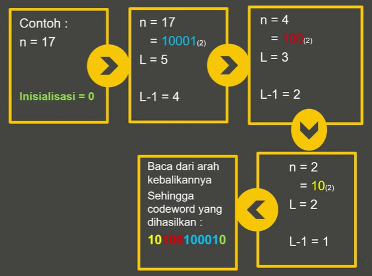
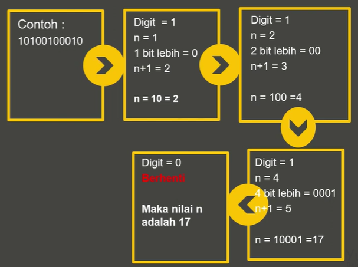

# 编码技术

## Unary coding

一元编码，是一个表示自然数（0和正整数）的熵编码。

编码自然数n：n个1后面再跟一个0。

如果n是正整数，则可以化简为：n-1个1后面跟一个0。

> 0相当于一个分隔符，一个一元码比特流后面再跟下一个自然数的一元码。
>
> 0 1可以互换，即n个0后面再跟一个1。

编码长度：n+1

例：

| n (non-negative) | n (strictly positive) | Unary code | Alternative |
| :--------------: | :-------------------: | :--------: | :---------: |
|        0         |           1           |     0      |      1      |
|        1         |           2           |     10     |     01      |
|        2         |           3           |    110     |     001     |
|        3         |           4           |    1110    |    0001     |
|        4         |           5           |   11110    |    00001    |
|        5         |           6           |   111110   |   000001    |
|        6         |           7           |  1111110   |   0000001   |
|        7         |           8           |  11111110  |  00000001   |
|        8         |           9           | 111111110  |  000000001  |
|        9         |          10           | 1111111110 | 0000000001  |

## Elias coding

Elias coding是一种通用代码，用于编码正整数序列。

It works by prefixing the positive integer with a representation of its order of magnitude in a universal code. 这类编码的工作原理是在正整数前面加上通用代码中其数量级的表示。

### Elias gamma coding

Elias $\gamma$ coding是一种通用代码，用于编码正整数序列。当不能事先确定整数的上界时，这种方法非常有用。

编码正整数$X$：

1. 找到使$2^N \le X$成立的最大整数$N$，即$N=\left\lfloor\log _2 X\right\rfloor$。将$X$拆成$2^N$（前缀）和$X-2^N$（后缀）。
2. 用unary code编码$N$。然后后面跟：
3. 用二进制表示$X-2^N$。（$2^N \le X < 2^{N+1}$，所以$X-2^N<2^N$可以用$N$bits表示）

解码：按照语义恢复出来原数字即可。

编码长度：$(N+1)+N=2N+1=2\left\lfloor\log _2 X\right\rfloor+1$

### Elias delta coding

Elias $\delta$ coding是一种通用代码，用于编码正整数序列。适合非常大的整数。

编码正整数$X$：

1. 找到使$2^N \le X$成立的最大整数$N$，即$N=\left\lfloor\log _2 X\right\rfloor$。将$X$拆成$2^N$（前缀）和$X-2^N$（后缀）。（$2^N \le X < 2^{N+1}$）
2. 用Elias gamma coding编码$N+1$。然后后面跟：
3. 用二进制表示$X-2^N$。（用$N$bits表示）

> step.2为什么不编码$N$，因为$N$可能为0，$N+1$保证正整数。

其实就是在Elias gamma coding基础上将原来编码$2^N$的方式由unary coding换成了Elias gamma coding。

解码：按照语义递归恢复出来原数字即可。

编码长度：$2\left\lfloor\log _2 (N+1)\right\rfloor+1+N=2\left\lfloor\log _2 (\left\lfloor\log _2 X\right\rfloor+1)\right\rfloor+1+\left\lfloor\log _2 X\right\rfloor$

This is useful for very large integers, where the overall encoded representation's bits end up being fewer [than what one might obtain using **Elias gamma coding**] due to the ${\displaystyle \log _{2}(\lfloor \log _{2}(x)\rfloor +1)}$ portion of the previous expression.

### Elias omega coding

Elias $\omega$ coding是一种通用代码，用于编码正整数序列。与前两个编码一样，其工作原理是在正整数前面加上通用代码中其数量级的表示。然而，与其他两个代码不同，Elias omega coding递归地编码那个前缀（数量级的表示$2^N$），因此，它有时被称为**recursive Elias codes**。其用于最大编码值事先不知道的应用程序，或用于压缩小值比大值频繁得多的数据。

编码正整数$X$：

1. 在编码的最后一位置0。
2. 如果$X=1$，停止；编码完成。
3. 将$X$的二进制表示加到编码头部。（需要$1+\lfloor \log _{2}X\rfloor$bits，该表示至少2bits）
4. 令$X=刚刚添加到头部的二进制串长度-1=\lfloor \log _{2}X\rfloor$。
5. 返回step.2。

编码长度：设编码长度为$B(X)$，则

${\displaystyle {\begin{aligned}B(0)&=0\,,\\B(X)&=1+\lfloor \log _{2}X\rfloor +B(\lfloor \log _{2}X\rfloor )\,.\end{aligned}}}$

所以$B(X)\leq \log X+\log \log X+\log \log \log X \ldots+1=(1+o(1)) \log X+1$

解码：

1. 初始化$X=1$。开始读取编码：
2. 如果下一bit为0则终止。解码结果为$X$。
3. 如果下一bit为1则读取该位及后面的$X$bit（共$X+1$bits），令$X=该X+1bits的十进制结果$。返回step.2。

**其具备以下性质：**

- 编码长度：$B(X)\leq \log X+\log \log X+\log \log \log X \ldots+1=(1+o(1)) \log X+1$。
- 编码和解码$X$时间复杂度为$O(|\operatorname{Elias}(X)|)$。
- 解码无需提前知道$X$大小的范围。

例：

| Value |      Code      |
| :---: | :------------: |
|   1   |       0        |
|   2   |      10 0      |
|   3   |      11 0      |
|   4   |    10 100 0    |
|   5   |    10 101 0    |
|   6   |    10 110 0    |
|   7   |    10 111 0    |
|   8   |   11 1000 0    |
|   9   |   11 1001 0    |
|  10   |   11 1010 0    |
|  11   |   11 1011 0    |
|  12   |   11 1100 0    |
|  13   |   11 1101 0    |
|  14   |   11 1110 0    |
|  15   |   11 1111 0    |
|  16   | 10 100 10000 0 |

### 为什么elias coding常作为数据压缩技术？

A **googol** to the hundredth power ($10^{10000}$) is a 33,220-bit binary number. Its **omega encoding** is 33,243 bits long. Under **Elias delta coding**, the same number is 33,250 bits long. **The omega and delta coding are, respectively, 0.07% and 0.09% longer than the ordinary 33,220-bit binary representation of the number.**

Elias coding的编码长度都大于$X$的二进制表示，反而膨胀了，怎么能作为数据压缩技术呢？

非也。这是将眼光聚焦到单个正整数上，但是在实际情况下我们需要编码传输一大串数字，如果用二进制表示，每个数的二进制表示的位数都必须以最大数字（这个最大值还未必知道）的二进制位数为准，否则在比特流中无法分辨出整数之间的界限。所以当小整数出现比较频繁的时候，本来可以用比较短的位数表示二进制，结果编码长度必须与最大值保持一致，这种等长编码造成了极大的空间浪费。

所以elias coding的优势就显示出来了，它是变长编码，小数值编码长度小，大数值编码长度大，并且在比特流中可以分辨出各个数字之间的分界。所以在传出一大串数字的时候就会节省很多空间，实现了数据压缩。

> 参考资料：
>
> 1. wiki